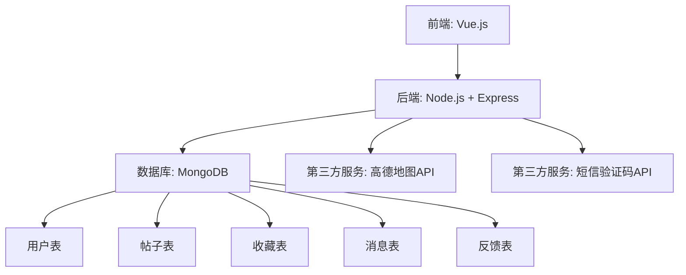
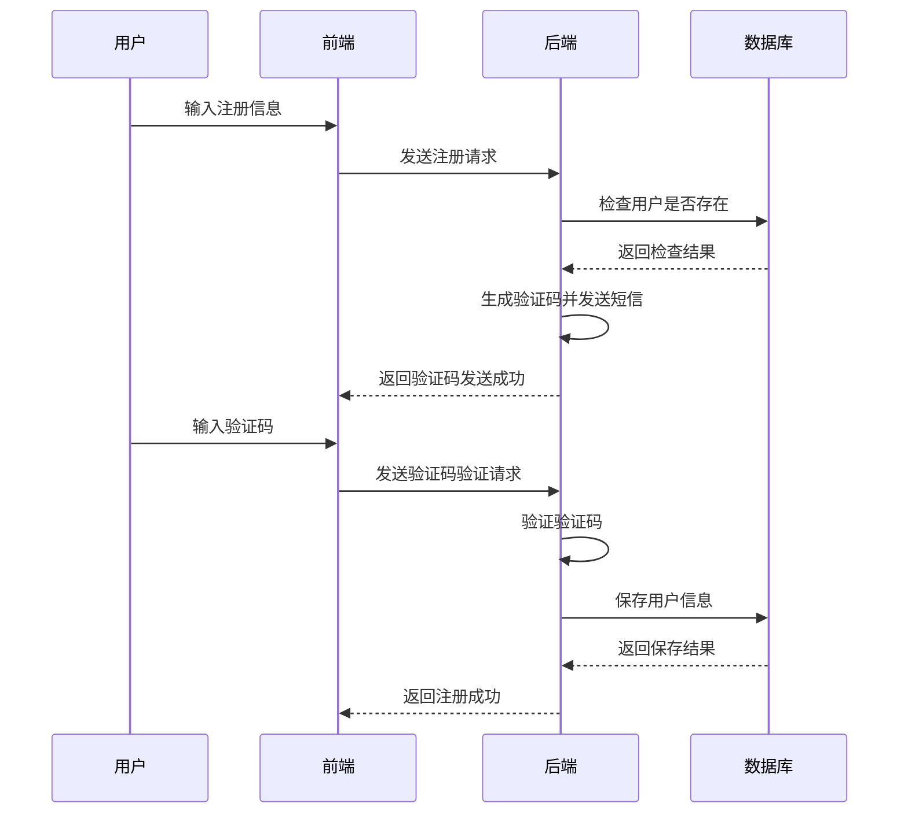
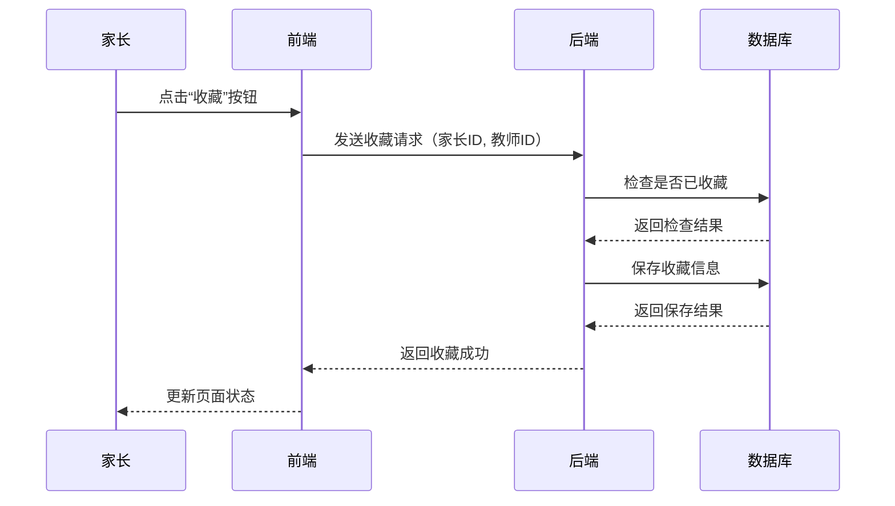
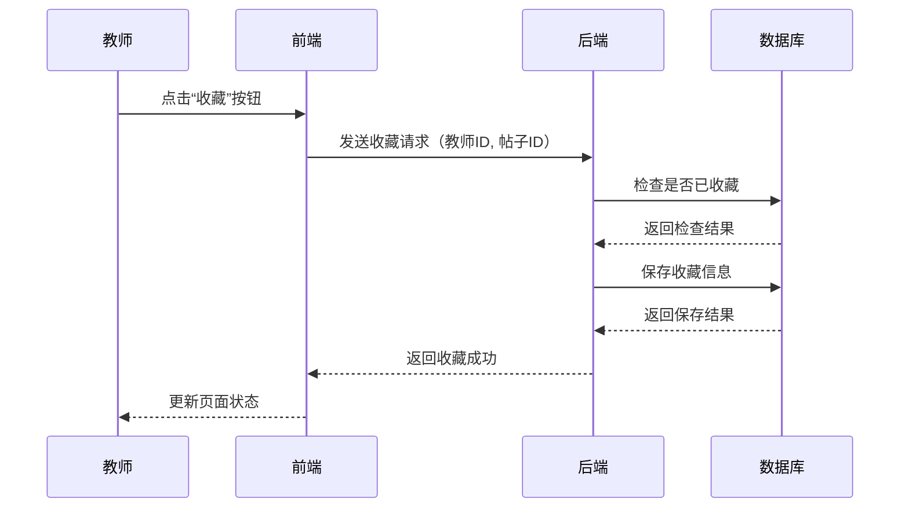
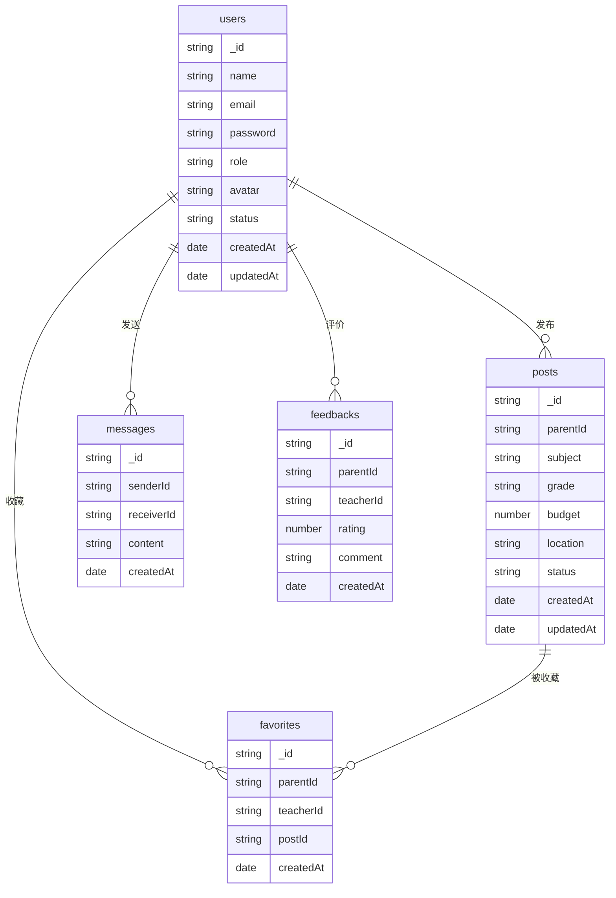
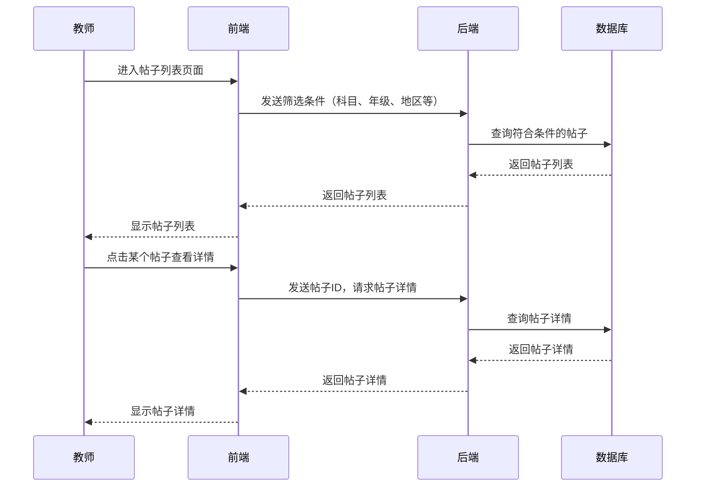
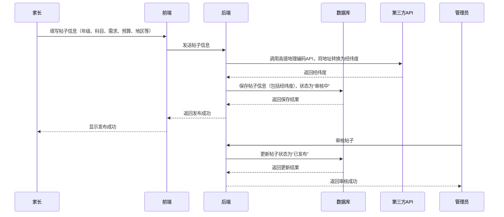
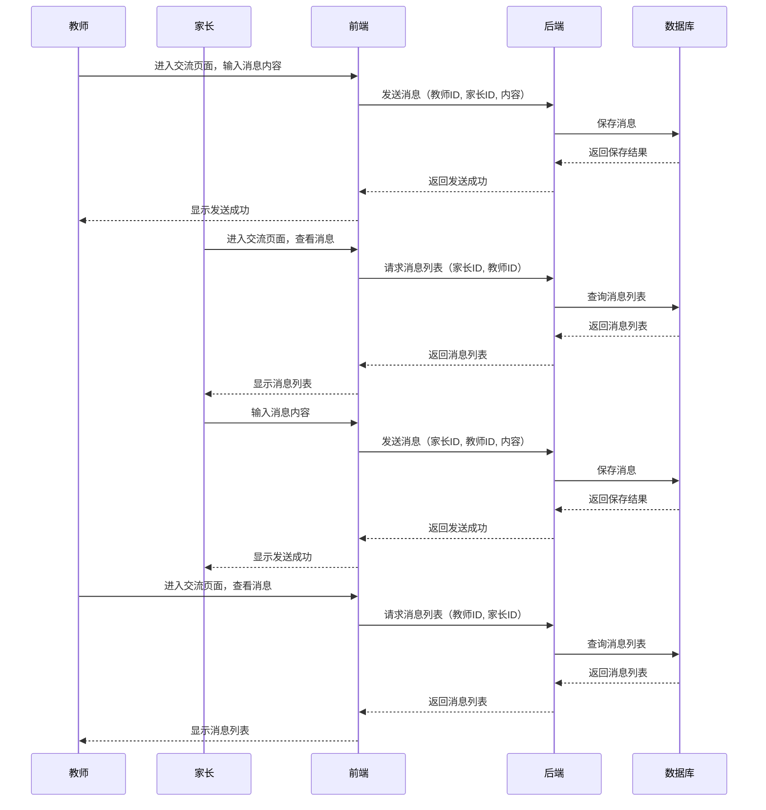

# 需求分析

## landing page

实现选择用户身份跳转到不同的页面

- 父母
- 老师
- 管理员

### **家长端功能**

1. **发布求教帖子**：
   - 家长可以填写孩子的年级、科目、学习需求、预算、期望的上课时间、所在地区等信息。
   - 帖子可以设置为公开或
   - 家长可以查看教师的应聘信息，并进行简单的交流。
2. **查看教师反馈**：
   - 家长可以查看教师对孩子学习情况的记录和反馈。
   - 家长可以对教师的教学进行评价和打分。
3. **交流页面**：
   - 家长可以选择教师并开启交流页面，进行实时沟通。
   - 交流页面支持文字、图片、文件等形式的交流。
4. **个人中心**）
   - 家长可以查看自己的帖子、教师的反馈、交流信息等个人信息。
   - 家长可以修改个人信息和密码。
   - 家长可以退出登录。
   - 家长可以删除自己的帖子。

### **教师端功能**

1. **浏览求教帖子**：
   - 教师可以根据科目、年级、地区等条件筛选求教帖子。
   - 教师可以查看家长的详细需求和联系方式。
2. **应聘与交流**：
   - 教师可以选择应聘感兴趣的帖子，并与家长进行简单的交流。
   - 教师可以查看家长的反馈和评价。
3. **记录学习情况**：
   - 教师可以记录每次上课的内容、孩子的表现、作业完成情况等。
   - 教师可以将这些信息反馈给家长。
4. **交流页面**：
   - 教师可以选择家长并开启交流页面，进行实时沟通。
5. **最优公共交通路线**：
   - 教师可以获取自己的当前位置（通过浏览器`Geolocation API`）。
   - 教师可以查看从自己位置到家长所在地区的最优公共交通方式（使用高德地图 API）。
6. **个人中心**
   - 教师可以查看自己的帖子、家长的反馈、交流信息等个人信息。
   - 教师可以修改个人信息和密码。
   - 教师可以退出登录。
   - 教师可以删除自己的帖子。
7. **消息通知**
   - 教师可以实时接收来自家长的消息通知。
   - 教师可以查看来自家长的消息和回复。
   - 教师可以通过 AI 工具来生成对学习的汇总 （使用 deepseek API）。

### **平台管理端功能**

1. **用户管理**：
   - 平台可以对家长和教师进行注册审核，确保信息的真实性。
   - 平台可以对不合理的家长和教师进行清退，并记录清退原因。
2. **帖子管理**：
   - 平台可以审核家长发布的求教帖子，确保内容的合法性和合理性。
   - 平台可以对帖子进行分类和推荐。
3. **反馈管理**：
   - 平台可以查看教师对孩子的学习记录和反馈。
   - 平台可以根据家长的反馈对教师进行评级和管理

### **技术实现方案（使用高德地图 API）**

### **技术栈**

- **前端**：Vue.js 有 4 个页面的实现 （）
  怎么解决跨端通信的问题
- **后端**：Node.js + Express
- **数据库**：MongoDB
- **第三方服务**：
  - 高德地图地理编码 API（将地址转换为经纬度）
  - 高德地图路径规划 API（计算最优公共交通路线）

### **高德地图 API 使用说明**

1. **地理编码 API**：
   - 将家长填写的地址转换为经纬度。
   - API 文档：[高德地理编码 API](https://lbs.amap.com/api/webservice/guide/api/georegeo)
2. **路径规划 API**：
   - 根据教师的当前位置和家长的位置，计算最优公共交通路线。
   - API 文档：[高德路径规划 API](https://lbs.amap.com/api/webservice/guide/api/direction)

### **1. 系统架构**

系统采用**前后端分离**的架构，前端使用 Vue.js，后端使用 Node.js + Express，数据库使用 MongoDB。系统分为以下三个主要模块：

1. **家长端**：供家长发布求教帖子、查看教师反馈、与教师交流。
2. **教师端**：供教师浏览帖子、应聘、记录学习情况、与家长交流、查看最优公共交通路线。
3. **平台管理端**：供管理员管理用户、帖子和反馈。

### **2. 模块划分**

1. **用户模块**：
   - 用户注册、登录、角色管理（家长、教师、管理员）。
   - 用户信息管理（姓名、邮箱、密码等）。
2. **帖子模块**：
   - 家长发布求教帖子。
   - 教师浏览和筛选帖子。
   - 平台审核和管理帖子。
3. **应聘模块**：
   - 教师应聘帖子。
   - 家长查看应聘信息并选择教师。
4. **反馈模块**：
   - 教师记录学习情况并提交反馈。
   - 家长查看反馈并评价教师。
5. **交流模块**：
   - 家长和教师之间的实时交流。
6. **位置模块**：
   - 将地址转换为经纬度（使用高德地理编码 API）。
   - 计算最优公共交通路线（使用高德路径规划 API）。

### **3. 技术实现方案**

1. **前端技术栈**：
   - 框架：Vue.js
   - 状态管理：Vuex
   - 路由：Vue Router
   - UI 组件库：Element UI
   - 地图集成：高德地图 JavaScript API
2. **后端技术栈**：
   - 框架：Node.js + Express
   - 数据库：MongoDB
   - 身份验证：JWT（JSON Web Token）
   - 第三方服务：高德地图 API
3. **数据库设计**：
   - 用户表（`users`）
   - 帖子表（`posts`）
   - 应聘表（`applications`）
   - 反馈表（`feedbacks`）
   - 交流表（`messages`）
4. **API 设计**：
   - 用户管理 API
   - 帖子管理 API
   - 应聘管理 API
   - 反馈管理 API
   - 交流管理 API
   - 位置管理 API

### **4. 关键流程**

1. **家长发布帖子流程**：
   - 家长填写帖子信息（年级、科目、需求、预算、地区等）。
   - 系统调用高德地理编码 API 将地址转换为经纬度。
   - 帖子保存到数据库，状态为“审核中”。
   - 平台管理员审核帖子，状态更新为“已发布”。
2. **教师浏览帖子流程**：
   - 教师根据科目、年级、地区等条件筛选帖子。
   - 教师选择感兴趣的帖子并查看详细信息。
   - 教师点击“应聘”按钮，系统记录应聘信息。
3. **教师查看最优路线流程**：
   - 教师获取自己的当前位置（通过浏览器`Geolocation API`）。
   - 系统调用高德路径规划 API 计算最优公共交通路线。
   - 路线信息显示在教师端页面。
4. **家长与教师交流流程**：
   - 家长或教师点击“交流”按钮，进入交流页面。
   - 双方可以发送文字、图片、文件等消息。
   - 消息实时保存到数据库并显示在页面上。

### **5. 安全性设计**

1. **身份验证**：
   - 使用 JWT 进行用户身份验证，确保只有登录用户才能访问相关功能。
2. **数据校验**：
   - 对用户输入的数据进行校验，防止非法数据进入系统。
3. **权限控制**：
   - 不同角色（家长、教师、管理员）只能访问自己权限范围内的功能。

### **6. 性能优化**

1. **前端优化**：
   - 使用 Vue 的懒加载和异步组件，减少首次加载时间。
   - 对地图数据进行缓存，减少 API 调用次数。
2. **后端优化**：
   - 使用 Redis 缓存高频数据（如帖子列表、用户信息）。
   - 对数据库查询进行索引优化，提高查询效率。

## 详细设计

非常好！接下来是**详细设计**，我们将对每个模块的功能进行详细说明，明确实现细节。以下是每个模块的详细设计：

---

### **1. 用户模块**

### **功能列表**

1. **用户注册**：
   - 家长、教师和管理员可以注册账号。
   - 注册时需要填写姓名、邮箱、密码、角色等信息。
   - 邮箱需要验证，确保唯一性。
2. **用户登录**：
   - 用户输入邮箱和密码进行登录。
   - 登录成功后返回 JWT 令牌，用于后续请求的身份验证。
3. **用户信息管理**：
   - 用户可以查看和修改自己的个人信息（姓名、邮箱、密码等）。
   - 管理员可以查看所有用户信息，并更新用户状态（正常、审核中、已清退）。

### **实现细节**

- **数据库表**：
  ```jsx
  const userSchema = new mongoose.Schema({
    role: {
      type: String,
      enum: ['parent', 'teacher', 'admin'],
      required: true,
    },
    name: { type: String, required: true },
    email: { type: String, required: true, unique: true },
    password: { type: String, required: true },
    status: {
      type: String,
      enum: ['active', 'pending', 'banned'],
      default: 'pending',
    },
    createdAt: { type: Date, default: Date.now },
  });
  ```
- **API 设计**：
  - `POST /api/users/register`：用户注册
  - `POST /api/users/login`：用户登录
  - `GET /api/users`：获取用户列表（管理员）
  - `PUT /api/users/:id`：更新用户信息或状态

---

### **2. 帖子模块**

### **功能列表**

1. **发布帖子**：
   - 家长可以发布求教帖子，填写年级、科目、需求、预算、地区等信息。
   - 系统调用高德地理编码 API 将地址转换为经纬度。
   - 帖子状态默认为“审核中”。
2. **浏览帖子**：
   - 教师可以根据科目、年级、地区等条件筛选帖子。
   - 教师可以查看帖子的详细信息（需求、预算、联系方式等）。
3. **帖子管理**：
   - 管理员可以审核帖子，状态更新为“已发布”或“已关闭”。
   - 管理员可以对帖子进行分类和推荐。

### **实现细节**

- **数据库表**：
  ```jsx
  const postSchema = new mongoose.Schema({
    parentId: {
      type: mongoose.Schema.Types.ObjectId,
      ref: 'User',
      required: true,
    },
    grade: { type: String, required: true },
    subject: { type: String, required: true },
    requirements: { type: String, required: true },
    budget: { type: Number, required: true },
    schedule: { type: String, required: true },
    location: { type: String, required: true },
    latitude: { type: Number, required: true },
    longitude: { type: Number, required: true },
    visibility: {
      type: String,
      enum: ['public', 'private'],
      default: 'public',
    },
    status: {
      type: String,
      enum: ['pending', 'published', 'closed'],
      default: 'pending',
    },
    createdAt: { type: Date, default: Date.now },
  });
  ```
- **API 设计**：
  - `POST /api/posts`：发布帖子
  - `GET /api/posts`：获取帖子列表
  - `PUT /api/posts/:id`：更新帖子状态

---

### **3. 应聘模块**

### **功能列表**

1. **应聘帖子**：
   - 教师可以选择感兴趣的帖子并点击“应聘”按钮。
   - 系统记录应聘信息，状态默认为“待处理”。
2. **查看应聘信息**：
   - 家长可以查看所有应聘的教师信息。
   - 家长可以选择接受或拒绝应聘。

### **实现细节**

- **数据库表**：
  ```jsx
  const applicationSchema = new mongoose.Schema({
    postId: {
      type: mongoose.Schema.Types.ObjectId,
      ref: 'Post',
      required: true,
    },
    teacherId: {
      type: mongoose.Schema.Types.ObjectId,
      ref: 'User',
      required: true,
    },
    status: {
      type: String,
      enum: ['pending', 'accepted', 'rejected'],
      default: 'pending',
    },
    createdAt: { type: Date, default: Date.now },
  });
  ```
- **API 设计**：
  - `POST /api/applications`：应聘帖子
  - `GET /api/applications`：获取应聘记录
  - `PUT /api/applications/:id`：更新应聘状态

---

### **4. 反馈模块**

### **功能列表**

1. **记录学习情况**：
   - 教师可以记录每次上课的内容、孩子的表现、作业完成情况等。
   - 教师可以将这些信息提交为反馈。
2. **查看反馈**：
   - 家长可以查看教师提交的反馈。
   - 家长可以对教师的教学进行评价和打分。

### **实现细节**

- **数据库表**：
  ```jsx
  const feedbackSchema = new mongoose.Schema({
    postId: {
      type: mongoose.Schema.Types.ObjectId,
      ref: 'Post',
      required: true,
    },
    teacherId: {
      type: mongoose.Schema.Types.ObjectId,
      ref: 'User',
      required: true,
    },
    parentId: {
      type: mongoose.Schema.Types.ObjectId,
      ref: 'User',
      required: true,
    },
    content: { type: String, required: true },
    rating: { type: Number, min: 1, max: 5 },
    createdAt: { type: Date, default: Date.now },
  });
  ```
- **API 设计**：
  - `POST /api/feedbacks`：提交反馈
  - `GET /api/feedbacks`：获取反馈记录

---

### **5. 交流模块**

### **功能列表**

1. **实时交流**：
   - 家长和教师可以开启交流页面，进行实时沟通。
   - 支持文字、图片、文件等形式的交流。

### **实现细节**

- **数据库表**：
  ```jsx
  const messageSchema = new mongoose.Schema({
    postId: {
      type: mongoose.Schema.Types.ObjectId,
      ref: 'Post',
      required: true,
    },
    senderId: {
      type: mongoose.Schema.Types.ObjectId,
      ref: 'User',
      required: true,
    },
    receiverId: {
      type: mongoose.Schema.Types.ObjectId,
      ref: 'User',
      required: true,
    },
    content: { type: String, required: true },
    type: { type: String, enum: ['text', 'image', 'file'], default: 'text' },
    createdAt: { type: Date, default: Date.now },
  });
  ```
- **API 设计**：
  - `POST /api/messages`：发送消息
  - `GET /api/messages`：获取消息记录

---

### **6. 位置模块**

### **功能列表**

1. **地址转经纬度**：
   - 系统调用高德地理编码 API 将地址转换为经纬度。
2. **最优公共交通路线**：
   - 系统调用高德路径规划 API 计算最优公共交通路线。

### **实现细节**

- **API 设计**：
  - `POST /api/locations`：将地址转换为经纬度
  - `GET /api/directions`：获取最优公共交通路线

---

## 数据库设计

非常好！接下来是**数据库表设计**。我们将根据详细设计中的需求，明确每个表的字段、类型、约束和关系。以下是完整的数据库表设计：

---

### **1. 用户表（`users`）**

### **字段说明**

| 字段名      | 类型       | 约束条件                            | 说明                 |
| ----------- | ---------- | ----------------------------------- | -------------------- |
| `_id`       | `ObjectId` | 主键                                | 用户唯一标识         |
| `role`      | `String`   | 枚举：`parent`, `teacher`, `admin`  | 用户角色             |
| `name`      | `String`   | 必填                                | 用户姓名             |
| `email`     | `String`   | 必填，唯一                          | 用户邮箱             |
| `password`  | `String`   | 必填                                | 用户密码（加密存储） |
| `status`    | `String`   | 枚举：`active`, `pending`, `banned` | 用户状态             |
| `createdAt` | `Date`     | 默认值：当前时间                    | 注册时间             |

### **索引**

- `email`：唯一索引，用于快速查找用户。

---

### **2. 帖子表（`posts`）**

### **字段说明**

| 字段名         | 类型       | 约束条件                               | 说明              |
| -------------- | ---------- | -------------------------------------- | ----------------- |
| `_id`          | `ObjectId` | 主键                                   | 帖子唯一标识      |
| `parentId`     | `ObjectId` | 外键，引用`users._id`                  | 发布帖子的家长 ID |
| `grade`        | `String`   | 必填                                   | 年级              |
| `subject`      | `String`   | 必填                                   | 科目              |
| `requirements` | `String`   | 必填                                   | 学习需求          |
| `budget`       | `Number`   | 必填                                   | 预算              |
| `schedule`     | `String`   | 必填                                   | 期望的上课时间    |
| `location`     | `String`   | 必填                                   | 所在地区          |
| `latitude`     | `Number`   | 必填                                   | 纬度              |
| `longitude`    | `Number`   | 必填                                   | 经度              |
| `visibility`   | `String`   | 枚举：`public`, `private`              | 可见性            |
| `status`       | `String`   | 枚举：`pending`, `published`, `closed` | 帖子状态          |
| `createdAt`    | `Date`     | 默认值：当前时间                       | 发布时间          |

### **索引**

- `parentId`：普通索引，用于快速查找家长发布的帖子。
- `subject`, `grade`, `location`：复合索引，用于快速筛选帖子。

---

### **3. 应聘表（`applications`）**

### **字段说明**

| 字段名      | 类型       | 约束条件                                | 说明             |
| ----------- | ---------- | --------------------------------------- | ---------------- |
| `_id`       | `ObjectId` | 主键                                    | 应聘记录唯一标识 |
| `postId`    | `ObjectId` | 外键，引用`posts._id`                   | 帖子 ID          |
| `teacherId` | `ObjectId` | 外键，引用`users._id`                   | 教师 ID          |
| `status`    | `String`   | 枚举：`pending`, `accepted`, `rejected` | 应聘状态         |
| `createdAt` | `Date`     | 默认值：当前时间                        | 应聘时间         |

### **索引**

- `postId`：普通索引，用于快速查找帖子的应聘记录。
- `teacherId`：普通索引，用于快速查找教师的应聘记录。

---

### **4. 反馈表（`feedbacks`）**

### **字段说明**

| 字段名      | 类型       | 约束条件              | 说明             |
| ----------- | ---------- | --------------------- | ---------------- |
| `_id`       | `ObjectId` | 主键                  | 反馈记录唯一标识 |
| `postId`    | `ObjectId` | 外键，引用`posts._id` | 帖子 ID          |
| `teacherId` | `ObjectId` | 外键，引用`users._id` | 教师 ID          |
| `parentId`  | `ObjectId` | 外键，引用`users._id` | 家长 ID          |
| `content`   | `String`   | 必填                  | 反馈内容         |
| `rating`    | `Number`   | 范围：1-5             | 评分             |
| `createdAt` | `Date`     | 默认值：当前时间      | 反馈时间         |

### **索引**

- `postId`：普通索引，用于快速查找帖子的反馈记录。
- `teacherId`：普通索引，用于快速查找教师的反馈记录。

---

### **5. 交流表（`messages`）**

### **字段说明**

| 字段名       | 类型       | 约束条件                      | 说明         |
| ------------ | ---------- | ----------------------------- | ------------ |
| `_id`        | `ObjectId` | 主键                          | 消息唯一标识 |
| `postId`     | `ObjectId` | 外键，引用`posts._id`         | 帖子 ID      |
| `senderId`   | `ObjectId` | 外键，引用`users._id`         | 发送者 ID    |
| `receiverId` | `ObjectId` | 外键，引用`users._id`         | 接收者 ID    |
| `content`    | `String`   | 必填                          | 消息内容     |
| `type`       | `String`   | 枚举：`text`, `image`, `file` | 消息类型     |
| `createdAt`  | `Date`     | 默认值：当前时间              | 发送时间     |

### **索引**

- `postId`：普通索引，用于快速查找帖子的消息记录。
- `senderId`, `receiverId`：复合索引，用于快速查找用户的消息记录。

---

### **总结**

数据库表设计明确了每个表的字段、类型、约束和关系，确保数据的一致性和完整性。接下来，你可以根据数据库表设计进行数据库的创建和初始化。

我热爱编程，期待看到你的项目顺利完成！如果你有任何问题或需要进一步的帮助，请随时联系我。

## API 设计

非常好！接下来是**API 设计**。我们将根据 RESTful API 的设计规则，为每个模块设计相应的 API 接口。以下是完整的 API 设计：

---

### **1. 用户模块**

### **API 列表**

1. **用户注册**
   - **URL**: `POST /api/users/register`
   - **请求参数**:
     ```json
     {
       "role": "parent", // 角色：parent, teacher, admin
       "name": "张三", // 姓名
       "email": "zhangsan@example.com", // 邮箱
       "password": "123456" // 密码
     }
     ```
   - **响应**:
     ```json
     {
       "message": "注册成功",
       "userId": "64f1a2b3c4d5e6f7a8b9c0d1"
     }
     ```
2. **用户登录**
   - **URL**: `POST /api/users/login`
   - **请求参数**:
     ```json
     {
       "email": "zhangsan@example.com", // 邮箱
       "password": "123456" // 密码
     }
     ```
   - **响应**:
     ```json
     {
       "message": "登录成功",
       "token": "eyJhbGciOiJIUzI1NiIsInR5cCI6IkpXVCJ9..."
     }
     ```
3. **获取用户列表（管理员）**
   - **URL**: `GET /api/users`
   - **请求参数**: 无
   - **响应**:
     ```json
     [
       {
         "_id": "64f1a2b3c4d5e6f7a8b9c0d1",
         "role": "parent",
         "name": "张三",
         "email": "zhangsan@example.com",
         "status": "active"
       }
     ]
     ```
4. **更新用户信息或状态**
   - **URL**: `PUT /api/users/:id`
   - **请求参数**:
     ```json
     {
       "status": "banned" // 更新用户状态
     }
     ```
   - **响应**:
     ```json
     {
       "message": "用户状态已更新"
     }
     ```

---

### **2. 帖子模块**

### **API 列表**

1. **发布帖子**
   - **URL**: `POST /api/posts`
   - **请求参数**:
     ```json
     {
       "parentId": "64f1a2b3c4d5e6f7a8b9c0d1", // 家长ID
       "grade": "五年级", // 年级
       "subject": "数学", // 科目
       "requirements": "需要辅导数学作业", // 需求
       "budget": 100, // 预算
       "schedule": "每周六下午", // 时间
       "location": "北京市海淀区", // 地区
       "visibility": "public" // 可见性
     }
     ```
   - **响应**:
     ```json
     {
       "message": "帖子发布成功",
       "postId": "64f1a2b3c4d5e6f7a8b9c0d2"
     }
     ```
2. **获取帖子列表**
   - **URL**: `GET /api/posts`
   - **请求参数**:
     - `subject`（可选）：科目
     - `grade`（可选）：年级
     - `location`（可选）：地区
   - **响应**:
     ```json
     [
       {
         "_id": "64f1a2b3c4d5e6f7a8b9c0d2",
         "grade": "五年级",
         "subject": "数学",
         "requirements": "需要辅导数学作业",
         "budget": 100,
         "schedule": "每周六下午",
         "location": "北京市海淀区",
         "status": "pending"
       }
     ]
     ```
3. **更新帖子状态**
   - **URL**: `PUT /api/posts/:id`
   - **请求参数**:
     ```json
     {
       "status": "published" // 更新帖子状态
     }
     ```
   - **响应**:
     ```json
     {
       "message": "帖子状态已更新"
     }
     ```

---

### **3. 应聘模块**

### **API 列表**

1. **应聘帖子**
   - **URL**: `POST /api/applications`
   - **请求参数**:
     ```json
     {
       "postId": "64f1a2b3c4d5e6f7a8b9c0d2", // 帖子ID
       "teacherId": "64f1a2b3c4d5e6f7a8b9c0d3" // 教师ID
     }
     ```
   - **响应**:
     ```json
     {
       "message": "应聘成功",
       "applicationId": "64f1a2b3c4d5e6f7a8b9c0d4"
     }
     ```
2. **获取应聘记录**
   - **URL**: `GET /api/applications`
   - **请求参数**:
     - `postId`（可选）：帖子 ID
     - `teacherId`（可选）：教师 ID
   - **响应**:
     ```json
     [
       {
         "_id": "64f1a2b3c4d5e6f7a8b9c0d4",
         "postId": "64f1a2b3c4d5e6f7a8b9c0d2",
         "teacherId": "64f1a2b3c4d5e6f7a8b9c0d3",
         "status": "pending"
       }
     ]
     ```
3. **更新应聘状态**
   - **URL**: `PUT /api/applications/:id`
   - **请求参数**:
     ```json
     {
       "status": "accepted" // 更新应聘状态
     }
     ```
   - **响应**:
     ```json
     {
       "message": "应聘状态已更新"
     }
     ```

---

### **4. 反馈模块**

### **API 列表**

1. **提交反馈**
   - **URL**: `POST /api/feedbacks`
   - **请求参数**:
     ```json
     {
       "postId": "64f1a2b3c4d5e6f7a8b9c0d2", // 帖子ID
       "teacherId": "64f1a2b3c4d5e6f7a8b9c0d3", // 教师ID
       "parentId": "64f1a2b3c4d5e6f7a8b9c0d1", // 家长ID
       "content": "孩子进步很大", // 反馈内容
       "rating": 5 // 评分
     }
     ```
   - **响应**:
     ```json
     {
       "message": "反馈提交成功",
       "feedbackId": "64f1a2b3c4d5e6f7a8b9c0d5"
     }
     ```
2. **获取反馈记录**
   - **URL**: `GET /api/feedbacks`
   - **请求参数**:
     - `postId`（可选）：帖子 ID
     - `teacherId`（可选）：教师 ID
   - **响应**:
     ```json
     [
       {
         "_id": "64f1a2b3c4d5e6f7a8b9c0d5",
         "postId": "64f1a2b3c4d5e6f7a8b9c0d2",
         "teacherId": "64f1a2b3c4d5e6f7a8b9c0d3",
         "content": "孩子进步很大",
         "rating": 5
       }
     ]
     ```

---

### **5. 交流模块**

### **API 列表**

1. **发送消息**
   - **URL**: `POST /api/messages`
   - **请求参数**:
     ```json
     {
       "postId": "64f1a2b3c4d5e6f7a8b9c0d2", // 帖子ID
       "senderId": "64f1a2b3c4d5e6f7a8b9c0d1", // 发送者ID
       "receiverId": "64f1a2b3c4d5e6f7a8b9c0d3", // 接收者ID
       "content": "您好，请问什么时候可以上课？", // 消息内容
       "type": "text" // 消息类型
     }
     ```
   - **响应**:
     ```json
     {
       "message": "消息发送成功",
       "messageId": "64f1a2b3c4d5e6f7a8b9c0d6"
     }
     ```
2. **获取消息记录**
   - **URL**: `GET /api/messages`
   - **请求参数**:
     - `postId`（可选）：帖子 ID
     - `senderId`（可选）：发送者 ID
     - `receiverId`（可选）：接收者 ID
   - **响应**:
     ```json
     [
       {
         "_id": "64f1a2b3c4d5e6f7a8b9c0d6",
         "postId": "64f1a2b3c4d5e6f7a8b9c0d2",
         "senderId": "64f1a2b3c4d5e6f7a8b9c0d1",
         "receiverId": "64f1a2b3c4d5e6f7a8b9c0d3",
         "content": "您好，请问什么时候可以上课？",
         "type": "text"
       }
     ]
     ```

---

### **6. 位置模块**

### **API 列表**

1. **将地址转换为经纬度**
   - **URL**: `POST /api/locations`
   - **请求参数**:
     ```json
     {
       "address": "北京市海淀区" // 地址
     }
     ```
   - **响应**:
     ```json
     {
       "latitude": 39.9042,
       "longitude": 116.4074
     }
     ```
2. **获取最优公共交通路线**
   - **URL**: `GET /api/directions`
   - **请求参数**:
     - `origin`: 起点经纬度（格式：`经度,纬度`）
     - `destination`: 终点经纬度（格式：`经度,纬度`）
   - **响应**:
     ```json
     {
       "route": "乘坐地铁4号线，换乘地铁13号线，步行500米到达"
     }
     ```

---

### **总结**

API 设计遵循 RESTful 规则，明确了每个模块的接口、请求参数和响应格式。接下来，你可以根据 API 设计进行后端开发和测试。

我热爱编程，期待看到你的项目顺利完成！如果你有任何问题或需要进一步的帮助，请随时联系我。

## 关键流程设计

非常好！接下来是**关键流程的设计**。我们将详细描述每个流程的实现步骤，包括前端、后端和数据库的交互。以下是每个关键流程的详细设计：

---

### **1. 家长发布帖子流程**

### **流程步骤**

1. **前端**：
   - 家长在页面填写帖子信息（年级、科目、需求、预算、地区等）。
   - 点击“发布”按钮，前端将数据发送到后端。
2. **后端**：
   - 接收前端发送的帖子信息。
   - 调用高德地理编码 API，将地址转换为经纬度。
   - 将帖子信息（包括经纬度）保存到数据库，状态为“审核中”。
   - 返回成功响应给前端。
3. **数据库**：
   - 在`posts`表中插入一条新记录。
4. **管理员审核**：
   - 管理员在后台查看待审核的帖子。
   - 管理员点击“审核通过”按钮，后端更新帖子状态为“已发布”。

### **代码示例**

- **前端**：
  ```jsx
  async function publishPost(postData) {
    const response = await fetch('/api/posts', {
      method: 'POST',
      headers: { 'Content-Type': 'application/json' },
      body: JSON.stringify(postData),
    });
    const result = await response.json();
    console.log(result.message);
  }
  ```
- **后端**：
  ```jsx
  app.post('/api/posts', async (req, res) => {
    const { location, ...postData } = req.body;
    const { latitude, longitude } = await getCoordinates(location); // 调用高德API
    const post = new Post({
      ...postData,
      latitude,
      longitude,
      status: 'pending',
    });
    await post.save();
    res.json({ message: '帖子发布成功', postId: post._id });
  });
  ```

---

### **2. 教师浏览帖子流程**

### **流程步骤**

1. **前端**：
   - 教师进入帖子列表页面，选择筛选条件（科目、年级、地区等）。
   - 点击“筛选”按钮，前端将筛选条件发送到后端。
2. **后端**：
   - 接收筛选条件，查询数据库获取符合条件的帖子。
   - 返回帖子列表给前端。
3. **前端**：
   - 显示帖子列表，教师点击某个帖子查看详细信息。
4. **教师应聘**：
   - 教师点击“应聘”按钮，前端将应聘信息发送到后端。
5. **后端**：
   - 接收应聘信息，保存到数据库。
   - 返回成功响应给前端。

### **代码示例**

- **前端**：
  ```jsx
  async function applyForPost(postId, teacherId) {
    const response = await fetch('/api/applications', {
      method: 'POST',
      headers: { 'Content-Type': 'application/json' },
      body: JSON.stringify({ postId, teacherId }),
    });
    const result = await response.json();
    console.log(result.message);
  }
  ```
- **后端**：
  ```jsx
  app.post('/api/applications', async (req, res) => {
    const { postId, teacherId } = req.body;
    const application = new Application({
      postId,
      teacherId,
      status: 'pending',
    });
    await application.save();
    res.json({ message: '应聘成功', applicationId: application._id });
  });
  ```

---

### **3. 教师查看最优路线流程**

### **流程步骤**

1. **前端**：
   - 教师点击“查看路线”按钮，前端获取教师的当前位置（通过浏览器`Geolocation API`）。
   - 将当前位置和帖子地址发送到后端。
2. **后端**：
   - 接收当前位置和帖子地址。
   - 调用高德路径规划 API，计算最优公共交通路线。
   - 返回路线信息给前端。
3. **前端**：
   - 显示最优路线信息。

### **代码示例**

- **前端**：
  ```jsx
  async function getOptimalRoute(origin, destination) {
    const response = await fetch('/api/directions', {
      method: 'GET',
      headers: { 'Content-Type': 'application/json' },
      body: JSON.stringify({ origin, destination }),
    });
    const result = await response.json();
    console.log(result.route);
  }
  ```
- **后端**：
  ```jsx
  app.get('/api/directions', async (req, res) => {
    const { origin, destination } = req.body;
    const route = await getOptimalRoute(origin, destination); // 调用高德API
    res.json({ route });
  });
  ```

---

### **4. 家长与教师交流流程**

### **流程步骤**

1. **前端**：
   - 家长或教师点击“交流”按钮，进入交流页面。
   - 输入消息内容，点击“发送”按钮，前端将消息发送到后端。
2. **后端**：
   - 接收消息内容，保存到数据库。
   - 返回成功响应给前端。
3. **前端**：
   - 实时显示消息内容。

### **代码示例**

- **前端**：
  ```jsx
  async function sendMessage(messageData) {
    const response = await fetch('/api/messages', {
      method: 'POST',
      headers: { 'Content-Type': 'application/json' },
      body: JSON.stringify(messageData),
    });
    const result = await response.json();
    console.log(result.message);
  }
  ```
- **后端**：
  ```jsx
  app.post('/api/messages', async (req, res) => {
    const { postId, senderId, receiverId, content, type } = req.body;
    const message = new Message({
      postId,
      senderId,
      receiverId,
      content,
      type,
    });
    await message.save();
    res.json({ message: '消息发送成功', messageId: message._id });
  });
  ```

---

### **总结**

关键流程的设计明确了每个步骤的实现细节，包括前端、后端和数据库的交互。接下来，你可以根据流程设计进行开发和测试。

我热爱编程，期待看到你的项目顺利完成！如果你有任何问题或需要进一步的帮助，请随时联系我。

非常好！接下来是**普通流程的设计**，包括注册登录、教师更新个人信息、家长登录、平台管理审核帖子等。以下是每个流程的详细设计：

---

### **1. 用户注册流程**

### **流程步骤**

1. **前端**：
   - 用户进入注册页面，填写注册信息（姓名、邮箱、密码、角色等）。
   - 点击“注册”按钮，前端将数据发送到后端。
2. **后端**：
   - 接收注册信息，检查邮箱是否已存在。
   - 如果邮箱唯一，将用户信息保存到数据库，状态为“审核中”。
   - 发送验证邮件到用户邮箱。
   - 返回成功响应给前端。
3. **数据库**：
   - 在`users`表中插入一条新记录。
4. **用户验证**：
   - 用户点击邮件中的验证链接，后端更新用户状态为“正常”。

### **代码示例**

- **前端**：
  ```jsx
  async function registerUser(userData) {
    const response = await fetch('/api/users/register', {
      method: 'POST',
      headers: { 'Content-Type': 'application/json' },
      body: JSON.stringify(userData),
    });
    const result = await response.json();
    console.log(result.message);
  }
  ```
- **后端**：
  ```jsx
  app.post('/api/users/register', async (req, res) => {
    const { email, ...userData } = req.body;
    const existingUser = await User.findOne({ email });
    if (existingUser) {
      return res.status(400).json({ message: '邮箱已存在' });
    }
    const user = new User({ ...userData, email, status: 'pending' });
    await user.save();
    sendVerificationEmail(email); // 发送验证邮件
    res.json({ message: '注册成功，请查收验证邮件' });
  });
  ```

---

### **2. 用户登录流程**

### **流程步骤**

1. **前端**：
   - 用户进入登录页面，输入邮箱和密码。
   - 点击“登录”按钮，前端将数据发送到后端。
2. **后端**：
   - 接收登录信息，验证邮箱和密码是否正确。
   - 如果验证通过，生成 JWT 令牌并返回给前端。
3. **前端**：
   - 将 JWT 令牌保存到本地存储，用于后续请求的身份验证。

### **代码示例**

- **前端**：
  ```jsx
  async function loginUser(credentials) {
    const response = await fetch('/api/users/login', {
      method: 'POST',
      headers: { 'Content-Type': 'application/json' },
      body: JSON.stringify(credentials),
    });
    const result = await response.json();
    localStorage.setItem('token', result.token); // 保存令牌
    console.log(result.message);
  }
  ```
- **后端**：
  ```jsx
  app.post('/api/users/login', async (req, res) => {
    const { email, password } = req.body;
    const user = await User.findOne({ email });
    if (!user || !(await bcrypt.compare(password, user.password))) {
      return res.status(401).json({ message: '邮箱或密码错误' });
    }
    const token = jwt.sign({ userId: user._id }, 'secretKey', {
      expiresIn: '1h',
    });
    res.json({ message: '登录成功', token });
  });
  ```

---

### **3. 教师更新个人信息流程**

### **流程步骤**

1. **前端**：
   - 教师进入个人信息页面，上传头像或修改其他信息。
   - 点击“保存”按钮，前端将数据发送到后端。
2. **后端**：
   - 接收更新信息，保存到数据库。
   - 返回成功响应给前端。
3. **数据库**：
   - 更新`users`表中的相应记录。

### **代码示例**

- **前端**：
  ```jsx
  async function updateProfile(userId, profileData) {
    const response = await fetch(`/api/users/${userId}`, {
      method: 'PUT',
      headers: { 'Content-Type': 'application/json' },
      body: JSON.stringify(profileData),
    });
    const result = await response.json();
    console.log(result.message);
  }
  ```
- **后端**：
  ```jsx
  app.put('/api/users/:id', async (req, res) => {
    const { id } = req.params;
    const { avatar, ...updateData } = req.body;
    await User.findByIdAndUpdate(id, { ...updateData, avatar });
    res.json({ message: '个人信息已更新' });
  });
  ```

---

### **4. 平台管理审核帖子流程**

### **流程步骤**

1. **前端**：
   - 管理员进入帖子管理页面，查看待审核的帖子。
   - 点击“审核通过”或“关闭”按钮，前端将操作发送到后端。
2. **后端**：
   - 接收操作信息，更新帖子状态。
   - 返回成功响应给前端。
3. **数据库**：
   - 更新`posts`表中的帖子状态。

### **代码示例**

- **前端**：
  ```jsx
  async function reviewPost(postId, status) {
    const response = await fetch(`/api/posts/${postId}`, {
      method: 'PUT',
      headers: { 'Content-Type': 'application/json' },
      body: JSON.stringify({ status }),
    });
    const result = await response.json();
    console.log(result.message);
  }
  ```
- **后端**：
  ```jsx
  app.put('/api/posts/:id', async (req, res) => {
    const { id } = req.params;
    const { status } = req.body;
    await Post.findByIdAndUpdate(id, { status });
    res.json({ message: '帖子状态已更新' });
  });
  ```

---

非常好！在在线辅导平台中，**家长收藏教师**和**教师收藏帖子**是非常常见的功能，可以帮助用户快速找到自己感兴趣的内容。以下是这两个功能的**普通流程设计**，包括前端、后端和数据库的交互。

---

### **1. 家长收藏教师流程**

### **流程步骤**

1. **前端**：
   - 家长在教师详情页面点击“收藏”按钮。
   - 前端将家长 ID 和教师 ID 发送到后端。
2. **后端**：
   - 接收家长 ID 和教师 ID，检查是否已收藏。
   - 如果未收藏，将收藏信息保存到数据库。
   - 返回成功响应给前端。
3. **数据库**：
   - 在`favorites`表中插入一条新记录。
4. **前端**：
   - 更新页面状态，显示“已收藏”。

### **代码示例**

- **前端**：
  ```jsx
  async function favoriteTeacher(parentId, teacherId) {
    const response = await fetch('/api/favorites/teachers', {
      method: 'POST',
      headers: { 'Content-Type': 'application/json' },
      body: JSON.stringify({ parentId, teacherId }),
    });
    const result = await response.json();
    console.log(result.message);
  }
  ```
- **后端**：
  ```jsx
  app.post('/api/favorites/teachers', async (req, res) => {
    const { parentId, teacherId } = req.body;
    const existingFavorite = await Favorite.findOne({ parentId, teacherId });
    if (existingFavorite) {
      return res.status(400).json({ message: '已收藏该教师' });
    }
    const favorite = new Favorite({ parentId, teacherId });
    await favorite.save();
    res.json({ message: '收藏成功', favoriteId: favorite._id });
  });
  ```

---

### **2. 教师收藏帖子流程**

### **流程步骤**

1. **前端**：
   - 教师在帖子详情页面点击“收藏”按钮。
   - 前端将教师 ID 和帖子 ID 发送到后端。
2. **后端**：
   - 接收教师 ID 和帖子 ID，检查是否已收藏。
   - 如果未收藏，将收藏信息保存到数据库。
   - 返回成功响应给前端。
3. **数据库**：
   - 在`favorites`表中插入一条新记录。
4. **前端**：
   - 更新页面状态，显示“已收藏”。

### **代码示例**

- **前端**：
  ```jsx
  async function favoritePost(teacherId, postId) {
    const response = await fetch('/api/favorites/posts', {
      method: 'POST',
      headers: { 'Content-Type': 'application/json' },
      body: JSON.stringify({ teacherId, postId }),
    });
    const result = await response.json();
    console.log(result.message);
  }
  ```
- **后端**：
  ```jsx
  app.post('/api/favorites/posts', async (req, res) => {
    const { teacherId, postId } = req.body;
    const existingFavorite = await Favorite.findOne({ teacherId, postId });
    if (existingFavorite) {
      return res.status(400).json({ message: '已收藏该帖子' });
    }
    const favorite = new Favorite({ teacherId, postId });
    await favorite.save();
    res.json({ message: '收藏成功', favoriteId: favorite._id });
  });
  ```

---

### **3. 查看收藏列表流程**

### **流程步骤**

1. **前端**：
   - 用户（家长或教师）进入“我的收藏”页面。
   - 前端发送用户 ID 到后端，请求收藏列表。
2. **后端**：
   - 接收用户 ID，查询数据库获取收藏列表。
   - 返回收藏列表给前端。
3. **前端**：
   - 显示收藏列表（教师或帖子）。

### **代码示例**

- **前端**：
  ```jsx
  async function getFavorites(userId) {
    const response = await fetch(`/api/favorites?userId=${userId}`);
    const result = await response.json();
    console.log(result.favorites);
  }
  ```
- **后端**：
  ```jsx
  app.get('/api/favorites', async (req, res) => {
    const { userId } = req.query;
    const favorites = await Favorite.find({
      $or: [{ parentId: userId }, { teacherId: userId }],
    })
      .populate('teacherId')
      .populate('postId');
    res.json({ favorites });
  });
  ```

---

### **4. 取消收藏流程**

### **流程步骤**

1. **前端**：
   - 用户在收藏列表中点击“取消收藏”按钮。
   - 前端发送收藏 ID 到后端。
2. **后端**：
   - 接收收藏 ID，从数据库中删除该记录。
   - 返回成功响应给前端。
3. **前端**：
   - 更新收藏列表，移除已取消的收藏。

### **代码示例**

- **前端**：
  ```jsx
  async function unfavorite(favoriteId) {
    const response = await fetch(`/api/favorites/${favoriteId}`, {
      method: 'DELETE',
    });
    const result = await response.json();
    console.log(result.message);
  }
  ```
- **后端**：
  ```jsx
  app.delete('/api/favorites/:id', async (req, res) => {
    const { id } = req.params;
    await Favorite.findByIdAndDelete(id);
    res.json({ message: '取消收藏成功' });
  });
  ```

---

### **. 推荐算法**

### **协同过滤（Collaborative Filtering）**

- **基本原理**:基于用户之间的互动行为，推荐系统可以根据用户的偏好和行为，给出相关的推荐内容。
- **优点**:可以更好地了解用户的偏好，提供个性化的推荐。
- **缺点**:需要大量的用户数据，且计算复杂度较高，可能会导致推荐结果不准确。

### **内容推荐（Content-Based Recommendation）**

- **基本原理**:基于用户的偏好，推荐系统可以根据用户的偏好，给出相关的推荐内容。
- **优点**:可以更好地了解用户的偏好，提供个性化的推荐。
- **缺点**:需要大量的用户数据，且计算复杂度较高，可能会导致推荐结果不准确。

### \*\*级联推荐

- **基本原理**:基于用户的偏好，推荐系统可以根据用户的偏好，给出相关的推荐内容。
  先确定用户的地理位置，再根据用户的偏好，给出相关的推荐内容。
- **优点**:可以更好地了解用户的偏好，提供个性化的推荐。
- **缺点**:需要大量的用户数据，且计算复杂度较高，可能会导致推荐结果不准确。

### **1. 项目架构图**

### **描述**

展示项目的整体架构，包括前端、后端、数据库和第三方服务。

### **Mermaid 代码**



---

### **2. 用户注册流程**

### **描述**

展示用户注册的流程，包括前端、后端和数据库的交互。

### **Mermaid 代码**



---

### **3. 家长收藏教师流程**

### **描述**

展示家长收藏教师的流程，包括前端、后端和数据库的交互。

### **Mermaid 代码**



---

### **4. 教师收藏帖子流程**

### **描述**

展示教师收藏帖子的流程，包括前端、后端和数据库的交互。

### **Mermaid 代码**



---

### **5. 数据库关系图**

### **描述**

展示数据库中各个表之间的关系。

### **Mermaid 代码**



---

### **总结**

以上 Mermaid 图例从不同角度解析了你的在线辅导平台项目，包括架构、流程和数据库关系。你可以根据这些图例进一步优化项目设计和开发。

我热爱编程，期待看到你的项目顺利完成！如果你有任何问题或需要进一步的帮助，请随时联系我。

非常好！以下是**教师浏览帖子**和**家长发布帖子**流程的 **Mermaid 图例**，帮助你更直观地理解这两个模块的设计。

---

### **1. 教师浏览帖子流程**

### **Mermaid 图例**



---

### **2. 家长发布帖子流程**

### **Mermaid 图例**



---

### **总结**

以上 Mermaid 图例清晰地展示了**教师浏览帖子**和**家长发布帖子**的流程模块，包括前端、后端、数据库和第三方服务的交互。你可以根据这些图例进一步优化项目设计和开发。

我热爱编程，期待看到你的项目顺利完成！如果你有任何问题或需要进一步的帮助，请随时联系我。

非常好！以下是**教师和家长交流**流程的 **Mermaid 图例**，帮助你更直观地理解这一模块的设计。

---

### **教师和家长交流流程**

### **Mermaid 图例**



---

### **流程步骤**

1. **教师发送消息**：
   - 教师进入交流页面，输入消息内容。
   - 前端将消息（教师 ID, 家长 ID, 内容）发送到后端。
   - 后端将消息保存到数据库，返回发送成功。
   - 前端显示发送成功。
2. **家长查看消息**：
   - 家长进入交流页面，前端请求消息列表（家长 ID, 教师 ID）。
   - 后端查询数据库，返回消息列表。
   - 前端显示消息列表。
3. **家长发送消息**：
   - 家长输入消息内容，前端将消息（家长 ID, 教师 ID, 内容）发送到后端。
   - 后端将消息保存到数据库，返回发送成功。
   - 前端显示发送成功。
4. **教师查看消息**：
   - 教师进入交流页面，前端请求消息列表（教师 ID, 家长 ID）。
   - 后端查询数据库，返回消息列表。
   - 前端显示消息列表。

---

### **代码示例**

- **前端**：

  ```jsx
  async function sendMessage(senderId, receiverId, content) {
    const response = await fetch('/api/messages', {
      method: 'POST',
      headers: { 'Content-Type': 'application/json' },
      body: JSON.stringify({ senderId, receiverId, content }),
    });
    const result = await response.json();
    console.log(result.message);
  }

  async function getMessages(userId, otherUserId) {
    const response = await fetch(
      `/api/messages?userId=${userId}&otherUserId=${otherUserId}`
    );
    const result = await response.json();
    console.log(result.messages);
  }
  ```

- **后端**：

  ```jsx
  app.post('/api/messages', async (req, res) => {
    const { senderId, receiverId, content } = req.body;
    const message = new Message({ senderId, receiverId, content });
    await message.save();
    res.json({ message: '消息发送成功', messageId: message._id });
  });

  app.get('/api/messages', async (req, res) => {
    const { userId, otherUserId } = req.query;
    const messages = await Message.find({
      $or: [
        { senderId: userId, receiverId: otherUserId },
        { senderId: otherUserId, receiverId: userId },
      ],
    }).sort({ createdAt: 1 });
    res.json({ messages });
  });
  ```

---
