# 智慧家教平台场景设计文档

## 目录

### 一、家长用户场景
1. 需求发布场景
   - 需求信息填写
   - 智能匹配推荐
   - 发布审核流程
2. 教师筛选场景
   - 教师信息浏览
   - 条件筛选流程
   - 招聘邀请发送
3. 课程管理场景
   - 课程计划确认
   - 学习进度跟踪
   - 作业完成监督
   - 教学效果评价

### 二、教师用户场景
1. 资质认证场景
   - 资料提交流程
   - 认证审核流程
   - 结果处理流程
2. 应聘管理场景
   - 需求浏览筛选
   - 试讲流程管理
   - 签约流程管理
3. 教学管理场景
   - 课程计划制定
   - 教学进度记录
   - 作业管理流程
   - 效果评估报告

### 三、管理员用户场景
1. 用户管理场景
   - 资质审核流程
   - 投诉处理流程
   - 违规处理流程
2. 内容管理场景
   - 需求审核流程
   - 评价监控流程
   - 内容维护流程
3. 运营管理场景
   - 数据监控流程
   - 配置管理流程
   - 异常处理流程

### 四、交互模块场景
1. 即时通讯场景
   - 消息管理流程
   - 文件传输流程
   - 历史记录管理
2. 评价反馈场景
   - 评价提交流程
   - 评分计算流程
   - 申诉处理流程
3. 智能推荐场景
   - 特征提取流程
   - 匹配计算流程
   - 推荐优化流程
4. 课程调度场景
   - 调课处理流程
   - 请假审批流程
   - 补课安排流程

## 一、用户认证场景

### 1.1 用户注册流程

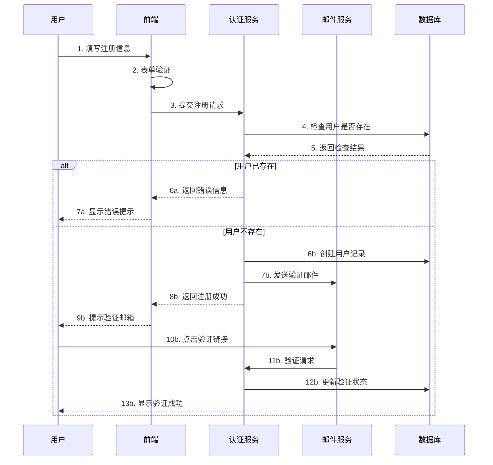
```mermaid
sequenceDiagram
    participant U as 用户
    participant F as 前端
    participant A as 认证服务
    participant E as 邮件服务
    participant DB as 数据库

    U->>F: 1. 填写注册信息
    F->>F: 2. 表单验证
    F->>A: 3. 提交注册请求
    A->>DB: 4. 检查用户是否存在
    DB-->>A: 5. 返回检查结果
    
    alt 用户已存在
        A-->>F: 6a. 返回错误信息
        F-->>U: 7a. 显示错误提示
    else 用户不存在
        A->>DB: 6b. 创建用户记录
        A->>E: 7b. 发送验证邮件
        A-->>F: 8b. 返回注册成功
        F-->>U: 9b. 提示验证邮箱
        U->>E: 10b. 点击验证链接
        E->>A: 11b. 验证请求
        A->>DB: 12b. 更新验证状态
        A-->>U: 13b. 显示验证成功
    end
```

### 1.2 用户登录流程

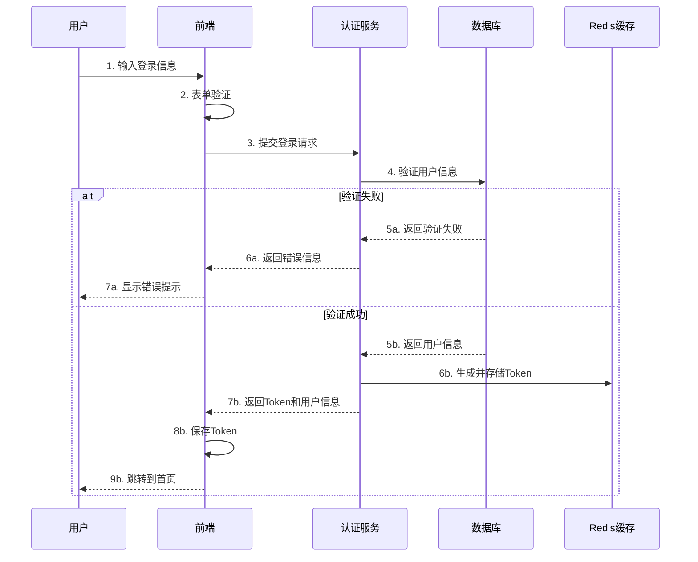
```mermaid
sequenceDiagram
    participant U as 用户
    participant F as 前端
    participant A as 认证服务
    participant DB as 数据库
    participant R as Redis缓存

    U->>F: 1. 输入登录信息
    F->>F: 2. 表单验证
    F->>A: 3. 提交登录请求
    A->>DB: 4. 验证用户信息
    
    alt 验证失败
        DB-->>A: 5a. 返回验证失败
        A-->>F: 6a. 返回错误信息
        F-->>U: 7a. 显示错误提示
    else 验证成功
        DB-->>A: 5b. 返回用户信息
        A->>R: 6b. 生成并存储Token
        A-->>F: 7b. 返回Token和用户信息
        F->>F: 8b. 保存Token
        F-->>U: 9b. 跳转到首页
    end
```

### 1.3 密码重置流程

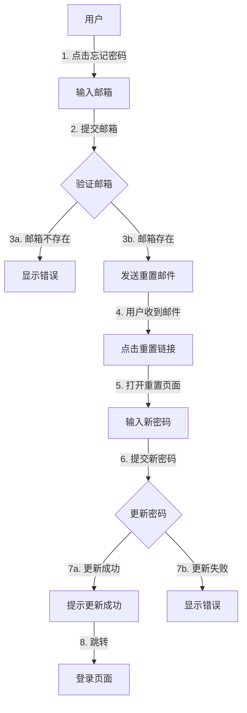
```mermaid
flowchart TD
    A[用户] -->|1. 点击忘记密码| B[输入邮箱]
    B -->|2. 提交邮箱| C{验证邮箱}
    C -->|3a. 邮箱不存在| D[显示错误]
    C -->|3b. 邮箱存在| E[发送重置邮件]
    E -->|4. 用户收到邮件| F[点击重置链接]
    F -->|5. 打开重置页面| G[输入新密码]
    G -->|6. 提交新密码| H{更新密码}
    H -->|7a. 更新成功| I[提示更新成功]
    H -->|7b. 更新失败| J[显示错误]
    I -->|8. 跳转| K[登录页面]
```

## 二、教师认证场景

### 2.1 教师认证流程

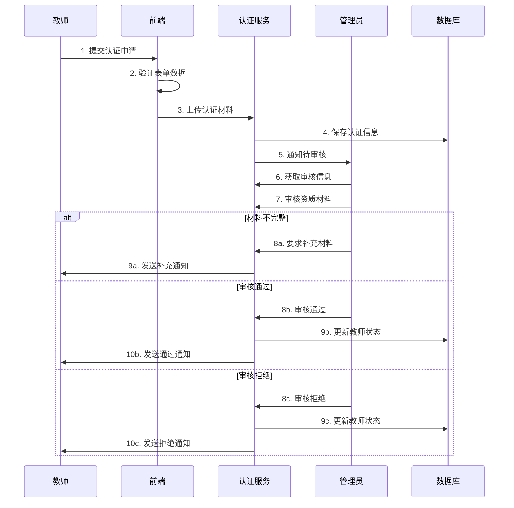
```mermaid
sequenceDiagram
    participant T as 教师
    participant F as 前端
    participant V as 认证服务
    participant A as 管理员
    participant DB as 数据库

    T->>F: 1. 提交认证申请
    F->>F: 2. 验证表单数据
    F->>V: 3. 上传认证材料
    V->>DB: 4. 保存认证信息
    V->>A: 5. 通知待审核
    
    A->>V: 6. 获取审核信息
    A->>V: 7. 审核资质材料
    
    alt 材料不完整
        A->>V: 8a. 要求补充材料
        V->>T: 9a. 发送补充通知
    else 审核通过
        A->>V: 8b. 审核通过
        V->>DB: 9b. 更新教师状态
        V->>T: 10b. 发送通过通知
    else 审核拒绝
        A->>V: 8c. 审核拒绝
        V->>DB: 9c. 更新教师状态
        V->>T: 10c. 发送拒绝通知
    end
```

## 三、课程预约场景

### 3.1 预约流程

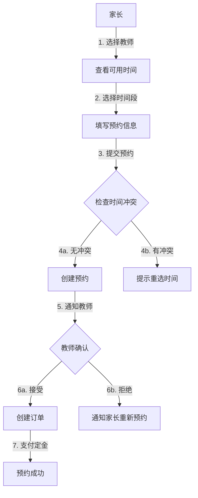
```mermaid
flowchart TD
    A[家长] -->|1. 选择教师| B[查看可用时间]
    B -->|2. 选择时间段| C[填写预约信息]
    C -->|3. 提交预约| D{检查时间冲突}
    D -->|4a. 无冲突| E[创建预约]
    D -->|4b. 有冲突| F[提示重选时间]
    E -->|5. 通知教师| G{教师确认}
    G -->|6a. 接受| H[创建订单]
    G -->|6b. 拒绝| I[通知家长重新预约]
    H -->|7. 支付定金| J[预约成功]
```

### 3.2 课程确认流程

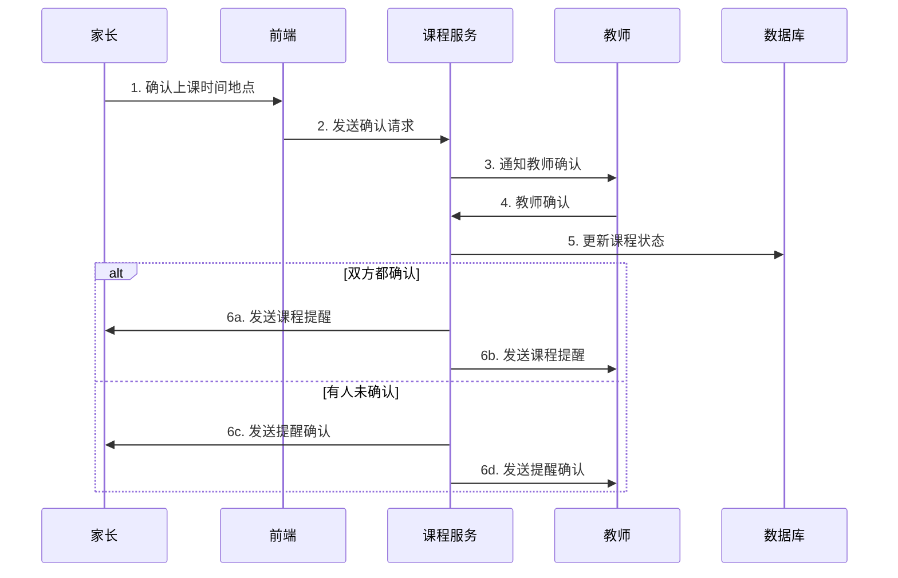
```mermaid
sequenceDiagram
    participant P as 家长
    participant F as 前端
    participant S as 课程服务
    participant T as 教师
    participant DB as 数据库

    P->>F: 1. 确认上课时间地点
    F->>S: 2. 发送确认请求
    S->>T: 3. 通知教师确认
    T->>S: 4. 教师确认
    S->>DB: 5. 更新课程状态
    
    alt 双方都确认
        S->>P: 6a. 发送课程提醒
        S->>T: 6b. 发送课程提醒
    else 有人未确认
        S->>P: 6c. 发送提醒确认
        S->>T: 6d. 发送提醒确认
    end
```

## 四、支付场景

### 4.1 支付流程

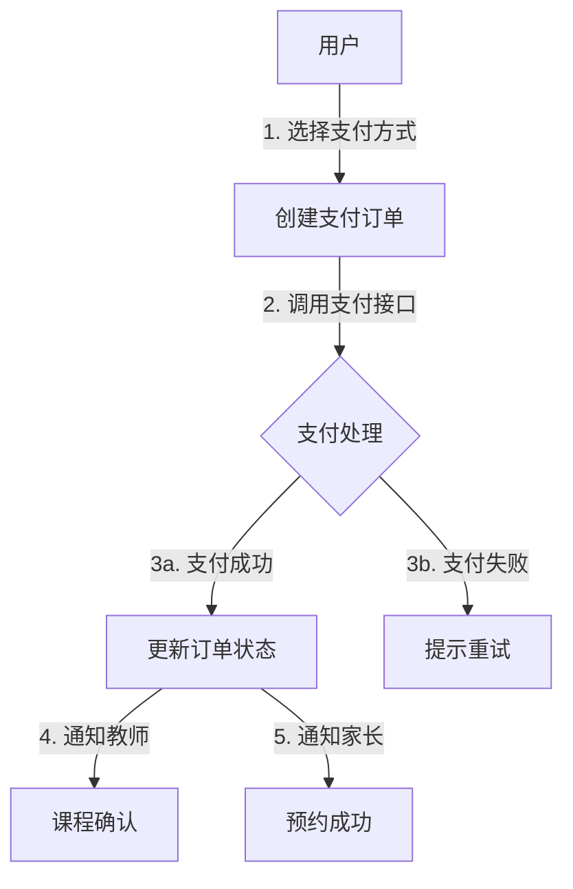
```mermaid
flowchart TD
    A[用户] -->|1. 选择支付方式| B[创建支付订单]
    B -->|2. 调用支付接口| C{支付处理}
    C -->|3a. 支付成功| D[更新订单状态]
    C -->|3b. 支付失败| E[提示重试]
    D -->|4. 通知教师| F[课程确认]
    D -->|5. 通知家长| G[预约成功]
```

## 五、评价反馈场景

### 5.1 课后评价流程

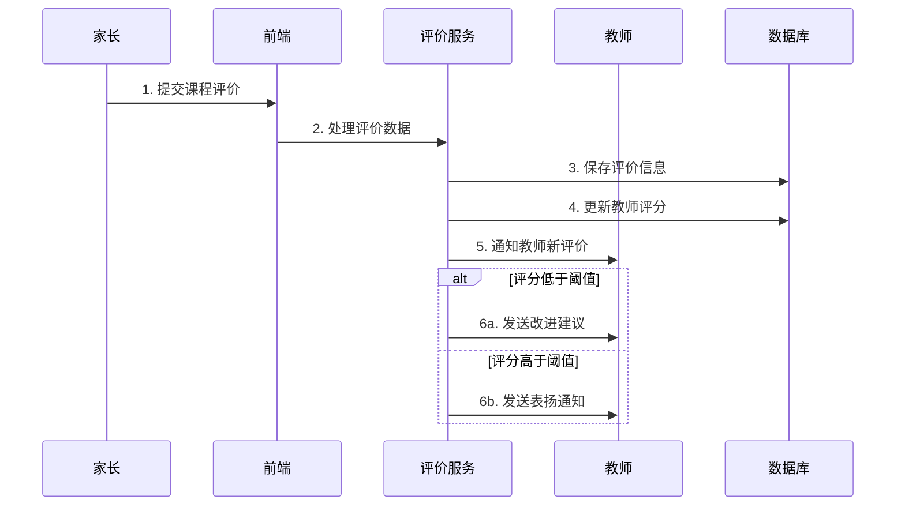
```mermaid
sequenceDiagram
    participant P as 家长
    participant F as 前端
    participant S as 评价服务
    participant T as 教师
    participant DB as 数据库

    P->>F: 1. 提交课程评价
    F->>S: 2. 处理评价数据
    S->>DB: 3. 保存评价信息
    S->>DB: 4. 更新教师评分
    S->>T: 5. 通知教师新评价
    
    alt 评分低于阈值
        S->>T: 6a. 发送改进建议
    else 评分高于阈值
        S->>T: 6b. 发送表扬通知
    end
```

## 六、智能推荐场景

### 6.1 教师推荐流程

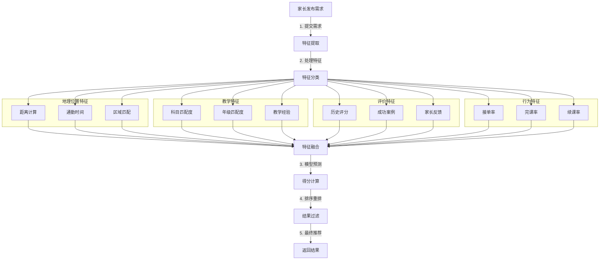
```mermaid
flowchart TD
    A[家长发布需求] -->|1. 提交需求| B[特征提取]
    B -->|2. 处理特征| C[特征分类]
    
    subgraph 地理位置特征
        D1[距离计算]
        D2[通勤时间]
        D3[区域匹配]
    end
    
    subgraph 教学特征
        E1[科目匹配度]
        E2[年级匹配度]
        E3[教学经验]
    end
    
    subgraph 评价特征
        F1[历史评分]
        F2[成功案例]
        F3[家长反馈]
    end
    
    subgraph 行为特征
        G1[接单率]
        G2[完课率]
        G3[续课率]
    end
    
    C --> D1
    C --> D2
    C --> D3
    C --> E1
    C --> E2
    C --> E3
    C --> F1
    C --> F2
    C --> F3
    C --> G1
    C --> G2
    C --> G3
    
    D1 --> H[特征融合]
    D2 --> H
    D3 --> H
    E1 --> H
    E2 --> H
    E3 --> H
    F1 --> H
    F2 --> H
    F3 --> H
    G1 --> H
    G2 --> H
    G3 --> H
    
    H -->|3. 模型预测| I[得分计算]
    I -->|4. 排序重排| J[结果过滤]
    J -->|5. 最终推荐| K[返回结果]
```

### 6.2 实时匹配流程

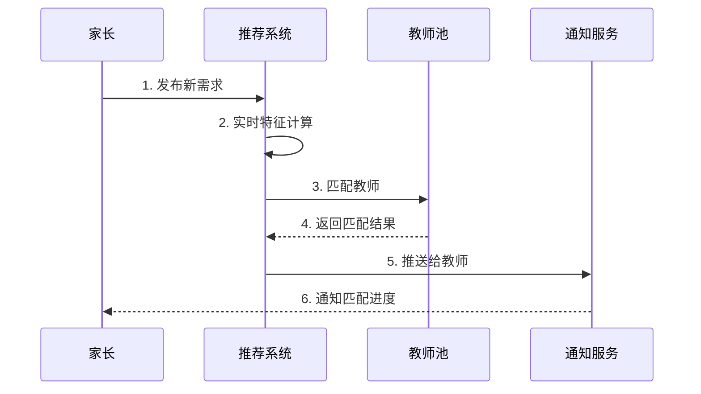
```mermaid
sequenceDiagram
    participant P as 家长
    participant R as 推荐系统
    participant T as 教师池
    participant N as 通知服务

    P->>R: 1. 发布新需求
    R->>R: 2. 实时特征计算
    R->>T: 3. 匹配教师
    T-->>R: 4. 返回匹配结果
    R->>N: 5. 推送给教师
    N-->>P: 6. 通知匹配进度
```

## 七、数据安全场景

### 7.1 数据访问控制

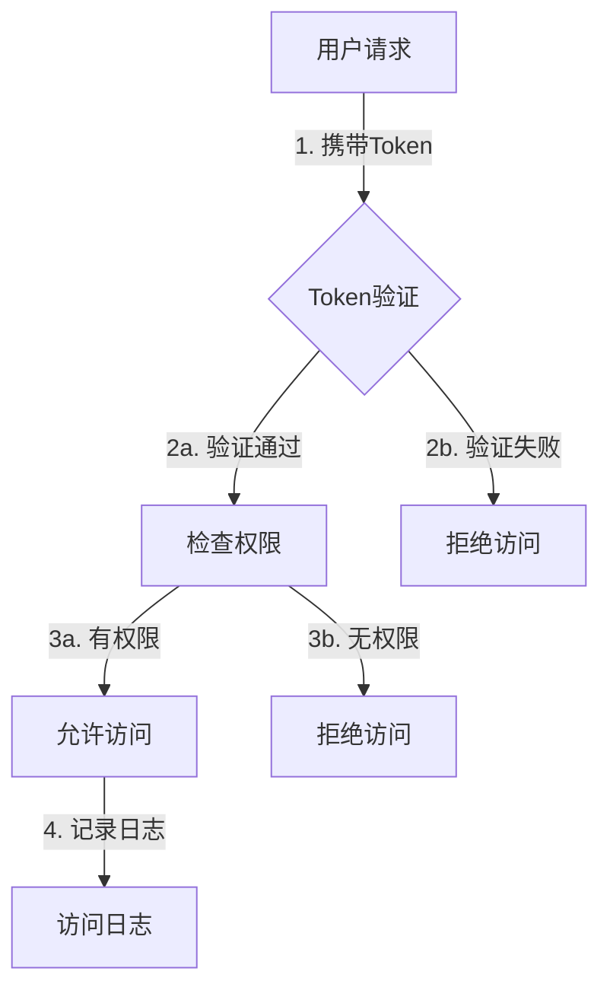
```mermaid
flowchart TD
    A[用户请求] -->|1. 携带Token| B{Token验证}
    B -->|2a. 验证通过| C[检查权限]
    B -->|2b. 验证失败| D[拒绝访问]
    C -->|3a. 有权限| E[允许访问]
    C -->|3b. 无权限| F[拒绝访问]
    E -->|4. 记录日志| G[访问日志]
```

## 八、消息通知场景

### 8.1 消息推送流程

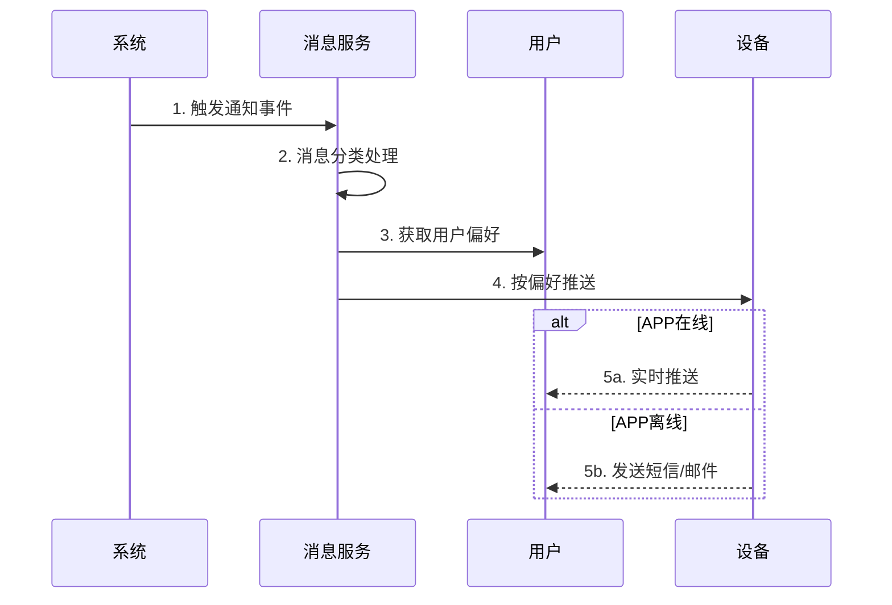
```mermaid
sequenceDiagram
    participant S as 系统
    participant N as 消息服务
    participant U as 用户
    participant D as 设备

    S->>N: 1. 触发通知事件
    N->>N: 2. 消息分类处理
    N->>U: 3. 获取用户偏好
    N->>D: 4. 按偏好推送
    
    alt APP在线
        D-->>U: 5a. 实时推送
    else APP离线
        D-->>U: 5b. 发送短信/邮件
    end
```

## 九、核心业务场景

### 9.1 家长发布需求完整流程

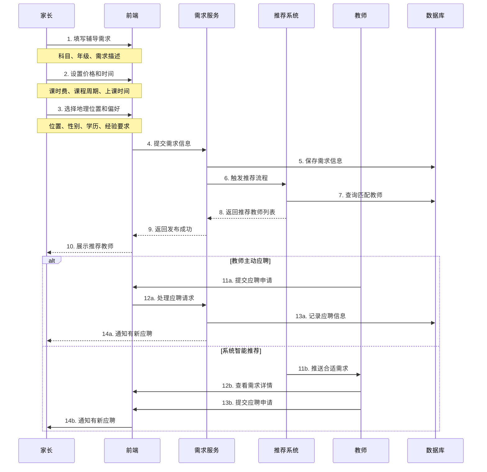
```mermaid
sequenceDiagram
    participant P as 家长
    participant F as 前端
    participant S as 需求服务
    participant R as 推荐系统
    participant T as 教师
    participant DB as 数据库

    P->>F: 1. 填写辅导需求
    Note over P,F: 科目、年级、需求描述
    P->>F: 2. 设置价格和时间
    Note over P,F: 课时费、课程周期、上课时间
    P->>F: 3. 选择地理位置和偏好
    Note over P,F: 位置、性别、学历、经验要求
    F->>S: 4. 提交需求信息
    S->>DB: 5. 保存需求信息
    S->>R: 6. 触发推荐流程
    R->>DB: 7. 查询匹配教师
    R-->>S: 8. 返回推荐教师列表
    S-->>F: 9. 返回发布成功
    F-->>P: 10. 展示推荐教师
    
    alt 教师主动应聘
        T->>F: 11a. 提交应聘申请
        F->>S: 12a. 处理应聘请求
        S->>DB: 13a. 记录应聘信息
        S-->>P: 14a. 通知有新应聘
    else 系统智能推荐
        R->>T: 11b. 推送合适需求
        T->>F: 12b. 查看需求详情
        T->>F: 13b. 提交应聘申请
        F->>P: 14b. 通知有新应聘
    end
```

### 9.2 试听课程详细流程

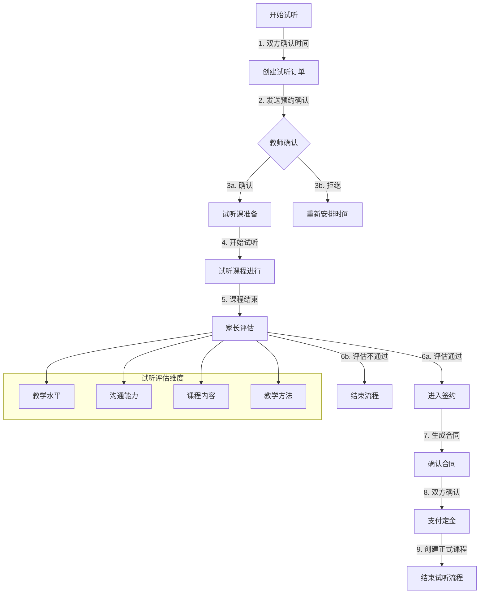
```mermaid
flowchart TD
    A[开始试听] -->|1. 双方确认时间| B[创建试听订单]
    B -->|2. 发送预约确认| C{教师确认}
    C -->|3a. 确认| D[试听课准备]
    C -->|3b. 拒绝| E[重新安排时间]
    D -->|4. 开始试听| F[试听课程进行]
    F -->|5. 课程结束| G[家长评估]
    
    G -->|6a. 评估通过| H[进入签约]
    G -->|6b. 评估不通过| I[结束流程]
    
    H -->|7. 生成合同| J[确认合同]
    J -->|8. 双方确认| K[支付定金]
    K -->|9. 创建正式课程| L[结束试听流程]
    
    subgraph 试听评估维度
        M[教学水平]
        N[沟通能力]
        O[课程内容]
        P[教学方法]
    end
    
    G --> M
    G --> N
    G --> O
    G --> P
```

### 9.3 智能推荐详细流程


```mermaid
flowchart TD
    A[接收推荐请求] -->|1. 特征提取| B[特征处理]
    B -->|2. 多维度特征| C[特征分类]
    
    subgraph 地理位置特征
        D1[距离计算]
        D2[通勤时间]
        D3[区域匹配]
    end
    
    subgraph 教学特征
        E1[科目匹配度]
        E2[年级匹配度]
        E3[教学经验]
    end
    
    subgraph 评价特征
        F1[历史评分]
        F2[成功案例]
        F3[家长反馈]
    end
    
    subgraph 行为特征
        G1[接单率]
        G2[完课率]
        G3[续课率]
    end
    
    C --> D1
    C --> D2
    C --> D3
    C --> E1
    C --> E2
    C --> E3
    C --> F1
    C --> F2
    C --> F3
    C --> G1
    C --> G2
    C --> G3
    
    D1 --> H[特征融合]
    D2 --> H
    D3 --> H
    E1 --> H
    E2 --> H
    E3 --> H
    F1 --> H
    F2 --> H
    F3 --> H
    G1 --> H
    G2 --> H
    G3 --> H
    
    H -->|3. 模型预测| I[得分计算]
    I -->|4. 排序重排| J[结果过滤]
    J -->|5. 最终推荐| K[返回结果]
```

### 9.4 签约与支付流程

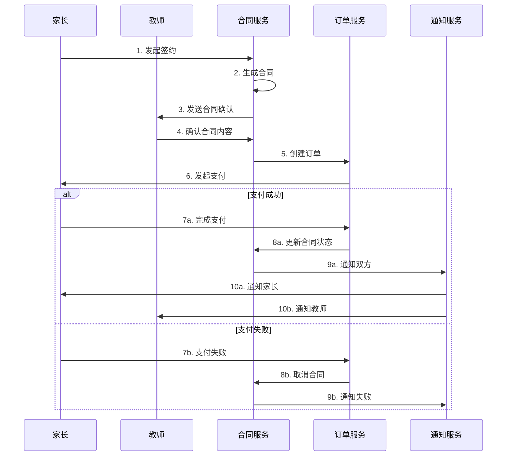
```mermaid
sequenceDiagram
    participant P as 家长
    participant T as 教师
    participant C as 合同服务
    participant O as 订单服务
    participant N as 通知服务
    
    P->>C: 1. 发起签约
    C->>C: 2. 生成合同
    C->>T: 3. 发送合同确认
    T->>C: 4. 确认合同内容
    C->>O: 5. 创建订单
    O->>P: 6. 发起支付
    
    alt 支付成功
        P->>O: 7a. 完成支付
        O->>C: 8a. 更新合同状态
        C->>N: 9a. 通知双方
        N->>P: 10a. 通知家长
        N->>T: 10b. 通知教师
    else 支付失败
        P->>O: 7b. 支付失败
        O->>C: 8b. 取消合同
        C->>N: 9b. 通知失败
    end
```

### 9.5 课程管理流程

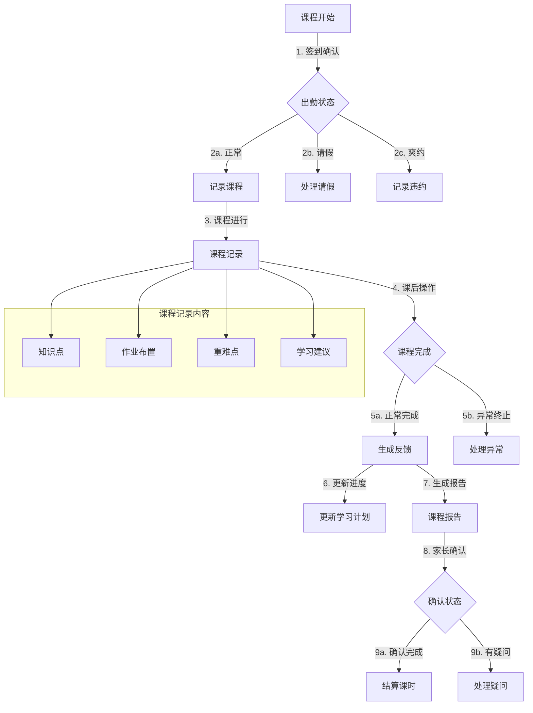
```mermaid
flowchart TD
    A[课程开始] -->|1. 签到确认| B{出勤状态}
    B -->|2a. 正常| C[记录课程]
    B -->|2b. 请假| D[处理请假]
    B -->|2c. 爽约| E[记录违约]
    
    C -->|3. 课程进行| F[课程记录]
    F -->|4. 课后操作| G{课程完成}
    
    G -->|5a. 正常完成| H[生成反馈]
    G -->|5b. 异常终止| I[处理异常]
    
    H -->|6. 更新进度| J[更新学习计划]
    H -->|7. 生成报告| K[课程报告]
    
    K -->|8. 家长确认| L{确认状态}
    L -->|9a. 确认完成| M[结算课时]
    L -->|9b. 有疑问| N[处理疑问]
    
    subgraph 课程记录内容
        O[知识点]
        P[作业布置]
        Q[重难点]
        R[学习建议]
    end
    
    F --> O
    F --> P
    F --> Q
    F --> R
```

## 十、管理员场景

### 10.1 教师资质审核流程

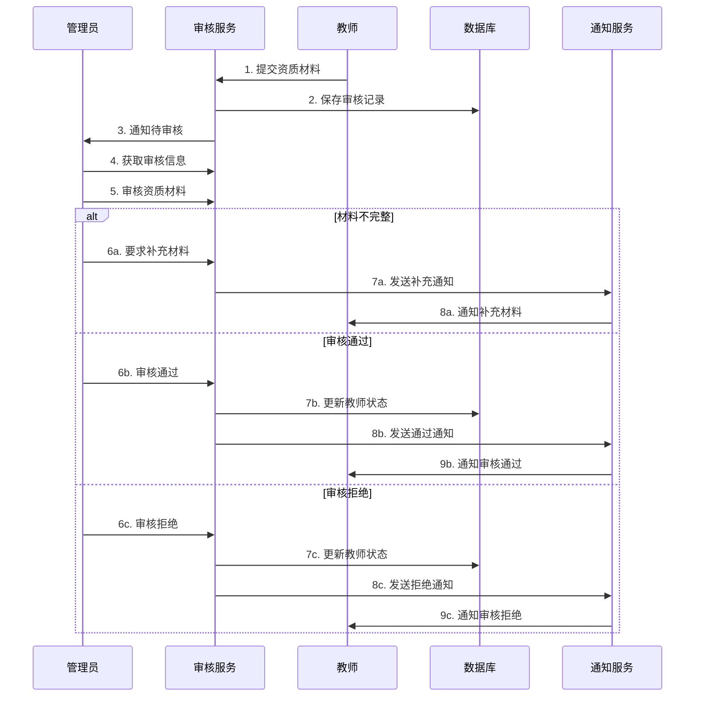
```mermaid
sequenceDiagram
    participant A as 管理员
    participant V as 审核服务
    participant T as 教师
    participant DB as 数据库
    participant N as 通知服务

    T->>V: 1. 提交资质材料
    V->>DB: 2. 保存审核记录
    V->>A: 3. 通知待审核
    
    A->>V: 4. 获取审核信息
    A->>V: 5. 审核资质材料
    
    alt 材料不完整
        A->>V: 6a. 要求补充材料
        V->>N: 7a. 发送补充通知
        N->>T: 8a. 通知补充材料
    else 审核通过
        A->>V: 6b. 审核通过
        V->>DB: 7b. 更新教师状态
        V->>N: 8b. 发送通过通知
        N->>T: 9b. 通知审核通过
    else 审核拒绝
        A->>V: 6c. 审核拒绝
        V->>DB: 7c. 更新教师状态
        V->>N: 8c. 发送拒绝通知
        N->>T: 9c. 通知审核拒绝
    end
```

### 10.2 需求帖子审核流程

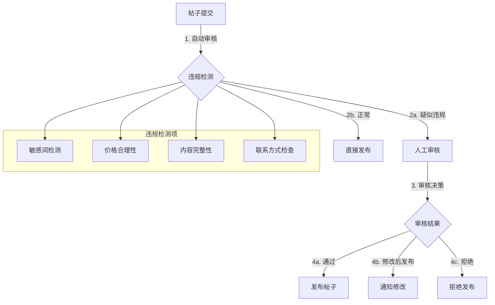
```mermaid
flowchart TD
    A[帖子提交] -->|1. 自动审核| B{违规检测}
    B -->|2a. 疑似违规| C[人工审核]
    B -->|2b. 正常| D[直接发布]
    
    C -->|3. 审核决策| E{审核结果}
    E -->|4a. 通过| F[发布帖子]
    E -->|4b. 修改后发布| G[通知修改]
    E -->|4c. 拒绝| H[拒绝发布]
    
    subgraph 违规检测项
        I[敏感词检测]
        J[价格合理性]
        K[内容完整性]
        L[联系方式检查]
    end
    
    B --> I
    B --> J
    B --> K
    B --> L
```

### 10.3 投诉处理流程

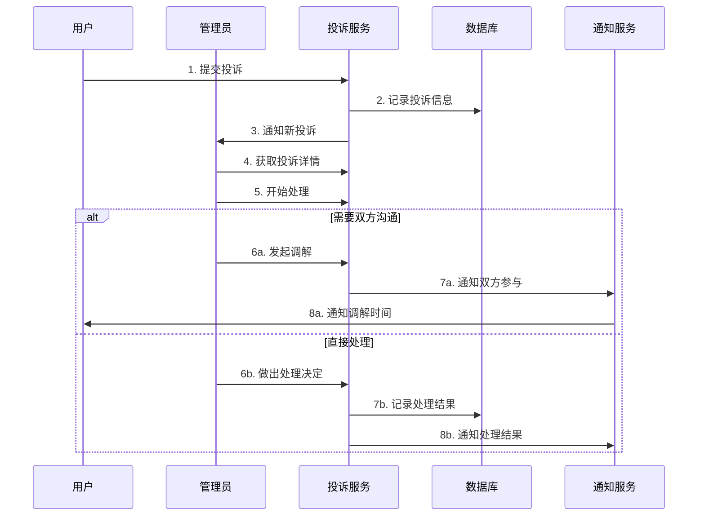
```mermaid
sequenceDiagram
    participant U as 用户
    participant A as 管理员
    participant C as 投诉服务
    participant DB as 数据库
    participant N as 通知服务

    U->>C: 1. 提交投诉
    C->>DB: 2. 记录投诉信息
    C->>A: 3. 通知新投诉
    
    A->>C: 4. 获取投诉详情
    A->>C: 5. 开始处理
    
    alt 需要双方沟通
        A->>C: 6a. 发起调解
        C->>N: 7a. 通知双方参与
        N->>U: 8a. 通知调解时间
    else 直接处理
        A->>C: 6b. 做出处理决定
        C->>DB: 7b. 记录处理结果
        C->>N: 8b. 通知处理结果
    end
```

### 10.4 平台数据监控

```mermaid
flowchart TD
    A[数据监控] -->|1. 实时数据| B[业务监控]
    A -->|2. 统计数据| C[运营分析]
    
    subgraph 实时监控
        B --> D[订单监控]
        B --> E[用户行为]
        B --> F[系统性能]
        B --> G[异常告警]
    end
    
    subgraph 运营分析
        C --> H[用户增长]
        C --> I[交易数据]
        C --> J[转化率]
        C --> K[留存率]
    end
    
    subgraph 告警处理
        L[告警触发]
        M[通知相关人]
        N[处理流程]
        O[结果反馈]
    end
    
    G --> L
    L --> M
    M --> N
    N --> O
```

### 10.5 系统配置管理

```mermaid
flowchart TD
    A[系统配置] -->|1. 基础配置| B[参数管理]
    A -->|2. 业务配置| C[规则管理]
    A -->|3. 权限配置| D[角色管理]
    
    subgraph 参数管理
        B --> E[平台费率]
        B --> F[提现限额]
        B --> G[保证金额]
    end
    
    subgraph 规则管理
        C --> H[匹配规则]
        C --> I[佣金规则]
        C --> J[信用规则]
    end
    
    subgraph 角色管理
        D --> K[权限分配]
        D --> L[操作审计]
        D --> M[访问控制]
    end
```

### 10.6 运营活动管理

```mermaid
sequenceDiagram
    participant A as 管理员
    participant O as 运营服务
    participant U as 用户群组
    participant N as 通知服务
    participant S as 统计服务

    A->>O: 1. 创建活动
    O->>O: 2. 设置活动规则
    O->>U: 3. 确定目标用户
    
    alt 定向活动
        O->>N: 4a. 定向推送
        N->>U: 5a. 通知特定用户
    else 全平台活动
        O->>N: 4b. 全平台推送
        N->>U: 5b. 通知所有用户
    end
    
    O->>S: 6. 监控活动数据
    S-->>A: 7. 活动效果分析
    
    A->>O: 8. 调整活动策略
```

## 十一、评价与申诉场景

### 11.1 评价管理流程

```mermaid
sequenceDiagram
    participant P as 家长
    participant T as 教师
    participant R as 评价服务
    participant M as 管理员
    participant DB as 数据库
    participant N as 通知服务

    P->>R: 1. 提交课程评价
    R->>R: 2. 评价内容检查
    
    alt 包含敏感内容
        R->>M: 3a. 转人工审核
        M->>R: 4a. 审核决定
    else 内容正常
        R->>DB: 3b. 直接发布
        R->>T: 4b. 通知教师
    end
    
    R->>DB: 5. 更新教师评分
    
    alt 评分变化显著
        R->>M: 6a. 通知管理员
        M->>R: 7a. 人工复核
    else 评分变化正常
        R->>DB: 6b. 仅更新记录
    end
    
    T->>R: 8. 查看评价
    
    alt 申请删除
        T->>R: 9a. 提交删除申请
        R->>M: 10a. 管理员审核
        M->>R: 11a. 审核结果
        R->>T: 12a. 通知结果
    else 回复评价
        T->>R: 9b. 提交回复
        R->>DB: 10b. 保存回复
        R->>P: 11b. 通知家长
    end
```

### 11.2 申诉处理流程

```mermaid
flowchart TD
    A[提交申诉] -->|1. 选择申诉类型| B{申诉分类}
    
    B -->|2a. 评价申诉| C[评价相关]
    B -->|2b. 课程申诉| D[课程相关]
    B -->|2c. 费用申诉| E[费用相关]
    B -->|2d. 其他申诉| F[其他问题]
    
    subgraph 评价申诉处理
        C --> C1[评价核实]
        C1 --> C2{核实结果}
        C2 -->|有效申诉| C3[修改评价]
        C2 -->|无效申诉| C4[维持评价]
    end
    
    subgraph 课程申诉处理
        D --> D1[课程记录核查]
        D1 --> D2[双方沟通]
        D2 --> D3{处理方案}
        D3 -->|补偿方案| D4[执行补偿]
        D3 -->|调整方案| D5[课程调整]
    end
    
    subgraph 费用申诉处理
        E --> E1[账单核查]
        E1 --> E2[费用核算]
        E2 --> E3{处理决定}
        E3 -->|退费| E4[退费处理]
        E3 -->|补差| E5[补差处理]
    end
    
    C3 --> G[执行处理]
    C4 --> G
    D4 --> G
    D5 --> G
    E4 --> G
    E5 --> G
    F --> G
    
    G --> H[通知结果]
    H --> I[更新记录]
```

### 11.3 评分计算流程

```mermaid
sequenceDiagram
    participant R as 评价服务
    participant C as 计算服务
    participant DB as 数据库
    participant N as 通知服务

    R->>C: 1. 触发评分计算
    C->>DB: 2. 获取历史评价
    
    C->>C: 3. 计算基础分
    Note over C: 计算各维度基础分
    
    C->>DB: 4. 获取权重因子
    Note over C: 获取时间衰减等权重
    
    C->>C: 5. 加权计算
    Note over C: 计算最终评分
    
    C->>DB: 6. 更新教师评分
    
    alt 评分变化显著
        C->>N: 7a. 通知教师
        C->>N: 8a. 通知管理员
    else 评分变化正常
        C->>DB: 7b. 仅更新记录
    end
```

### 11.4 评价奖惩机制

```mermaid
flowchart TD
    A[评价统计] -->|1. 定期统计| B{评价分析}
    
    B -->|2a. 优秀评价| C[奖励机制]
    B -->|2b. 差评预警| D[预警机制]
    
    subgraph 奖励机制
        C --> C1[展示优先]
        C --> C2[降低费率]
        C --> C3[荣誉徽章]
    end
    
    subgraph 预警机制
        D --> D1[系统预警]
        D --> D2[限制接单]
        D --> D3[强制培训]
    end
    
    C1 --> E[执行奖惩]
    C2 --> E
    C3 --> E
    D1 --> E
    D2 --> E
    D3 --> E
    
    E -->|3. 通知相关方| F[结果通知]
    F -->|4. 记录存档| G[更新记录]
```

## 十二、核心招聘流程场景

### 12.1 家长主动招聘流程

```mermaid
sequenceDiagram
    participant P as 家长
    participant F as 前端
    participant S as 搜索服务
    participant T as 教师
    participant C as 契约服务
    participant N as 通知服务
    participant DB as 数据库
    
    P->>F: 1. 浏览教师列表
    F->>S: 2. 获取教师信息
    S->>DB: 3. 查询教师数据
    DB-->>S: 4. 返回教师列表
    S-->>F: 5. 返回筛选结果
    
    Note over P,F: 可按地区、科目、评分等筛选
    
    P->>F: 6. 查看教师详情
    F->>DB: 7. 获取详细信息
    DB-->>F: 8. 返回教师资料
    
    P->>F: 9. 发送招聘邀请
    F->>N: 10. 创建邀请
    N->>T: 11. 通知教师
    
    alt 教师接受邀请
        T->>F: 12a. 确认接受
        F->>C: 13a. 创建契约
        C->>P: 14a. 通知签约
        C->>T: 15a. 通知签约
    else 教师拒绝邀请
        T->>F: 12b. 拒绝邀请
        F->>N: 13b. 更新状态
        N->>P: 14b. 通知家长
    end
```

### 12.2 契约签订流程

```mermaid
flowchart TD
    A[开始签约] -->|1. 生成契约| B[契约草案]
    
    subgraph 契约内容确认
        B --> C[课程安排确认]
        B --> D[费用标准确认]
        B --> E[其他条款确认]
        
        C --> F{双方确认}
        D --> F
        E --> F
    end
    
    F -->|2a. 需要修改| G[修改契约]
    G --> B
    
    F -->|2b. 双方同意| H[正式签约]
    
    H -->|3. 支付定金| I{支付状态}
    I -->|4a. 支付成功| J[生效契约]
    I -->|4b. 支付失败| K[支付重试]
    K --> I
    
    J -->|5. 创建课程| L[排课安排]
    L -->|6. 通知双方| M[开始上课]
```

### 12.3 双向智能推荐流程

```mermaid
sequenceDiagram
    participant P as 家长
    participant T as 教师
    participant R as 推荐系统
    participant M as 匹配服务
    participant DB as 数据库
    participant N as 通知服务
    
    par 家长端推荐
        P->>R: 1a. 发布需求
        R->>M: 2a. 特征提取
        M->>DB: 3a. 教师匹配
        
        par 多维度匹配
            M->>M: 4a1. 地理位置匹配
            M->>M: 4a2. 科目匹配
            M->>M: 4a3. 评价匹配
            M->>M: 4a4. 协同过滤
        end
        
        M->>R: 5a. 返回匹配结果
        R->>P: 6a. 展示推荐教师
    and 教师端推荐
        T->>R: 1b. 查看需求
        R->>M: 2b. 特征提取
        M->>DB: 3b. 需求匹配
        
        par 多维度匹配
            M->>M: 4b1. 地理位置匹配
            M->>M: 4b2. 教学能力匹配
            M->>M: 4b3. 时间匹配
            M->>M: 4b4. 价格匹配
        end
        
        M->>R: 5b. 返回匹配结果
        R->>T: 6b. 展示推荐需求
    end

    alt 家长选择教师
        P->>R: 7a. 选择教师
        R->>N: 8a. 通知教师
        N->>T: 9a. 发送邀请
    else 教师选择需求
        T->>R: 7b. 选择需求
        R->>N: 8b. 通知家长
        N->>P: 9b. 发送应聘
    end
```

### 12.4 智能匹配评分机制

```mermaid
flowchart TD
    A[开始匹配] -->|1. 获取数据| B[数据预处理]
    
    subgraph 地理位置评分
        C1[距离计算]
        C2[通勤时间]
        C3[区域偏好]
        C1 --> C4[位置得分]
        C2 --> C4
        C3 --> C4
    end
    
    subgraph 教学匹配评分
        D1[科目匹配度]
        D2[年级匹配度]
        D3[教学经验]
        D1 --> D4[教学得分]
        D2 --> D4
        D3 --> D4
    end
    
    subgraph 时间价格评分
        E1[时间重叠度]
        E2[价格匹配度]
        E3[课时匹配]
        E1 --> E4[匹配得分]
        E2 --> E4
        E3 --> E4
    end
    
    subgraph 历史数据评分
        F1[历史评价]
        F2[完成率]
        F3[续课率]
        F1 --> F4[历史得分]
        F2 --> F4
        F3 --> F4
    end
    
    B --> C1
    B --> D1
    B --> E1
    B --> F1
    
    C4 --> G[综合评分]
    D4 --> G
    E4 --> G
    F4 --> G
    
    G -->|2. 排序| H[结果排序]
    H -->|3. 筛选| I[最终推荐]
```

## 十三、个人中心场景

### 13.1 家长个人中心

```mermaid
flowchart TD
    A[家长个人中心] --> B[个人信息管理]
    A --> C[帖子管理]
    A --> D[收藏管理]
    A --> E[订单管理]
    A --> F[评价管理]
    A --> G[支付管理]
    
    subgraph 个人信息模块
        B --> B1[基础信息维护]
        B --> B2[孩子信息管理]
        B --> B3[联系方式管理]
        B --> B4[地址管理]
    end
    
    subgraph 帖子管理模块
        C --> C1[发布新帖]
        C --> C2[帖子状态查看]
        C --> C3[帖子编辑]
        C --> C4[帖子关闭]
    end
    
    subgraph 收藏管理模块
        D --> D1[收藏教师]
        D --> D2[取消收藏]
        D --> D3[收藏列表]
        D --> D4[快速联系]
    end
    
    subgraph 订单管理模块
        E --> E1[订单列表]
        E --> E2[订单详情]
        E --> E3[订单状态]
        E --> E4[订单评价]
    end
    
    subgraph 评价管理模块
        F --> F1[评价列表]
        F --> F2[评价编辑]
        F --> F3[评价回复]
        F --> F4[申诉处理]
    end
    
    subgraph 支付管理模块
        G --> G1[支付记录]
        G --> G2[退款申请]
        G --> G3[发票管理]
        G --> G4[账户余额]
    end
```

### 13.2 教师个人中心

```mermaid
flowchart TD
    A[教师个人中心] --> B[个人信息管理]
    A --> C[应聘管理]
    A --> D[收藏管理]
    A --> E[课程管理]
    A --> F[评价管理]
    A --> G[收入管理]
    
    subgraph 个人信息模块
        B --> B1[基础信息维护]
        B --> B2[资质证书管理]
        B --> B3[教学经历]
        B --> B4[可教科目]
    end
    
    subgraph 应聘管理模块
        C --> C1[应聘记录]
        C --> C2[面试安排]
        C --> C3[试讲记录]
        C --> C4[签约状态]
    end
    
    subgraph 收藏管理模块
        D --> D1[收藏需求]
        D --> D2[取消收藏]
        D --> D3[收藏列表]
        D --> D4[快速应聘]
    end
    
    subgraph 课程管理模块
        E --> E1[课程表]
        E --> E2[课程记录]
        E --> E3[课程调整]
        E --> E4[请假管理]
    end
    
    subgraph 评价管理模块
        F --> F1[评价列表]
        F --> F2[评价回复]
        F --> F3[申诉处理]
        F --> F4[评分统计]
    end
    
    subgraph 收入管理模块
        G --> G1[收入明细]
        G --> G2[提现管理]
        G --> G3[发票管理]
        G --> G4[收入统计]
    end
```

### 13.3 管理员个人中心

```mermaid
sequenceDiagram
    participant A as 管理员
    participant S as 系统
    participant U as 用户服务
    participant C as 内容服务
    participant F as 反馈服务
    participant DB as 数据库
    
    rect rgb(200, 220, 240)
    Note over A,DB: 系统配置管理
        A->>S: 1. 访问系统配置
        S->>DB: 2. 获取配置项
        DB-->>S: 3. 返回配置
        A->>S: 4. 修改配置
        S->>DB: 5. 更新配置
        Note over S: 配置生效
    end
    
    rect rgb(220, 240, 200)
    Note over A,DB: 用户管理
        A->>U: 6. 查询用户
        U->>DB: 7. 获取用户数据
        DB-->>U: 8. 返回用户列表
        A->>U: 9. 用户操作
        alt 封禁用户
            U->>DB: 10a. 更新状态
            U->>S: 11a. 强制登出
        else 解除封禁
            U->>DB: 10b. 恢复状态
            U->>S: 11b. 发送通知
        end
    end
    
    rect rgb(240, 220, 220)
    Note over A,DB: 内容审核
        A->>C: 12. 获取待审内容
        C->>DB: 13. 查询内容
        DB-->>C: 14. 返回内容列表
        A->>C: 15. 审核决定
        alt 通过审核
            C->>DB: 16a. 更新状态
            C->>S: 17a. 内容发布
        else 拒绝通过
            C->>DB: 16b. 标记违规
            C->>S: 17b. 发送通知
        end
    end
    
    rect rgb(240, 240, 200)
    Note over A,DB: 反馈处理
        A->>F: 18. 获取反馈列表
        F->>DB: 19. 查询反馈
        DB-->>F: 20. 返回反馈数据
        A->>F: 21. 处理反馈
        F->>DB: 22. 更新状态
        F->>S: 23. 发送处理结果
    end
```

### 13.4 个人中心权限控制

```mermaid
flowchart TD
    A[权限控制] --> B[角色定义]
    A --> C[功能权限]
    A --> D[数据权限]
    A --> E[操作权限]
    
    subgraph 角色管理
        B --> B1[家长角色]
        B --> B2[教师角色]
        B --> B3[管理员角色]
        B --> B4[超级管理员]
    end
    
    subgraph 功能权限
        C --> C1[菜单访问]
        C --> C2[功能操作]
        C --> C3[特殊功能]
    end
    
    subgraph 数据权限
        D --> D1[数据可见性]
        D --> D2[数据操作权]
        D --> D3[敏感数据]
    end
    
    subgraph 操作权限
        E --> E1[创建权限]
        E --> E2[修改权限]
        E --> E3[删除权限]
        E --> E4[审核权限]
    end
```

## 十四、即时通讯场景

### 14.1 消息列表管理

```mermaid
flowchart TD
    A[消息中心] --> B[最近联系人]
    A --> C[未读消息]
    A --> D[消息分类]
    A --> E[消息搜索]
    
    subgraph 最近联系人管理
        B --> B1[契约关系用户]
        B --> B2[应聘关系用户]
        B --> B3[收藏关系用户]
        B --> B4[置顶联系人]
    end
    
    subgraph 未读消息管理
        C --> C1[未读计数]
        C --> C2[消息提醒]
        C --> C3[一键已读]
        C --> C4[免打扰设置]
    end
    
    subgraph 消息分类管理
        D --> D1[系统通知]
        D --> D2[聊天消息]
        D --> D3[课程提醒]
        D --> D4[交易消息]
    end
    
    subgraph 搜索功能
        E --> E1[按用户搜索]
        E --> E2[按内容搜索]
        E --> E3[按时间搜索]
        E --> E4[按类型搜索]
    end
```

### 14.2 聊天功能流程

```mermaid
sequenceDiagram
    participant U1 as 用户1
    participant C as 聊天服务
    participant S as 存储服务
    participant N as 通知服务
    participant U2 as 用户2
    
    Note over U1,U2: 前置条件：已建立契约/应聘关系
    
    U1->>C: 1. 发起聊天
    C->>C: 2. 检查聊天权限
    
    alt 无聊天权限
        C-->>U1: 3a. 提示无权限
    else 有聊天权限
        C->>S: 3b. 创建/获取会话
        S-->>C: 4b. 返回会话信息
        
        loop 消息交互
            U1->>C: 5. 发送消息
            
            alt 文本消息
                C->>S: 6a. 存储文本
            else 图片消息
                C->>S: 6b. 上传图片
                S-->>C: 7b. 返回图片URL
            else 文件消息
                C->>S: 6c. 上传文件
                S-->>C: 7c. 返回文件URL
            end
            
            C->>N: 8. 推送消息
            N->>U2: 9. 实时通知
            
            U2->>C: 10. 接收消息
            C->>S: 11. 更新状态
        end
    end
```

### 14.3 历史记录管理

```mermaid
sequenceDiagram
    participant U as 用户
    participant C as 聊天服务
    participant S as 存储服务
    participant DB as 数据库
    
    U->>C: 1. 请求历史记录
    C->>DB: 2. 查询会话记录
    
    par 并行处理
        DB->>DB: 3a. 分页查询
        DB->>DB: 3b. 时间过滤
        DB->>DB: 3c. 类型过滤
    end
    
    DB-->>C: 4. 返回记录列表
    
    loop 媒体内容加载
        C->>S: 5. 获取媒体URL
        S-->>C: 6. 返回访问URL
    end
    
    C-->>U: 7. 展示历史记录
    
    alt 导出记录
        U->>C: 8a. 请求导出
        C->>S: 9a. 生成文件
        S-->>U: 10a. 下载记录
    else 删除记录
        U->>C: 8b. 删除请求
        C->>DB: 9b. 标记删除
        DB-->>U: 10b. 确认删除
    end
```

### 14.4 消息权限控制

```mermaid
flowchart TD
    A[消息权限] --> B[关系验证]
    A --> C[内容控制]
    A --> D[频率控制]
    A --> E[隐私设置]
    
    subgraph 关系验证
        B --> B1[契约关系]
        B --> B2[应聘关系]
        B --> B3[系统通知]
        B --> B4[管理员消息]
    end
    
    subgraph 内容控制
        C --> C1[敏感词过滤]
        C --> C2[文件类型限制]
        C --> C3[大小限制]
        C --> C4[格式验证]
    end
    
    subgraph 频率控制
        D --> D1[发送频率]
        D --> D2[会话限制]
        D --> D3[文件频率]
        D --> D4[图片频率]
    end
    
    subgraph 隐私设置
        E --> E1[在线状态]
        E --> E2[消息提醒]
        E --> E3[黑名单]
        E --> E4[阅读状态]
    end
```

## 十五、课程管理场景

### 15.1 学习计划制定流程

```mermaid
sequenceDiagram
    participant T as 教师
    participant P as 计划服务
    participant N as 通知服务
    participant PA as 家长
    participant DB as 数据库
    
    Note over T,PA: 前置条件：已建立契约关系
    
    T->>P: 1. 创建学习计划
    P->>DB: 2. 获取学生信息
    DB-->>P: 3. 返回基础数据
    
    T->>P: 4. 设置阶段目标
    T->>P: 5. 设置课程内容
    T->>P: 6. 设置作业计划
    
    P->>DB: 7. 保存计划
    P->>N: 8. 通知家长确认
    N->>PA: 9. 发送确认请求
    
    alt 家长确认
        PA->>P: 10a. 确认计划
        P->>DB: 11a. 更新状态
        P->>N: 12a. 通知教师
    else 家长请求修改
        PA->>P: 10b. 提出建议
        P->>T: 11b. 转发建议
        T->>P: 12b. 修改计划
        P->>PA: 13b. 重新确认
    end
```

### 15.2 知识点追踪流程

```mermaid
flowchart TD
    A[知识点管理] --> B[课堂记录]
    A --> C[掌握度评估]
    A --> D[报告生成]
    
    subgraph 课堂记录模块
        B --> B1[知识点标记]
        B --> B2[重难点记录]
        B --> B3[课堂反馈]
        B --> B4[课后总结]
    end
    
    subgraph 掌握度评估
        C --> C1[课堂表现]
        C --> C2[作业完成度]
        C --> C3[测试成绩]
        C --> C4[综合评估]
    end
    
    subgraph 报告生成
        D --> D1[数据分析]
        D --> D2[趋势分析]
        D --> D3[对比分析]
        D --> D4[建议生成]
    end
    
    B1 --> E[知识图谱]
    B2 --> E
    C4 --> E
    E --> F[学习建议]
```

### 15.3 作业管理流程

```mermaid
sequenceDiagram
    participant T as 教师
    participant H as 作业服务
    participant S as 学生
    participant P as 家长
    participant DB as 数据库
    
    T->>H: 1. 布置作业
    H->>DB: 2. 保存作业内容
    H->>S: 3. 通知学生
    H->>P: 4. 通知家长
    
    S->>H: 5. 提交作业
    H->>T: 6. 通知教师批改
    
    T->>H: 7. 批改作业
    H->>DB: 8. 保存批改结果
    
    par 错题分析
        H->>H: 9a. 统计错题
        H->>H: 9b. 分析原因
        H->>H: 9c. 生成建议
    end
    
    H->>S: 10. 反馈结果
    H->>P: 11. 通知家长
```

### 15.4 课程调度管理

```mermaid
sequenceDiagram
    participant U1 as 发起方
    participant S as 调度服务
    participant C as 日历服务
    participant U2 as 接收方
    participant DB as 数据库
    
    U1->>S: 1. 提交调课/请假申请
    S->>DB: 2. 检查课程信息
    
    par 并行处理
        DB->>DB: 3a. 分页查询
        DB->>DB: 3b. 时间过滤
        DB->>DB: 3c. 类型过滤
    end
    
    DB-->>S: 4. 返回课程信息
    
    alt 调课申请
        S->>C: 5a. 查询可用时间
        C->>S: 6a. 返回时间建议
        S->>U2: 7a. 发送调课申请
        
        alt 对方同意
            U2->>S: 8aa. 确认新时间
            S->>DB: 9aa. 更新课程
            S->>U1: 10aa. 通知确认
        else 对方拒绝
            U2->>S: 8ab. 拒绝申请
            S->>U1: 9ab. 通知重新安排
        end
        
    else 请假申请
        S->>DB: 5b. 记录请假
        S->>U2: 6b. 通知对方
        S->>C: 7b. 安排补课
        C->>S: 8b. 补课建议
        S->>U1: 9b. 确认补课
        S->>U2: 10b. 确认补课
    end
```

### 15.5 教学效果追踪

```mermaid
flowchart TD
    A[效果追踪] --> B[考试成绩]
    A --> C[学习状态]
    A --> D[家长指导]
    A --> E[评估报告]
    
    subgraph 考试成绩分析
        B --> B1[成绩记录]
        B --> B2[趋势分析]
        B --> B3[对比分析]
        B --> B4[知识点分析]
    end
    
    subgraph 学习状态评估
        C --> C1[注意力]
        C --> C2[完成质量]
        C --> C3[学习兴趣]
        C --> C4[学习习惯]
    end
    
    subgraph 家长指导方案
        D --> D1[辅导方法]
        D --> D2[沟通技巧]
        D --> D3[环境建议]
        D --> D4[习惯培养]
    end
    
    subgraph 定期评估
        E --> E1[月度总结]
        E --> E2[目标完成度]
        E --> E3[问题分析]
        E --> E4[改进计划]
    end
    
    B4 --> F[智能建议]
    C4 --> F
    D4 --> F
    E4 --> F
```

这些场景设计涵盖了课程管理的主要功能：

1. **学习计划制定**：
   - 阶段目标设置
   - 课程内容规划
   - 作业计划制定
   - 家长确认机制

2. **知识点追踪**：
   - 课堂记录管理
   - 掌握度评估
   - 知识图谱构建
   - 报告生成

3. **作业管理**：
   - 作业布置和提交
   - 批改和反馈
   - 错题分析
   - 结果通知

4. **课程调度**：
   - 调课申请流程
   - 请假管理
   - 补课安排
   - 时间协调

5. **教学效果追踪**：
   - 考试成绩分析
   - 学习状态评估
   - 家长指导方案
   - 定期评估报告

特别注意：
- 所有功能基于已建立的契约关系
- 包含完整的通知和确认机制
- 强调数据分析和智能建议
- 注重家长参与和反馈

```
