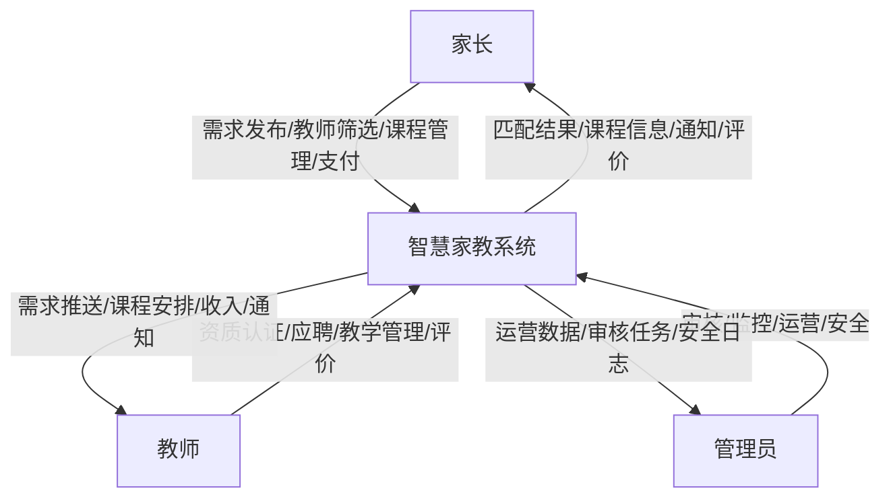
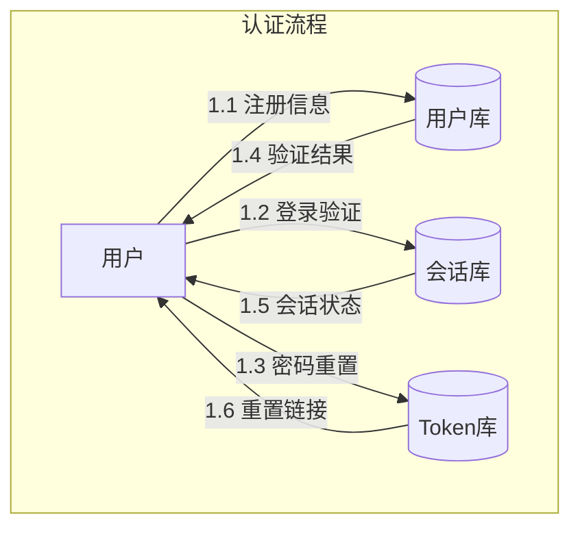
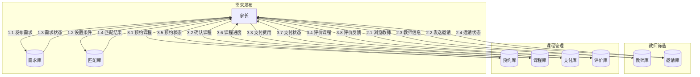
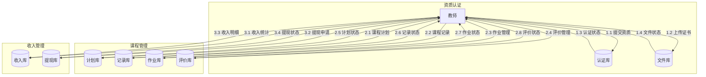
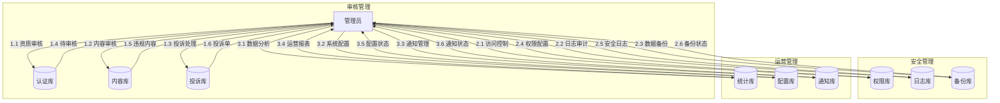
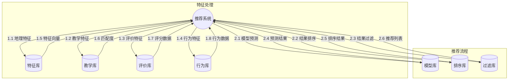
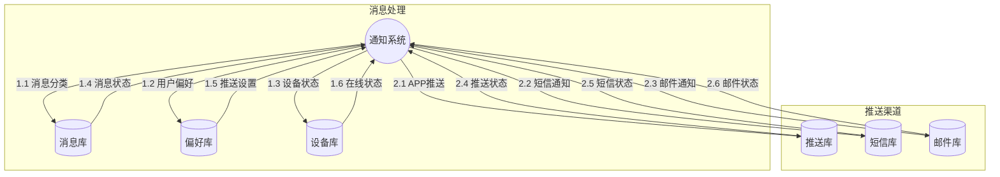
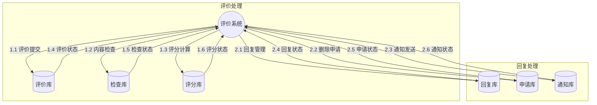
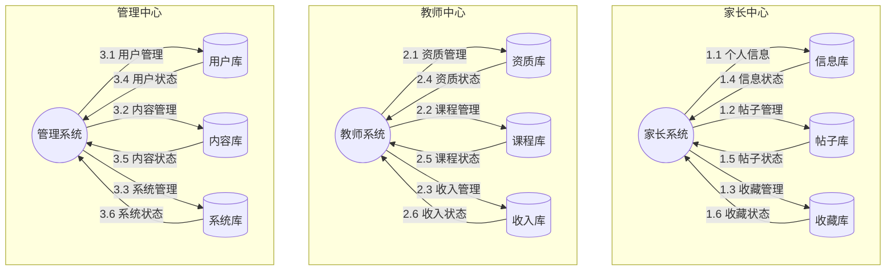

# 智慧家教平台数据流图

## 1. 顶层数据流图（Level 0）



## 2. 一级数据流图（Level 1）

### 2.1 用户认证数据流



### 2.2 家长数据流



### 2.3 教师数据流



### 2.4 管理员数据流



### 2.5 智能推荐数据流



### 2.6 消息通知数据流



### 2.7 试听课程数据流


### 2.8 签约支付数据流


### 2.9 课程管理数据流


### 2.10 投诉处理数据流


### 2.11 平台监控数据流


### 2.12 系统配置数据流


### 2.13 运营活动数据流


### 2.14 评价管理数据流



### 2.15 申诉处理数据流


### 2.16 评分计算数据流


### 2.17 招聘流程数据流


### 2.18 智能匹配评分数据流


### 2.19 个人中心数据流



### 2.20 即时通讯数据流

```mermaid
graph TD
    subgraph 消息管理
        M((消息系统)) --> |1.1 消息发送| D1[(消息库)]
        M --> |1.2 权限检查| D2[(权限库)]
        M --> |1.3 状态更新| D3[(状态库)]
        D1 --> |1.4 消息状态| M
        D2 --> |1.5 权限状态| M
        D3 --> |1.6 更新状态| M
    end

    subgraph 历史记录
        M --> |2.1 记录查询| D4[(历史库)]
        M --> |2.2 媒体处理| D5[(媒体库)]
        M --> |2.3 导出处理| D6[(导出库)]
        D4 --> |2.4 历史数据| M
        D5 --> |2.5 媒体数据| M
        D6 --> |2.6 导出数据| M
    end
```

### 2.21 课程管理数据流

```mermaid
graph TD
    subgraph 学习计划
        C((课程系统)) --> |1.1 计划制定| D1[(计划库)]
        C --> |1.2 目标设置| D2[(目标库)]
        C --> |1.3 内容管理| D3[(内容库)]
        D1 --> |1.4 计划状态| C
        D2 --> |1.5 目标状态| C
        D3 --> |1.6 内容状态| C
    end

    subgraph 知识追踪
        C --> |2.1 知识记录| D4[(知识库)]
        C --> |2.2 评估处理| D5[(评估库)]
        C --> |2.3 报告生成| D6[(报告库)]
        D4 --> |2.4 知识状态| C
        D5 --> |2.5 评估状态| C
        D6 --> |2.6 报告状态| C
    end
```

### 2.22 作业管理数据流

```mermaid
graph TD
    subgraph 作业处理
        H((作业系统)) --> |1.1 作业布置| D1[(作业库)]
        H --> |1.2 提交管理| D2[(提交库)]
        H --> |1.3 批改处理| D3[(批改库)]
        D1 --> |1.4 作业状态| H
        D2 --> |1.5 提交状态| H
        D3 --> |1.6 批改状态| H
    end

    subgraph 分析处理
        H --> |2.1 错题分析| D4[(错题库)]
        H --> |2.2 建议生成| D5[(建议库)]
        H --> |2.3 通知发送| D6[(通知库)]
        D4 --> |2.4 分析结果| H
        D5 --> |2.5 建议结果| H
        D6 --> |2.6 通知状态| H
    end
```

### 2.23 教学效果数据流

```mermaid
graph TD
    subgraph 效果评估
        E((效果系统)) --> |1.1 成绩分析| D1[(成绩库)]
        E --> |1.2 状态评估| D2[(状态库)]
        E --> |1.3 指导生成| D3[(指导库)]
        D1 --> |1.4 成绩数据| E
        D2 --> |1.5 状态数据| E
        D3 --> |1.6 指导数据| E
    end

    subgraph 报告处理
        E --> |2.1 总结生成| D4[(总结库)]
        E --> |2.2 目标评估| D5[(目标库)]
        E --> |2.3 建议生成| D6[(建议库)]
        D4 --> |2.4 总结状态| E
        D5 --> |2.5 目标状态| E
        D6 --> |2.6 建议状态| E
    end
```

## 3. 数据存储说明

### 3.1 核心数据库

1. 用户数据

   - 用户基本信息
   - 认证信息
   - 权限信息
   - 偏好设置

2. 业务数据

   - 需求信息
   - 课程信息
   - 预约信息
   - 支付信息
   - 评价信息

3. 交互数据

   - 即时消息
   - 系统通知
   - 操作日志
   - 安全日志

4. 分析数据
   - 用户行为
   - 匹配记录
   - 推荐结果
   - 统计报表

### 3.2 数据流转规则

1. 实时数据流

   - 即时通讯
   - 状态更新
   - 通知推送
   - 支付处理

2. 批处理数据流

   - 数据分析
   - 报表生成
   - 推荐计算
   - 数据备份

3. 触发式数据流
   - 审核流程
   - 评价处理
   - 异常处理
   - 定时任务

## 4. 二级数据流图

### 4.1 即时通讯二级数据流图

```mermaid
graph TD
    subgraph 消息发送处理
        MS((消息发送)) --> |1.1 文本消息| P1[文本处理]
        MS --> |1.2 图片消息| P2[图片处理]
        MS --> |1.3 文件消息| P3[文件处理]

        P1 --> |1.4 敏感词过滤| F1[过滤器]
        P2 --> |1.5 图片压缩| F2[压缩器]
        P3 --> |1.6 文件验证| F3[验证器]

        F1 --> |1.7 过滤结果| D1[(消息库)]
        F2 --> |1.8 压缩结果| D2[(媒体库)]
        F3 --> |1.9 验证结果| D3[(文件库)]
    end

    subgraph 权限控制处理
        PC((权限控制)) --> |2.1 关系验证| P4[关系处理]
        PC --> |2.2 频率控制| P5[频率处理]
        PC --> |2.3 隐私设置| P6[隐私处理]

        P4 --> |2.4 验证结果| D4[(权限库)]
        P5 --> |2.5 频率结果| D5[(控制库)]
        P6 --> |2.6 隐私结果| D6[(设置库)]
    end
```

### 4.2 课程管理二级数据流图

```mermaid
graph TD
    subgraph 学习计划处理
        LP((学习计划)) --> |1.1 目标设定| P1[目标处理]
        LP --> |1.2 内容规划| P2[内容处理]
        LP --> |1.3 进度跟踪| P3[进度处理]

        P1 --> |1.4 目标分解| F1[分解器]
        P2 --> |1.5 内容组织| F2[组织器]
        P3 --> |1.6 进度计算| F3[计算器]

        F1 --> |1.7 目标数据| D1[(目标库)]
        F2 --> |1.8 内容数据| D2[(内容库)]
        F3 --> |1.9 进度数据| D3[(进度库)]
    end

    subgraph 知识点管理
        KM((知识管理)) --> |2.1 知识标记| P4[标记处理]
        KM --> |2.2 难度评估| P5[评估处理]
        KM --> |2.3 关联分析| P6[关联处理]

        P4 --> |2.4 标记结果| D4[(知识库)]
        P5 --> |2.5 评估结果| D5[(评估库)]
        P6 --> |2.6 关联结果| D6[(关联库)]
    end
```

### 4.3 作业管理二级数据流图

```mermaid
graph TD
    subgraph 作业处理流程
        HW((作业管理)) --> |1.1 作业创建| P1[创建处理]
        HW --> |1.2 作业分发| P2[分发处理]
        HW --> |1.3 提交管理| P3[提交处理]

        P1 --> |1.4 模板应用| F1[模板器]
        P2 --> |1.5 分发控制| F2[控制器]
        P3 --> |1.6 提交验证| F3[验证器]

        F1 --> |1.7 作业数据| D1[(作业库)]
        F2 --> |1.8 分发数据| D2[(分发库)]
        F3 --> |1.9 提交数据| D3[(提交库)]
    end

    subgraph 批改分析流程
        CA((批改分析)) --> |2.1 答案比对| P4[比对处理]
        CA --> |2.2 错误分析| P5[分析处理]
        CA --> |2.3 建议生成| P6[建议处理]

        P4 --> |2.4 比对结果| D4[(批改库)]
        P5 --> |2.5 分析结果| D5[(分析库)]
        P6 --> |2.6 建议结果| D6[(建议库)]
    end
```

### 4.4 教学效果二级数据流图

```mermaid
graph TD
    subgraph 效果评估流程
        EA((效果评估)) --> |1.1 成绩收集| P1[收集处理]
        EA --> |1.2 数据分析| P2[分析处理]
        EA --> |1.3 趋势预测| P3[预测处理]

        P1 --> |1.4 数据整理| F1[整理器]
        P2 --> |1.5 统计分析| F2[分析器]
        P3 --> |1.6 模型预测| F3[预测器]

        F1 --> |1.7 成绩数据| D1[(成绩库)]
        F2 --> |1.8 分析数据| D2[(分析库)]
        F3 --> |1.9 预测数据| D3[(预测库)]
    end

    subgraph 报告生成流程
        RG((报告生成)) --> |2.1 数据汇总| P4[汇总处理]
        RG --> |2.2 报告编写| P5[编写处理]
        RG --> |2.3 建议生成| P6[建议处理]

        P4 --> |2.4 汇总结果| D4[(汇总库)]
        P5 --> |2.5 报告结果| D5[(报告库)]
        P6 --> |2.6 建议结果| D6[(建议库)]
    end
```

### 4.5 用户认证二级数据流图

```mermaid
graph TD
    subgraph 注册流程
        UR((用户注册)) --> |1.1 信息验证| P1[验证处理]
        UR --> |1.2 账号创建| P2[创建处理]
        UR --> |1.3 角色分配| P3[角色处理]
        
        P1 --> |1.4 格式验证| F1[验证器]
        P2 --> |1.5 密码加密| F2[加密器]
        P3 --> |1.6 权限分配| F3[分配器]
        
        F1 --> |1.7 验证数据| D1[(验证库)]
        F2 --> |1.8 账号数据| D2[(账号库)]
        F3 --> |1.9 角色数据| D3[(角色库)]
    end
    
    subgraph 登录认证流程
        LA((登录认证)) --> |2.1 身份验证| P4[身份处理]
        LA --> |2.2 会话管理| P5[会话处理]
        LA --> |2.3 安全控制| P6[安全处理]
        
        P4 --> |2.4 验证结果| D4[(认证库)]
        P5 --> |2.5 会话数据| D5[(会话库)]
        P6 --> |2.6 安全记录| D6[(安全库)]
    end
```

### 4.6 支付管理二级数据流图

```mermaid
graph TD
    subgraph 订单处理流程
        OP((订单处理)) --> |1.1 订单创建| P1[创建处理]
        OP --> |1.2 价格计算| P2[计算处理]
        OP --> |1.3 优惠应用| P3[优惠处理]
        
        P1 --> |1.4 订单生成| F1[生成器]
        P2 --> |1.5 价格核算| F2[核算器]
        P3 --> |1.6 优惠计算| F3[计算器]
        
        F1 --> |1.7 订单数据| D1[(订单库)]
        F2 --> |1.8 价格数据| D2[(价格库)]
        F3 --> |1.9 优惠数据| D3[(优惠库)]
    end
    
    subgraph 支付处理流程
        PP((支付处理)) --> |2.1 支付验证| P4[验证处理]
        PP --> |2.2 交易处理| P5[交易处理]
        PP --> |2.3 退款处理| P6[退款处理]
        
        P4 --> |2.4 验证结果| D4[(支付库)]
        P5 --> |2.5 交易记录| D5[(交易库)]
        P6 --> |2.6 退款记录| D6[(退款库)]
    end
```

### 4.7 评价管理二级数据流图

```mermaid
graph TD
    subgraph 评价处理流程
        EP((评价处理)) --> |1.1 评价收集| P1[收集处理]
        EP --> |1.2 内容审核| P2[审核处理]
        EP --> |1.3 分数计算| P3[计算处理]
        
        P1 --> |1.4 数据验证| F1[验证器]
        P2 --> |1.5 内容过滤| F2[过滤器]
        P3 --> |1.6 得分计算| F3[计算器]
        
        F1 --> |1.7 评价数据| D1[(评价库)]
        F2 --> |1.8 审核数据| D2[(审核库)]
        F3 --> |1.9 分数数据| D3[(分数库)]
    end
    
    subgraph 反馈处理流程
        FB((反馈处理)) --> |2.1 反馈分类| P4[分类处理]
        FB --> |2.2 问题处理| P5[问题处理]
        FB --> |2.3 跟进管理| P6[跟进处理]
        
        P4 --> |2.4 分类结果| D4[(分类库)]
        P5 --> |2.5 问题记录| D5[(问题库)]
        P6 --> |2.6 跟进记录| D6[(跟进库)]
    end
```

### 4.8 数据分析二级数据流图

```mermaid
graph TD
    subgraph 数据收集流程
        DC((数据收集)) --> |1.1 用户行为| P1[行为处理]
        DC --> |1.2 业务数据| P2[业务处理]
        DC --> |1.3 系统日志| P3[日志处理]
        
        P1 --> |1.4 行为分析| F1[分析器]
        P2 --> |1.5 数据清洗| F2[清洗器]
        P3 --> |1.6 日志解析| F3[解析器]
        
        F1 --> |1.7 行为数据| D1[(行为库)]
        F2 --> |1.8 业务数据| D2[(业务库)]
        F3 --> |1.9 日志数据| D3[(日志库)]
    end
    
    subgraph 分析处理流程
        AP((分析处理)) --> |2.1 统计分析| P4[统计处理]
        AP --> |2.2 预测分析| P5[预测处理]
        AP --> |2.3 报告生成| P6[报告处理]
        
        P4 --> |2.4 统计结果| D4[(统计库)]
        P5 --> |2.5 预测结果| D5[(预测库)]
        P6 --> |2.6 报告数据| D6[(报告库)]
    end
```

{{ ... }}
