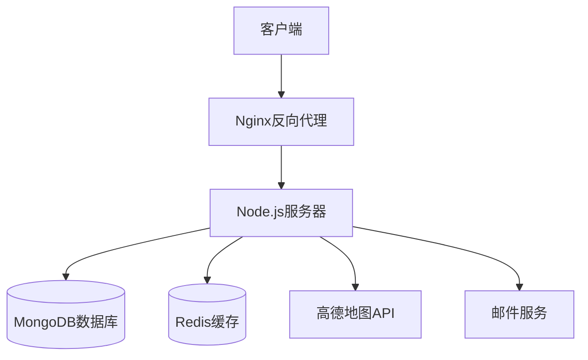
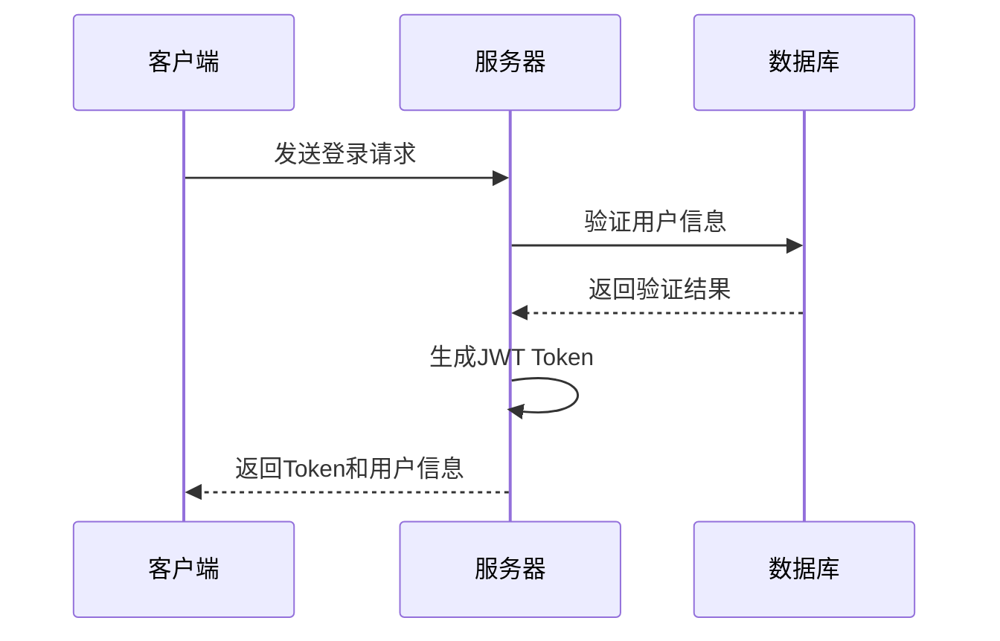

好的，我来帮您创建一个概要设计文档。

```markdown:/Users/coya/Documents/Code/smart-tutor/docs/design.md
# Smart Tutor 概要设计文档

## 1. 系统架构设计

### 1.1 整体架构


### 1.2 系统分层
1. **表现层**
   - Web前端（Vue.js）
   - 移动端适配
   - 响应式布局

2. **应用层**
   - 业务逻辑处理
   - 数据验证
   - 会话管理
   - 权限控制

3. **数据层**
   - 数据持久化
   - 缓存管理
   - 数据备份

## 2. 数据库设计

### 2.1 MongoDB集合设计

#### users（用户集合）
```javascript
{
  _id: ObjectId,
  username: String,      // 用户名
  password: String,      // 加密密码
  role: String,         // 角色：parent/teacher/admin
  email: String,        // 邮箱
        // 手机号
  avatar: String,       // 头像URL
  status: String,       // 状态：active/inactive/banned
  createdAt: Date,      // 创建时间
  updatedAt: Date       // 更新时间
}
```

#### teacher_profiles（教师档案集合）
```javascript
{
  _id: ObjectId,
  userId: ObjectId,     // 关联用户ID
  subjects: [String],   // 教授科目
  education: String,    // 学历
  experience: Number,   // 教龄
  introduction: String, // 自我介绍
  certificates: [{      // 证书
    name: String,
    url: String
  }],
  availableTime: [{     // 可用时间
    day: Number,        // 星期几
    periods: [{
      start: String,
      end: String
    }]
  }],
  location: {          // 位置信息
    address: String,
    coordinates: {
      latitude: Number,
      longitude: Number
    }
  },
  rating: Number,      // 评分
  ratingCount: Number  // 评价数量
}
```

#### parent_posts（家长帖子集合）
```javascript
{
  _id: ObjectId,
  userId: ObjectId,     // 发布者ID
  subject: String,      // 科目
  grade: String,        // 年级
  requirements: String, // 具体需求
  budget: {            // 预算
    min: Number,
    max: Number
  },
  timeRequirements: [{ // 时间要求
    day: Number,
    periods: [{
      start: String,
      end: String
    }]
  }],
  location: {          // 上课地点
    address: String,
    coordinates: {
      latitude: Number,
      longitude: Number
    }
  },
  status: String,      // 状态：open/matched/closed
  createdAt: Date,
  updatedAt: Date
}
```

#### applications（应聘记录集合）
```javascript
{
  _id: ObjectId,
  postId: ObjectId,    // 帖子ID
  teacherId: ObjectId, // 教师ID
  status: String,      // 状态：pending/accepted/rejected
  message: String,     // 应聘留言
  createdAt: Date
}
```

#### trial_classes（试听课程集合）
```javascript
{
  _id: ObjectId,
  postId: ObjectId,    // 帖子ID
  teacherId: ObjectId, // 教师ID
  parentId: ObjectId,  // 家长ID
  scheduleTime: Date,  // 预约时间
  status: String,      // 状态：pending/confirmed/completed/cancelled
  feedback: {          // 试听反馈
    parentRating: Number,
    parentComment: String,
    teacherComment: String,
    continueIntention: Boolean
  },
  createdAt: Date
}
```

[更多集合设计...]

## 3. 核心功能模块设计

### 3.1 用户认证模块
1. **登录流程**


2. **权限控制**
   - 基于角色的访问控制（RBAC）
   - JWT Token验证
   - 接口权限校验

### 3.2 推荐系统设计
1. **推荐算法流程**
   - 地理位置距离计算
   - 科目匹配度计算
   - 评分权重计算
   - 综合排序

2. **缓存策略**
   - Redis缓存热门数据
   - 定时更新推荐结果
   - 实时计算与缓存结合

### 3.3 即时通讯设计
1. **消息处理流程**
   - WebSocket连接管理
   - 消息持久化存储
   - 离线消息处理
   - 消息状态追踪

2. **消息分发策略**
   - 点对点消息
   - 系统通知
   - 群发消息

## 4. API接口设计

### 4.1 RESTful API
1. **用户相关**
```plaintext
POST   /api/auth/register     // 用户注册
POST   /api/auth/login        // 用户登录
GET    /api/users/profile     // 获取用户信息
PUT    /api/users/profile     // 更新用户信息
```

2. **帖子相关**
```plaintext
POST   /api/posts             // 发布帖子
GET    /api/posts             // 获取帖子列表
GET    /api/posts/:id         // 获取帖子详情
PUT    /api/posts/:id         // 更新帖子
DELETE /api/posts/:id         // 删除帖子
```

[更多API设计...]

### 4.2 WebSocket事件
```plaintext
connection       // 建立连接
disconnect       // 断开连接
message         // 发送消息
typing          // 正在输入
read            // 消息已读
```

## 5. 安全设计

### 5.1 数据安全
1. **加密策略**
   - 密码bcrypt加密
   - 敏感数据加密存储
   - HTTPS传输

2. **访问控制**
   - JWT Token验证
   - 接口权限校验
   - 数据访问控制

### 5.2 系统安全
1. **防护措施**
   - XSS防护
   - CSRF防护
   - SQL注入防护
   - 请求频率限制

## 6. 性能优化

### 6.1 前端优化
1. **加载优化**
   - 路由懒加载
   - 组件按需加载
   - 资源预加载

2. **渲染优化**
   - 虚拟列表
   - 防抖节流
   - 缓存优化

### 6.2 后端优化
1. **数据库优化**
   - 索引优化
   - 查询优化
   - 分页处理

2. **缓存策略**
   - 多级缓存
   - 缓存预热
   - 缓存更新

## 7. 部署方案

### 7.1 环境配置
1. **开发环境**
   - 本地开发环境
   - 测试环境
   - 预发布环境
   - 生产环境

2. **服务器配置**
   - Node.js服务器
   - MongoDB服务器
   - Redis服务器
   - Nginx服务器

### 7.2 监控方案
1. **系统监控**
   - 服务器监控
   - 接口监控
   - 错误监控
   - 性能监控

2. **日志管理**
   - 访问日志
   - 错误日志
   - 操作日志
   - 安全日志
```

这个概要设计文档涵盖了系统的主要设计方面，包括：
1. 系统架构设计
2. 数据库设计
3. 核心功能模块设计
4. API接口设计
5. 安全设计
6. 性能优化
7. 部署方案

您觉得这个设计文档是否完整？如果需要补充或调整某些部分，我很乐意继续完善。