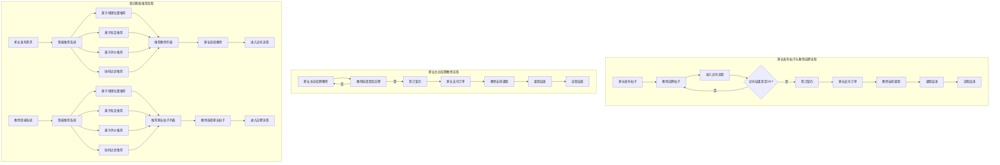

# Smart Tutor 需求分析文档

## 1. 项目概述

### 1.1 项目背景
Smart Tutor 是一个在线家教匹配平台，旨在为家长和教师提供便捷的家教服务对接平台。通过该平台，家长可以发布家教需求，教师可以查看并应聘合适的家教机会，实现家教资源的高效匹配。

### 1.2 项目目标
- 为家长提供便捷的发布家教需求渠道
- 为教师提供优质的家教机会
- 提供智能的家教匹配推荐系统
- 实现家长与教师的高效沟通
- 建立完善的评价反馈机制

## 2. 用户角色分析

### 2.1 家长用户
- **特征**：有辅导需求的学生家长

  

- **核心需求**：
  
  - 发布家教需求帖子。
  - 主动招聘教师
  
  
  
  **衍生需求**
  
  - 查看和筛选教师信息
  
  - 预约试听课程
  - 与教师实时沟通
  - 查看教学反馈
  - 评价教师服务
  - 管理订单和支付

### 2.2 教师用户
- **特征**：具有教学能力的教师
- **主要需求**：
  - 发布个人信息
  - 浏览和筛选家教需求
  - 应聘合适的家教机会
  - 与家长实时沟通
  - 记录教学反馈
  - 管理课程安排
  - 查看收入和提现

### 2.3 管理员
- **特征**：平台运营管理人员
- **主要需求**：
  - 审核家长发布的帖子。
  - 审核教师资质。
  - 系统配置管理
  - 处理用户反馈

##  核心功能需求

#### 3.1.1 家长发布帖子与教师应聘流程

1. **家长发布帖子**：
   - 填写辅导需求（科目、年级、需求描述）。
   - 设置价格和时间安排。
   - 选择地理位置和教师偏好（性别、学历、经验）。
   - 提交帖子并等待教师应聘。
2. **教师应聘帖子**：
   - 教师浏览家长发布的帖子。
   - 选择感兴趣的帖子并提交应聘申请。
   - 家长查看应聘教师信息并筛选。
3. **试听流程**：
   - 家长和教师确认试听时间。
   - 教师进行试讲，家长评估试听结果。
   - 试听结果确认：
     - 如果试听通过，进入签订契约流程。
     - 如果试听不通过，家长可以重新选择教师。
4. **签订契约**：
   - 家长和教师确认契约内容（课程安排、费用等）。
   - 家长支付订单。
   - 教师根据排班安排上课。
5. **课程结束与支付**：
   - 课程结束后，家长确认课程完成。
   - 家长支付订单费用。

#### 3.1.2 家长主动招聘教师流程

1. **家长主动招聘**：
   - 家长浏览教师信息。
   - 选择心仪的教师并发送招聘邀请。
2. **教师选择是否应聘**：
   - 教师收到招聘邀请。
   - 教师选择是否接受招聘：
     - 如果接受，进入签订契约流程。
     - 如果不接受，家长可以继续招聘其他教师。
3. **签订契约**：
   - 家长和教师确认契约内容（课程安排、费用等）。
   - 家长支付订单。
   - 教师根据排班安排上课。
4. **课程结束与支付**：
   - 课程结束后，家长确认课程完成。
   - 家长支付订单费用。

#### 3.1.3 智能推荐模块

1. **基于地理位置的推荐**：
   - 根据家长和教师的地理位置进行匹配。
   - 计算距离并优先推荐距离较近的教师。
   - 提供通勤时间估算，帮助家长和教师做出决策。
2. **基于科目的推荐**：
   - 根据家长需求的科目和教师的专业领域进行匹配。
   - 计算科目匹配度，优先推荐专业对口的教师。
   - 支持教学年级匹配，确保教师的教学经验符合需求。
3. **基于评价的推荐**：
   - 根据教师的评分和历史成功案例进行推荐。
   - 计算教师评分权重，优先推荐高评分教师。
   - 分析家长评价，推荐符合家长偏好的教师。
4. **协同过滤推荐**：
   - 基于用户行为数据（如浏览记录、应聘记录）进行推荐。
   - 推荐与家长需求相似的教师。
   - 推荐与教师经验相似的家教需求。
5. **智能排序**：
   - 综合地理位置、科目、评价等多维度进行评分。
   - 动态调整推荐权重，适应不同家长的需求。
   - 提供个性化排序结果，提升匹配效率。

## 衍生功能需求

### 3.2 用户认证模块

1. **用户注册**
   - 用户名密码注册
   - 图形验证码验证
   - 角色选择（家长/教师）
   - 基本信息填写
   - 邮箱验证

2. **用户登录**
   - 用户名密码登录
   - 图形验证码验证
   - 记住登录状态
   - JWT 身份验证

3. **密码找回**
   - 邮箱验证
   - 重置密码
   - 安全验证

### 3.3个人中心模块

1. **家长个人中心**
   - 个人信息管理
   - 发布帖子管理
   - 收藏教师管理
   - 订单记录查看
   - 评价管理
   - 支付管理

2. **教师个人中心**
   - 个人信息管理
   - 应聘记录管理
   - 收藏帖子管理
   - 课程安排管理
   - 评价记录查看
   - 收入管理

3. **管理员个人中心**
   - 系统配置管理
   - 用户管理
   - 内容审核管理
   - 反馈处理

### 3.4 即时通讯模块

1. **消息列表**
   - 最近联系人
   - 未读消息提醒
   - 消息分类（系统通知、聊天消息）
   - 消息搜索

2. **聊天功能**
   - 文字消息
   - 图片消息
   - 文件传输
   - 历史记录查看

### 3.5 评价反馈模块
1. **家长评价教师**
   - 教学专业度评分（教学方法、知识掌握程度）
   - 教学态度评分（耐心程度、责任心）
   - 教学效果评分（学生进步情况、作业完成质量）
   - 守时情况评分（是否准时上课、是否拖堂）
   - 沟通能力评分（与学生沟通效果、与家长沟通及时性）
   - 文字评价
   - 是否愿意继续聘用
   - 是否推荐给其他家长

2. **教师评价家长/学生**
   - 学生学习态度评分（专注度、配合度）
   - 学生基础评分（现有水平、学习能力）
   - 作业完成情况评分（按时完成、认真程度）
   - 家长配合度评分（沟通及时性、辅导配合度）
   - 学习环境评分（学习环境、设备配合）
   - 文字评价
   - 教学建议
   - 是否愿意继续授课

3. **评价管理**
   - 评价提醒（课程结束后自动提醒双方评价）
   - 评价可见性设置（公开/私密）
   - 评价申诉处理
   - 恶意评价过滤
   - 评分统计分析
   - 教师排名计算

### 3.6 支付系统模块
1. **订单管理**
   - 创建订单
   - 订单状态追踪
   - 订单历史查询

2. **基础支付功能**
   - 模拟支付功能
   - 支付状态更新
   - 订单完成确认

### 3.8 试听课程模块
1. **试听预约**
   - 家长浏览教师课程信息
   - 查看教师可预约时间段
   - 选择合适的试听时间
   - 填写试听需求说明
   - 提交试听申请
   - 教师接受或拒绝试听申请
   - 系统通知家长申请结果

2. **试听进度追踪**
   - 试听申请状态查看
   - 教师确认结果通知
   - 试听课程提醒
   - 试听完成确认
   - 教师查看试听课程安排

3. **试听课程反馈**
   - 家长提交试听课程评价
   - 教学效果评分
   - 是否继续学习的意向
   - 对教师的建议
   - 教师查看试听课程反馈
   - 教师回复家长反馈

4. **试听记录管理**
   - 历史试听记录查询
   - 试听课程状态查看
   - 试听教师信息浏览
   - 相似教师推荐
   - 教师查看历史试听记录
   - 教师查看试听转化率

### 3.9 管理员模块
1. **用户管理**
   - 查看用户列表（家长、教师、管理员）
   - 用户状态管理（启用/禁用账号）
   - 用户信息查看与编辑
   - 重置用户密码
   - 添加/删除管理员账号
   - 用户行为日志查看

2. **内容审核**
   - 帖子审核管理
     * 查看待审核帖子列表
     * 审核通过/拒绝
     * 违规内容标记
     * 帖子删除与恢复
   - 教师资料审核
     * 查看教师认证申请
     * 审核教师资质材料
     * 处理教师认证结果
   - 评价内容审核
     * 违规评价处理
     * 敏感词过滤设置

3. **数据统计与分析**
   - 用户数据统计
     * 用户增长趋势
     * 用户活跃度分析
     * 用户地域分布
   - 交易数据统计
     * 试听转化率
     * 成交量统计
     * 投诉率统计
   - 系统性能监控
     * 服务器负载监控
     * 接口响应时间统计
     * 错误日志分析

4. **系统配置管理**
   - 基础配置管理
     * 系统参数设置
     * 权限规则配置
     * 敏感词库管理
   - 推荐算法配置
     * 推荐权重设置
     * 匹配规则配置
     * 排序规则设置
   - 通知模板管理
     * 邮件模板配置
     * 消息模板设置
     * 推送规则设置

5. **问题处理中心**
   - 用户反馈处理
     * 查看反馈列表
     * 反馈分类管理
     * 反馈处理与回复
   - 投诉处理
     * 查看投诉列表
     * 调解用户纠纷
     * 处理结果记录
   - 系统通知管理
     * 发布系统公告
     * 发送用户通知
     * 通知发送记录

6. **运营数据报表**
   - 日常运营报表
     * 日/周/月报表生成
     * 关键指标监控
     * 异常数据分析
   - 自定义报表
     * 报表模板配置
     * 数据筛选条件
     * 报表导出功能

### 3.10 课程进度模块
1. **学习计划制定**
   - 教师制定阶段性学习目标
   - 设置每节课的具体内容
   - 制定作业和练习计划
   - 家长查看和确认计划

2. **知识点掌握度追踪**
   - 记录每节课学习的知识点
   - 标记重点和难点
   - 记录学生掌握程度
   - 生成知识点掌握度报告

3. **作业管理**
   - 布置作业记录
   - 作业完成情况记录
   - 作业批改反馈
   - 错题分析和总结

### 3.11 课程调度模块
1. **课程调整**
   - 临时调课申请
   - 补课时间协调
   - 调课原因记录
   - 自动推荐可用时间段

2. **请假管理**
   - 请假申请提交
   - 请假审批流程
   - 自动安排补课
   - 请假记录统计

### 3.12 教学效果追踪模块
1. **考试成绩追踪**
   - 记录月考/期中/期末成绩
   - 成绩变化趋势分析
   - 各科目成绩对比
   - 与班级平均分对比
   - 薄弱知识点分析

2. **学习状态分析**
   - 课堂注意力记录
   - 作业完成质量
   - 学习兴趣变化
   - 学习习惯养成
   - 学习方法适应度

3. **家长指导建议**
   - 家庭辅导方法推荐
   - 亲子沟通技巧
   - 学习环境改善建议
   - 作息时间安排
   - 学习习惯培养方案

4. **定期评估报告**
   - 月度学习情况总结
   - 学习目标完成度
   - 存在问题分析
   - 改进方案制定
   - 下阶段学习计划

## 4. 非功能需求

### 4.1 性能需求
- 页面响应时间 < 2秒
- 并发用户数 > 1000
- 系统可用性 > 99.9%
- 消息实时推送延迟 < 1秒

### 4.2 安全需求
- 用户数据加密存储
- 防SQL注入
- 防XSS攻击
- 敏感信息脱敏
- 支付安全保障

### 4.3 兼容性需求
- 支持主流浏览器
- 支持移动端访问
- 响应式设计
- 适配不同分辨率

## 5. 技术架构

### 5.1 前端技术栈
- Vue.js 3
- Arciodesign TailwindCSS
- Axios
- Pinia
- Vue Router
- Socket.IO Client

### 5.2 后端技术栈
- Node.js
- Express
- MongoDB
- Redis
- JWT
- Socket.IO
- 高德地图 API
- NodeMail  dotenv  CORS

## 6. 项目规划

### 6.1 开发阶段
1. 需求分析与设计（1周）
2. 用户认证模块（1周）
3. 个人中心模块（1周）
4. 帖子管理模块（2周）
5. 即时通讯模块（2周）
6. 评价反馈模块（1周）
7. 支付系统模块（1周）
8. 测试与优化（1周）

### 6.2 测试计划
- 单元测试
- 集成测试
- 性能测试
- 安全测试
- 用户验收测试
