# 家教管理系统的场景设计


当然可以！交互场景的设计可以进一步扩展，覆盖更多细节和功能，包括 **用户注册登录**、**个人中心**、**消息系统**、**支付系统** 等。以下是更详细的交互场景设计，涵盖系统的方方面面。

---

### **1. 用户注册与登录**

#### **1.1 用户注册**
- **场景描述**：
  - 新用户（家长、教师、管理员）注册账号。
- **交互流程**：
  1. 用户访问注册页面，选择角色（家长、教师、管理员）。
  2. 填写基本信息（如姓名、手机号、邮箱、密码）。
  3. 提交注册信息，系统发送验证邮件或短信。
  4. 用户完成验证，注册成功。

#### **1.2 用户登录**
- **场景描述**：
  - 用户登录系统。
- **交互流程**：
  1. 用户访问登录页面，输入邮箱/手机号和密码。
  2. 系统验证用户信息，登录成功。
  3. 根据用户角色（家长、教师、管理员）跳转到对应的主页。

#### **1.3 忘记密码**
- **场景描述**：
  - 用户忘记密码，通过邮箱或手机号重置密码。
- **交互流程**：
  1. 用户点击“忘记密码”链接，输入邮箱/手机号。
  2. 系统发送重置密码链接或验证码。
  3. 用户点击链接或输入验证码，设置新密码。
  4. 密码重置成功，用户重新登录。

---

### **2. 个人中心**

#### **2.1 家长个人中心**
- **场景描述**：
  - 家长查看和管理个人信息、帖子、收藏、订单等。
- **交互流程**：
  1. 家长登录系统，进入“个人中心”页面。
  2. 查看个人信息（如姓名、手机号、邮箱）。
  3. 查看已发布的帖子列表，点击帖子查看详情。
  4. 查看收藏的教师列表，点击教师查看详情。
  5. 查看订单列表，点击订单查看详情。

#### **2.2 教师个人中心**
- **场景描述**：
  - 教师查看和管理个人信息、响应记录、收藏、评价等。
- **交互流程**：
  1. 教师登录系统，进入“个人中心”页面。
  2. 查看个人信息（如姓名、手机号、邮箱）。
  3. 查看已响应的帖子列表，点击帖子查看详情。
  4. 查看收藏的帖子列表，点击帖子查看详情。
  5. 查看收到的评价列表，点击评价查看详情。

#### **2.3 管理员个人中心**
- **场景描述**：
  - 管理员查看和管理个人信息、系统配置、通知等。
- **交互流程**：
  1. 管理员登录系统，进入“个人中心”页面。
  2. 查看个人信息（如姓名、手机号、邮箱）。
  3. 查看系统配置，修改参数并保存。
  4. 查看系统通知，处理用户反馈。

---

### **3. 消息系统**

#### **3.1 家长与教师聊天**
- **场景描述**：
  - 家长和教师通过系统内置的聊天功能沟通。
- **交互流程**：
  1. 家长在教师详情页点击“联系”按钮，进入聊天页面。
  2. 家长和教师发送消息，系统实时显示消息。
  3. 家长和教师可以查看聊天记录。

#### **3.2 系统通知**
- **场景描述**：
  - 系统向用户发送通知（如帖子被收藏、教师响应帖子等）。
- **交互流程**：
  1. 系统检测到用户行为（如帖子被收藏）。
  2. 生成通知内容，发送给相关用户。
  3. 用户在“通知中心”查看通知。

---

### **4. 支付系统**

#### **4.1 家长支付订单**
- **场景描述**：
  - 家长通过系统支付订单。
- **交互流程**：
  1. 家长在教师详情页点击“预约”按钮，生成订单。
  2. 家长进入支付页面，选择支付方式（如支付宝、微信支付）。
  3. 家长完成支付，系统更新订单状态。

#### **4.2 教师提现**
- **场景描述**：
  - 教师将收入提现到银行卡。
- **交互流程**：
  1. 教师登录系统，进入“我的收入”页面。
  2. 点击“提现”按钮，输入提现金额和银行卡信息。
  3. 提交提现申请，系统处理提现并更新收入状态。

---

### **5. 评价与反馈**

#### **5.1 家长评价教师**
- **场景描述**：
  - 家长对教师的教学质量进行评价。
- **交互流程**：
  1. 家长登录系统，进入“我的订单”页面。
  2. 点击已完成订单，进入评价页面。
  3. 填写评价内容（如评分、评论），提交评价。

#### **5.2 教师评价家长**
- **场景描述**：
  - 教师对家长的合作态度进行评价。
- **交互流程**：
  1. 教师登录系统，进入“我的响应”页面。
  2. 点击已完成响应，进入评价页面。
  3. 填写评价内容（如评分、评论），提交评价。

#### **5.3 用户反馈**
- **场景描述**：
  - 用户提交反馈（如功能建议、问题反馈）。
- **交互流程**：
  1. 用户登录系统，进入“反馈中心”页面。
  2. 填写反馈内容，提交反馈。
  3. 管理员查看并处理反馈。

---

### **6. 扩展功能**

#### **6.1 教师排课**
- **场景描述**：
  - 教师管理自己的上课时间表。
  
- **交互流程**：
  
  1. 教师登录系统，进入“我的排课”页面。
  2. 添加、修改或删除上课时间。
  3. 系统根据排课时间推荐帖子。
  
  我热爱编程！为了支持教师排课功能，我们需要在教师表和教师自荐表中添加与排课相关的字段，并设计相应的 RESTful API 和交互流程。以下是具体的修改和设计：
  
  ---
  
  ### **字段修改**
  
  #### 1. **教师表 (`TeacherSchema`)**
  在教师表中添加 `schedule` 字段，用于存储教师的排课时间。
  
  ```javascript
  const teacherSchema = new mongoose.Schema({
    userId: { type: mongoose.Schema.Types.ObjectId, ref: 'User', required: true },
    firstName: { type: String, required: true },
    lastName: { type: String, required: true },
    phoneNumber: { type: String },
    location: { type: String, required: true },
    subjects: [{ type: String }],
    bio: { type: String },
    rating: { type: Number, default: 0 },
    ratingCount: { type: Number, default: 0 },
    schedule: [{ // 新增排课字段
      day: { type: String, enum: ['周一', '周二', '周三', '周四', '周五', '周六', '周日'], required: true },
      startTime: { type: String, required: true }, // 开始时间（如 "09:00"）
      endTime: { type: String, required: true } // 结束时间（如 "11:00"）
    }],
    createdAt: { type: Date, default: Date.now },
    updatedAt: { type: Date, default: Date.now }
  });
  ```
  
  #### 2. **教师自荐表 (`TeacherProfileSchema`)**
  在教师自荐表中添加 `availableSessions` 字段，用于存储教师的可用时间。
  
  ```javascript
  const teacherProfileSchema = new mongoose.Schema({
    teacherId: { type: mongoose.Schema.Types.ObjectId, ref: 'Teacher', required: true },
    gender: { type: String, enum: ['男', '女'], required: true },
    education: { type: String, enum: ['985/211', '名牌大学', '其他'], required: true },
    experience: { type: String, enum: ['有经验', '无经验'], default: '有经验' },
    personality: { type: String },
    subjects: [{ type: String }],
    teachingStyle: { type: String },
    location: { type: String, required: true },
    availableSessions: [{ // 新增可用时间字段
      day: { type: String, enum: ['周一', '周二', '周三', '周四', '周五', '周六', '周日'], required: true },
      startTime: { type: String, required: true }, // 开始时间（如 "09:00"）
      endTime: { type: String, required: true } // 结束时间（如 "11:00"）
    }],
    priceRange: { type: String, required: true },
    rating: { type: Number, default: 0 },
    bio: { type: String },
    specialSkills: { type: String },
    createdAt: { type: Date, default: Date.now },
    updatedAt: { type: Date, default: Date.now }
  });
  ```
  
  ---
  
  ### **RESTful API 设计**
  
  #### 1. **教师添加排课时间 (`POST /teachers/:id/schedule`)**
  - **描述**：教师添加排课时间。
  - **请求方法**：`POST`
  - **请求体**：
    ```json
    {
      "day": "周六",
      "startTime": "09:00",
      "endTime": "11:00"
    }
    ```
  - **响应**：
    ```json
    {
      "teacherId": "教师ID",
      "schedule": [
        {
          "day": "周六",
          "startTime": "09:00",
          "endTime": "11:00"
        }
      ]
    }
    ```
  
  #### 2. **教师修改排课时间 (`PUT /teachers/:id/schedule/:scheduleId`)**
  - **描述**：教师修改排课时间。
  - **请求方法**：`PUT`
  - **请求体**：
    ```json
    {
      "day": "周六",
      "startTime": "10:00",
      "endTime": "12:00"
    }
    ```
  - **响应**：
    ```json
    {
      "teacherId": "教师ID",
      "schedule": [
        {
          "day": "周六",
          "startTime": "10:00",
          "endTime": "12:00"
        }
      ]
    }
    ```
  
  #### 3. **教师删除排课时间 (`DELETE /teachers/:id/schedule/:scheduleId`)**
  - **描述**：教师删除排课时间。
  - **请求方法**：`DELETE`
  - **响应**：
    ```json
    {
      "teacherId": "教师ID",
      "message": "排课时间已删除"
    }
    ```
  
  #### 4. **教师查看排课时间 (`GET /teachers/:id/schedule`)**
  - **描述**：教师查看自己的排课时间。
  - **请求方法**：`GET`
  - **响应**：
    ```json
    {
      "teacherId": "教师ID",
      "schedule": [
        {
          "day": "周六",
          "startTime": "09:00",
          "endTime": "11:00"
        }
      ]
    }
    ```
  
  ---
  
  ### **Mermaid 流程图**
  
  ```mermaid
  graph TD
      A[教师登录系统] --> B[进入“我的排课”页面]
      B --> C{选择操作}
      C -->|添加| D[添加排课时间]
      C -->|修改| E[修改排课时间]
      C -->|删除| F[删除排课时间]
      D --> G[系统保存排课时间]
      E --> G
      F --> G
      G --> H[系统根据排课时间推荐帖子]
  ```
  
  ---
  
  ### **Mermaid 时序图**
  
  ```mermaid
  sequenceDiagram
      participant 教师 as 教师
      participant 系统 as 系统 (Express API)
  
      教师->>系统: POST /teachers/:id/schedule (添加排课时间)
      系统-->>教师: 201 Created (排课时间添加成功)
  
      教师->>系统: PUT /teachers/:id/schedule/:scheduleId (修改排课时间)
      系统-->>教师: 200 OK (排课时间修改成功)
  
      教师->>系统: DELETE /teachers/:id/schedule/:scheduleId (删除排课时间)
      系统-->>教师: 200 OK (排课时间删除成功)
  
      教师->>系统: GET /teachers/:id/schedule (查看排课时间)
      系统-->>教师: 200 OK (返回排课时间列表)
  ```
  
  ---
  
  ### **Express API 实现**
  
  #### 1. 教师添加排课时间 (`POST /teachers/:id/schedule`)
  
  ```javascript
  app.post('/teachers/:id/schedule', async (req, res) => {
    const { id } = req.params;
    const { day, startTime, endTime } = req.body;
  
    const teacher = await Teacher.findById(id);
    if (!teacher) {
      return res.status(404).json({ message: '教师未找到' });
    }
  
    teacher.schedule.push({ day, startTime, endTime });
    await teacher.save();
  
    res.status(201).json({ teacherId: id, schedule: teacher.schedule });
  });
  ```
  
  #### 2. 教师修改排课时间 (`PUT /teachers/:id/schedule/:scheduleId`)
  
  ```javascript
  app.put('/teachers/:id/schedule/:scheduleId', async (req, res) => {
    const { id, scheduleId } = req.params;
    const { day, startTime, endTime } = req.body;
  
    const teacher = await Teacher.findById(id);
    if (!teacher) {
      return res.status(404).json({ message: '教师未找到' });
    }
  
    const schedule = teacher.schedule.id(scheduleId);
    if (!schedule) {
      return res.status(404).json({ message: '排课时间未找到' });
    }
  
    schedule.day = day;
    schedule.startTime = startTime;
    schedule.endTime = endTime;
    await teacher.save();
  
    res.status(200).json({ teacherId: id, schedule: teacher.schedule });
  });
  ```
  
  #### 3. 教师删除排课时间 (`DELETE /teachers/:id/schedule/:scheduleId`)
  
  ```javascript
  app.delete('/teachers/:id/schedule/:scheduleId', async (req, res) => {
    const { id, scheduleId } = req.params;
  
    const teacher = await Teacher.findById(id);
    if (!teacher) {
      return res.status(404).json({ message: '教师未找到' });
    }
  
    teacher.schedule.pull(scheduleId);
    await teacher.save();
  
    res.status(200).json({ teacherId: id, message: '排课时间已删除' });
  });
  ```
  
  #### 4. 教师查看排课时间 (`GET /teachers/:id/schedule`)
  
  ```javascript
  app.get('/teachers/:id/schedule', async (req, res) => {
    const { id } = req.params;
  
    const teacher = await Teacher.findById(id);
    if (!teacher) {
      return res.status(404).json({ message: '教师未找到' });
    }
  
    res.status(200).json({ teacherId: id, schedule: teacher.schedule });
  });
  ```
  
  ---
  
  ### **总结**
  通过修改教师表和教师自荐表，并设计相应的 RESTful API 和交互流程，我们可以实现教师排课功能。如果你有更多的需求或问题，欢迎继续讨论！我热爱编程！

#### **6.2 家长预约试听**
- **场景描述**：
  - 家长预约教师的试听课程。
- **交互流程**：
  1. 家长在教师详情页点击“预约试听”按钮。
  2. 选择试听时间，提交预约申请。
  3. 教师确认预约，系统通知家长。

- 4. 

---

### **7. 总结**
通过扩展交互场景，系统可以覆盖更多功能和细节，为用户提供更全面的服务：
- **注册登录**：支持用户注册、登录、忘记密码。
- **个人中心**：支持家长、教师、管理员管理个人信息和相关数据。
- **消息系统**：支持家长与教师聊天、系统通知。
- **支付系统**：支持家长支付订单、教师提现。
- **评价与反馈**：支持家长和教师互评、用户反馈。
- **扩展功能**：支持教师排课、家长预约试听、教师直播授课。

这些交互场景能够显著提升系统的用户体验和功能性，满足家长、教师和管理员的多样化需求。


------

- 1. 

------

### **2. 个人中心**

#### **2.1 家长个人中心**

- **场景描述**：
  - 家长查看和管理个人信息、帖子、收藏、订单等。
- **交互流程**：
  1. 家长登录系统，进入“个人中心”页面。
  2. 查看个人信息（如姓名、手机号、邮箱）。
  3. 查看已发布的帖子列表，点击帖子查看详情。
  4. 查看收藏的教师列表，点击教师查看详情。
  5. 查看订单列表，点击订单查看详情。

#### **2.2 教师个人中心**

- **场景描述**：
  - 教师查看和管理个人信息、响应记录、收藏、评价等。
- **交互流程**：
  1. 教师登录系统，进入“个人中心”页面。
  2. 查看个人信息（如姓名、手机号、邮箱）。
  3. 查看已响应的帖子列表，点击帖子查看详情。
  4. 查看收藏的帖子列表，点击帖子查看详情。
  5. 查看收到的评价列表，点击评价查看详情。

#### **2.3 管理员个人中心**

- **场景描述**：
  - 管理员查看和管理个人信息、系统配置、通知等。
- **交互流程**：
  1. 管理员登录系统，进入“个人中心”页面。
  2. 查看个人信息（如姓名、手机号、邮箱）。
  3. 查看系统配置，修改参数并保存。
  4. 查看系统通知，处理用户反馈。

------

### **3. 消息系统**

#### **3.1 家长与教师聊天**

- **场景描述**：
  - 家长和教师通过系统内置的聊天功能沟通。
- **交互流程**：
  1. 家长在教师详情页点击“联系”按钮，进入聊天页面。
  2. 家长和教师发送消息，系统实时显示消息。
  3. 家长和教师可以查看聊天记录。

#### **3.2 系统通知**

- **场景描述**：
  - 系统向用户发送通知（如帖子被收藏、教师响应帖子等）。
- **交互流程**：
  1. 系统检测到用户行为（如帖子被收藏）。
  2. 生成通知内容，发送给相关用户。
  3. 用户在“通知中心”查看通知。

------

### **4. 支付系统**

#### **4.1 家长支付订单**

- **场景描述**：
  - 家长通过系统支付订单。
- **交互流程**：
  1. 家长在教师详情页点击“预约”按钮，生成订单。
  2. 家长进入支付页面
  3. 家长完成支付，系统更新订单状态。

------

### **5. 评价与反馈**

#### **5.1 家长评价教师**

- **场景描述**：
  - 家长对教师的教学质量进行评价。
- **交互流程**：
  1. 家长登录系统，进入“我的订单”页面。
  2. 点击已完成订单，进入评价页面。
  3. 填写评价内容（如评分、评论），提交评价。

#### **5.2 教师评价家长**

- **场景描述**：
  - 教师对家长的合作态度进行评价。
- **交互流程**：
  1. 教师登录系统，进入“我的响应”页面。
  2. 点击已完成响应，进入评价页面。
  3. 填写评价内容（如评分、评论），提交评价。

我热爱编程！以下是家长评价教师和教师评价家长的详细设计，包括 RESTful API 和 Mermaid 流程图及时序图。

---

### **RESTful API 设计**

#### 1. **家长评价教师 (`POST /reviews/teacher`)**
- **描述**：家长对教师进行评价。
- **请求方法**：`POST`
- **请求体**：
  ```json
  {
    "orderId": "订单ID",
    "rating": 5, // 评分（1-5）
    "comment": "教师非常专业，孩子进步很大！" // 评论
  }
  ```
- **响应**：
  ```json
  {
    "reviewId": "评价ID",
    "orderId": "订单ID",
    "rating": 5,
    "comment": "教师非常专业，孩子进步很大！",
    "createdAt": "2023-06-25T12:00:00.000Z"
  }
  ```

#### 2. **教师评价家长 (`POST /reviews/parent`)**
- **描述**：教师对家长进行评价。
- **请求方法**：`POST`
- **请求体**：
  ```json
  {
    "orderId": "订单ID",
    "rating": 4, // 评分（1-5）
    "comment": "家长非常配合，沟通顺畅。" // 评论
  }
  ```
- **响应**：
  ```json
  {
    "reviewId": "评价ID",
    "orderId": "订单ID",
    "rating": 4,
    "comment": "家长非常配合，沟通顺畅。",
    "createdAt": "2023-06-25T12:00:00.000Z"
  }
  ```

---

### **Mermaid 流程图**

#### 家长评价教师

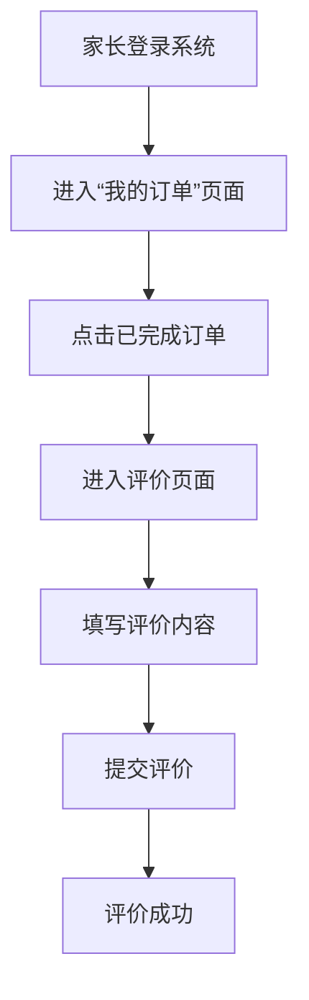
```mermaid
graph TD
    A[家长登录系统] --> B[进入“我的订单”页面]
    B --> C[点击已完成订单]
    C --> D[进入评价页面]
    D --> E[填写评价内容]
    E --> F[提交评价]
    F --> G[评价成功]
```

#### 教师评价家长

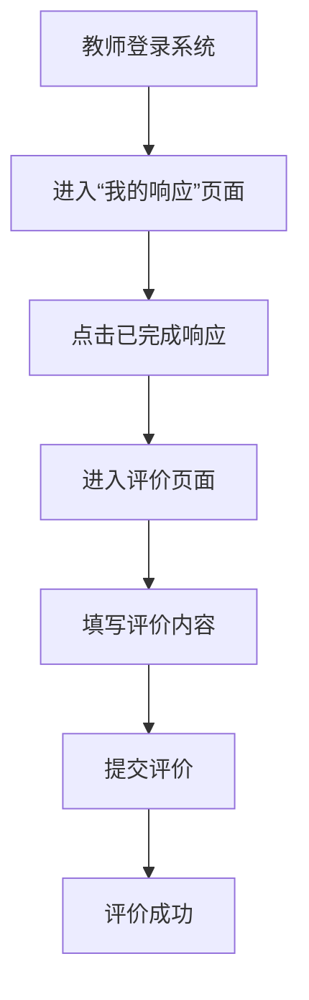
```mermaid
graph TD
    A[教师登录系统] --> B[进入“我的响应”页面]
    B --> C[点击已完成响应]
    C --> D[进入评价页面]
    D --> E[填写评价内容]
    E --> F[提交评价]
    F --> G[评价成功]
```

---

### **Mermaid 时序图**

#### 家长评价教师

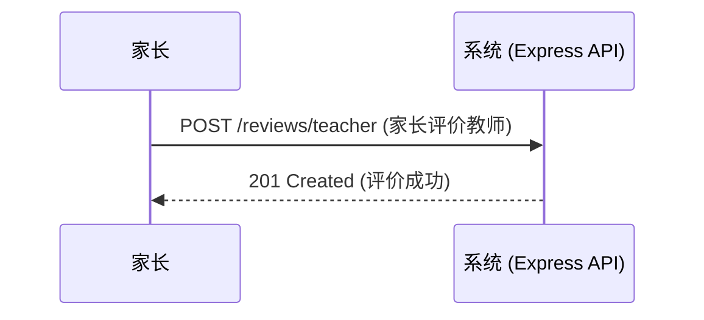
```mermaid
sequenceDiagram
    participant 家长 as 家长
    participant 系统 as 系统 (Express API)

    家长->>系统: POST /reviews/teacher (家长评价教师)
    系统-->>家长: 201 Created (评价成功)
```

#### 教师评价家长

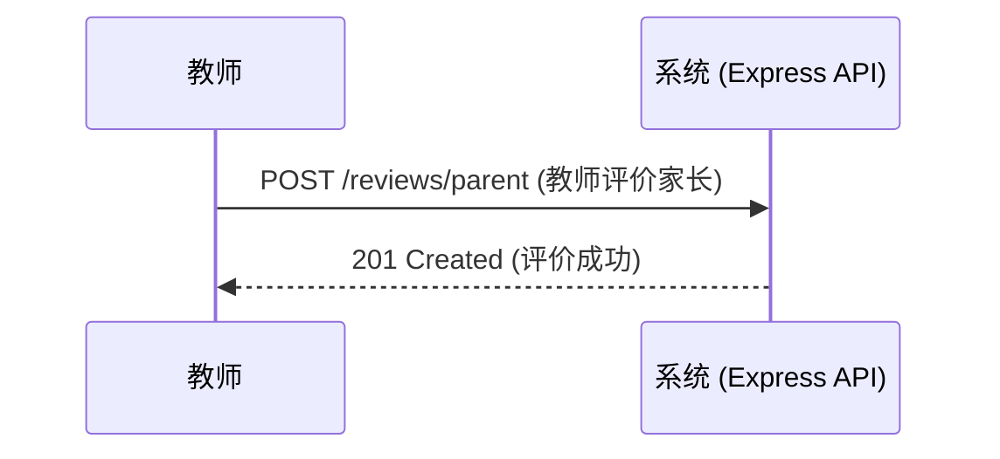
```mermaid
sequenceDiagram
    participant 教师 as 教师
    participant 系统 as 系统 (Express API)

    教师->>系统: POST /reviews/parent (教师评价家长)
    系统-->>教师: 201 Created (评价成功)
```

---

### **Express API 实现**

#### 1. 家长评价教师 (`POST /reviews/teacher`)

```javascript
app.post('/reviews/teacher', async (req, res) => {
  const { orderId, rating, comment } = req.body;

  // 检查订单是否存在且已完成
  const order = await Order.findById(orderId);
  if (!order || order.status !== 'completed') {
    return res.status(400).json({ message: '订单未完成或不存在' });
  }

  // 创建评价
  const review = new Review({
    orderId,
    rating,
    comment,
    type: 'teacher' // 评价类型：teacher
  });

  await review.save();

  // 更新教师的评分
  const teacher = await Teacher.findById(order.teacherId);
  teacher.rating = (teacher.rating * teacher.ratingCount + rating) / (teacher.ratingCount + 1);
  teacher.ratingCount += 1;
  await teacher.save();

  res.status(201).json(review);
});
```

#### 2. 教师评价家长 (`POST /reviews/parent`)

```javascript
app.post('/reviews/parent', async (req, res) => {
  const { orderId, rating, comment } = req.body;

  // 检查订单是否存在且已完成
  const order = await Order.findById(orderId);
  if (!order || order.status !== 'completed') {
    return res.status(400).json({ message: '订单未完成或不存在' });
  }

  // 创建评价
  const review = new Review({
    orderId,
    rating,
    comment,
    type: 'parent' // 评价类型：parent
  });

  await review.save();

  // 更新家长的评分
  const parent = await Parent.findById(order.parentId);
  parent.rating = (parent.rating * parent.ratingCount + rating) / (parent.ratingCount + 1);
  parent.ratingCount += 1;
  await parent.save();

  res.status(201).json(review);
});
```

---

### **数据结构**

#### 评价表 (`ReviewSchema`)

```javascript
const reviewSchema = new mongoose.Schema({
  orderId: { type: mongoose.Schema.Types.ObjectId, ref: 'Order', required: true }, // 订单ID
  rating: { type: Number, min: 1, max: 5, required: true }, // 评分（1-5）
  comment: { type: String }, // 评论
  type: { type: String, enum: ['teacher', 'parent'], required: true }, // 评价类型
  createdAt: { type: Date, default: Date.now } // 创建时间
});

const Review = mongoose.model('Review', reviewSchema);
```

#### 订单表 (`OrderSchema`)

```javascript
const orderSchema = new mongoose.Schema({
  parentId: { type: mongoose.Schema.Types.ObjectId, ref: 'Parent', required: true }, // 家长ID
  teacherId: { type: mongoose.Schema.Types.ObjectId, ref: 'Teacher', required: true }, // 教师ID
  status: { type: String, enum: ['pending', 'accepted', 'completed'], default: 'pending' }, // 订单状态
  createdAt: { type: Date, default: Date.now }, // 创建时间
  updatedAt: { type: Date, default: Date.now } // 更新时间
});

const Order = mongoose.model('Order', orderSchema);
```

---

### **总结**
通过 RESTful API 和 Mermaid 流程图及时序图，我们可以清晰地实现家长评价教师和教师评价家长的功能。如果你有更多的需求或问题，欢迎继续讨论！我热爱编程！

#### **5.3 用户反馈**

- **场景描述**：
  - 用户提交反馈（如功能建议、问题反馈）。
- **交互流程**：
  1. 用户登录系统，进入“反馈中心”页面。
  2. 填写反馈内容，提交反馈。
  3. 管理员查看并处理反馈。

我热爱编程！以下是基于家长和教师已有订单关系的评价与反馈功能的 RESTful API 设计和 Mermaid 流程图及时序图。

---

### **RESTful API 设计**

#### 1. **家长评价教师 (`POST /reviews/teacher`)**
- **描述**：家长对教师进行评价。
- **请求方法**：`POST`
- **请求体**：
  ```json
  {
    "orderId": "订单ID",
    "rating": 5, // 评分（1-5）
    "comment": "教师非常专业，孩子进步很大！" // 评论
  }
  ```
- **响应**：
  ```json
  {
    "reviewId": "评价ID",
    "orderId": "订单ID",
    "rating": 5,
    "comment": "教师非常专业，孩子进步很大！",
    "createdAt": "2023-06-25T12:00:00.000Z"
  }
  ```

#### 2. **教师评价家长 (`POST /reviews/parent`)**
- **描述**：教师对家长进行评价。
- **请求方法**：`POST`
- **请求体**：
  ```json
  {
    "orderId": "订单ID",
    "rating": 4, // 评分（1-5）
    "comment": "家长非常配合，沟通顺畅。" // 评论
  }
  ```
- **响应**：
  ```json
  {
    "reviewId": "评价ID",
    "orderId": "订单ID",
    "rating": 4,
    "comment": "家长非常配合，沟通顺畅。",
    "createdAt": "2023-06-25T12:00:00.000Z"
  }
  ```

#### 3. **用户提交反馈 (`POST /feedbacks`)**
- **描述**：用户提交反馈（如功能建议、问题反馈）。
- **请求方法**：`POST`
- **请求体**：
  ```json
  {
    "userId": "用户ID",
    "content": "希望增加更多科目的教师推荐功能。" // 反馈内容
  }
  ```
- **响应**：
  ```json
  {
    "feedbackId": "反馈ID",
    "userId": "用户ID",
    "content": "希望增加更多科目的教师推荐功能。",
    "status": "pending", // 反馈状态（pending/resolved）
    "createdAt": "2023-06-25T12:00:00.000Z"
  }
  ```

#### 4. **管理员查看反馈 (`GET /feedbacks`)**
- **描述**：管理员查看用户提交的反馈。
- **请求方法**：`GET`
- **响应**：
  ```json
  [
    {
      "feedbackId": "反馈ID",
      "userId": "用户ID",
      "content": "希望增加更多科目的教师推荐功能。",
      "status": "pending",
      "createdAt": "2023-06-25T12:00:00.000Z"
    }
  ]
  ```

#### 5. **管理员处理反馈 (`PUT /feedbacks/:id`)**
- **描述**：管理员处理用户反馈。
- **请求方法**：`PUT`
- **请求体**：
  ```json
  {
    "status": "resolved" // 更新反馈状态
  }
  ```
- **响应**：
  ```json
  {
    "feedbackId": "反馈ID",
    "userId": "用户ID",
    "content": "希望增加更多科目的教师推荐功能。",
    "status": "resolved",
    "createdAt": "2023-06-25T12:00:00.000Z",
    "updatedAt": "2023-06-25T12:30:00.000Z"
  }
  ```

---

### **Mermaid 流程图**

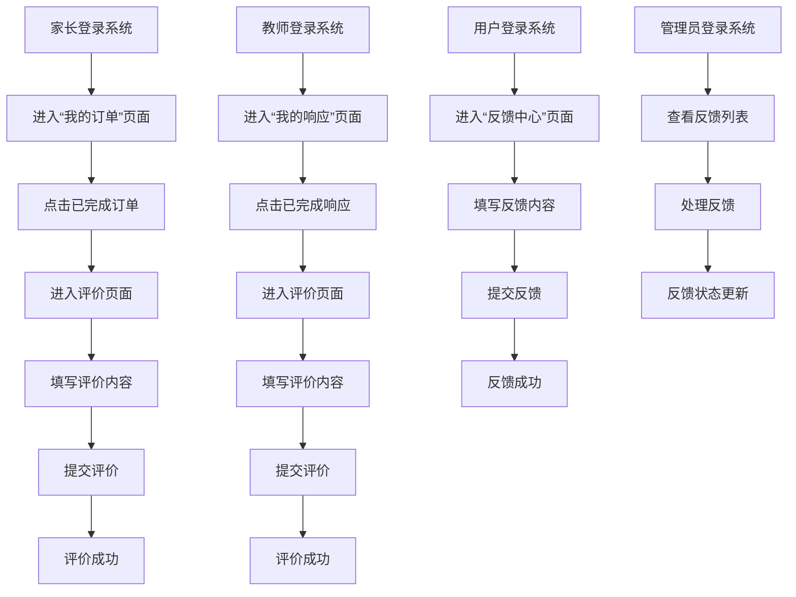
```mermaid
graph TD
    A[家长登录系统] --> B[进入“我的订单”页面]
    B --> C[点击已完成订单]
    C --> D[进入评价页面]
    D --> E[填写评价内容]
    E --> F[提交评价]
    F --> G[评价成功]

    H[教师登录系统] --> I[进入“我的响应”页面]
    I --> J[点击已完成响应]
    J --> K[进入评价页面]
    K --> L[填写评价内容]
    L --> M[提交评价]
    M --> N[评价成功]

    O[用户登录系统] --> P[进入“反馈中心”页面]
    P --> Q[填写反馈内容]
    Q --> R[提交反馈]
    R --> S[反馈成功]

    T[管理员登录系统] --> U[查看反馈列表]
    U --> V[处理反馈]
    V --> W[反馈状态更新]
```

---

### **Mermaid 时序图**

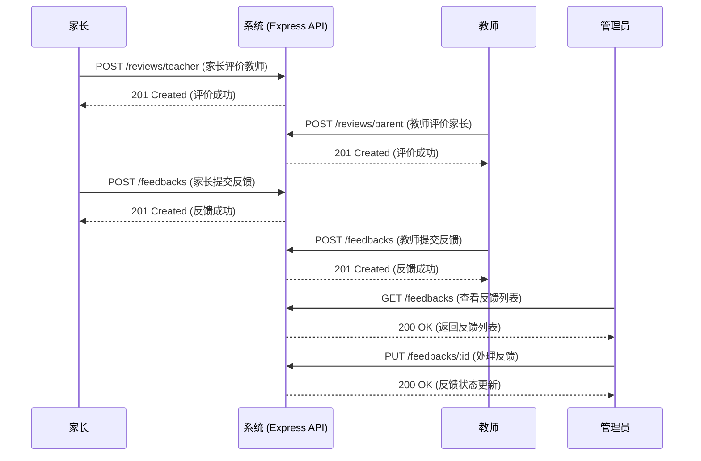
```mermaid
sequenceDiagram
    participant 家长 as 家长
    participant 系统 as 系统 (Express API)
    participant 教师 as 教师
    participant 管理员 as 管理员

    家长->>系统: POST /reviews/teacher (家长评价教师)
    系统-->>家长: 201 Created (评价成功)

    教师->>系统: POST /reviews/parent (教师评价家长)
    系统-->>教师: 201 Created (评价成功)

    家长->>系统: POST /feedbacks (家长提交反馈)
    系统-->>家长: 201 Created (反馈成功)

    教师->>系统: POST /feedbacks (教师提交反馈)
    系统-->>教师: 201 Created (反馈成功)

    管理员->>系统: GET /feedbacks (查看反馈列表)
    系统-->>管理员: 200 OK (返回反馈列表)

    管理员->>系统: PUT /feedbacks/:id (处理反馈)
    系统-->>管理员: 200 OK (反馈状态更新)
```

---

### **Express API 实现**

#### 1. 家长评价教师 (`POST /reviews/teacher`)

```javascript
app.post('/reviews/teacher', async (req, res) => {
  const { orderId, rating, comment } = req.body;
  const review = await createTeacherReview(orderId, rating, comment);
  res.status(201).json(review);
});

const createTeacherReview = async (orderId, rating, comment) => {
  const review = new Review({
    orderId,
    rating,
    comment,
    type: 'teacher' // 评价类型：teacher
  });

  await review.save();
  return review;
};
```

#### 2. 教师评价家长 (`POST /reviews/parent`)

```javascript
app.post('/reviews/parent', async (req, res) => {
  const { orderId, rating, comment } = req.body;
  const review = await createParentReview(orderId, rating, comment);
  res.status(201).json(review);
});

const createParentReview = async (orderId, rating, comment) => {
  const review = new Review({
    orderId,
    rating,
    comment,
    type: 'parent' // 评价类型：parent
  });

  await review.save();
  return review;
};
```

#### 3. 用户提交反馈 (`POST /feedbacks`)

```javascript
app.post('/feedbacks', async (req, res) => {
  const { userId, content } = req.body;
  const feedback = await createFeedback(userId, content);
  res.status(201).json(feedback);
});

const createFeedback = async (userId, content) => {
  const feedback = new Feedback({
    userId,
    content,
    status: 'pending' // 反馈状态：pending
  });

  await feedback.save();
  return feedback;
};
```

#### 4. 管理员查看反馈 (`GET /feedbacks`)

```javascript
app.get('/feedbacks', async (req, res) => {
  const feedbacks = await Feedback.find();
  res.status(200).json(feedbacks);
});
```

#### 5. 管理员处理反馈 (`PUT /feedbacks/:id`)

```javascript
app.put('/feedbacks/:id', async (req, res) => {
  const { id } = req.params;
  const { status } = req.body;
  const feedback = await updateFeedbackStatus(id, status);
  res.status(200).json(feedback);
});

const updateFeedbackStatus = async (id, status) => {
  const feedback = await Feedback.findByIdAndUpdate(
    id,
    { status, updatedAt: Date.now() },
    { new: true }
  );

  return feedback;
};
```

---

### **总结**
通过 RESTful API 和 Mermaid 流程图及时序图，我们可以清晰地实现家长评价教师、教师评价家长以及用户反馈的功能。如果你有更多的需求或问题，欢迎继续讨论！我热爱编程！


------

### **1. 家长预约试听**

#### **1.1 场景描述**

- 家长可以预约教师的试听课程，了解教师的教学风格和水平。

#### **1.2 交互流程**

1. **家长操作**：
   - 家长登录系统，进入教师详情页。
   - 点击“预约试听”按钮。
   - 选择试听时间（从教师的可选时间段中选择）。
   - 提交预约申请。
2. **系统操作**：
   - 系统生成试听预约记录，并通知教师。
3. **教师操作**：
   - 教师登录系统，查看试听预约申请。
   - 确认或拒绝预约。
4. **系统通知**：
   - 如果教师确认预约，系统通知家长试听时间和地点。
   - 如果教师拒绝预约，系统通知家长并建议选择其他教师。

#### **1.3 数据结构**

- **试听预约表 (TrialClassBooking)**

  | 字段名      | 类型       | 说明                                         |
  | :---------- | :--------- | :------------------------------------------- |
  | `_id`       | `ObjectId` | 预约ID（主键）                               |
  | `parentId`  | `ObjectId` | 关联家长表（外键）                           |
  | `teacherId` | `ObjectId` | 关联教师表（外键）                           |
  | `trialTime` | `Date`     | 试听时间                                     |
  | `status`    | `String`   | 预约状态（`pending`/`confirmed`/`rejected`） |
  | `createdAt` | `Date`     | 创建时间                                     |
  | `updatedAt` | `Date`     | 更新时间                                     |

结合 **Express**、**MongoDB**、**Vue 3** 和 **RESTful API**，我们可以构建一个完整的智能家教推荐系统。以下是具体的实现方案，包括 **API 设计**、**前后端交互** 和 **数据流**。

---

### **1. 技术栈**
- **后端**：
  - 框架：Express.js
  - 数据库：MongoDB
  - API 风格：RESTful API
- **前端**：
  - 框架：Vue 3
  - 状态管理：Pinia（或 Vuex）
  - UI 库：Element Plus 或 Vuetify
- **通信**：
  - HTTP 请求：Axios
  - 实时通知：Socket.IO（可选）

---

### **2. RESTful API 设计**

#### **2.1 家长相关 API**
| 方法 | 路径                           | 描述                   |
| ---- | ------------------------------ | ---------------------- |
| POST | `/api/parents/register`        | 家长注册               |
| POST | `/api/parents/login`           | 家长登录               |
| POST | `/api/parents/forgot-password` | 家长忘记密码           |
| GET  | `/api/parents/profile`         | 获取家长个人信息       |
| PUT  | `/api/parents/profile`         | 更新家长个人信息       |
| POST | `/api/parents/posts`           | 家长发布帖子           |
| GET  | `/api/parents/posts`           | 获取家长发布的帖子列表 |
| GET  | `/api/parents/recommendations` | 获取推荐教师列表       |

#### **2.2 教师相关 API**
| 方法 | 路径                            | 描述             |
| ---- | ------------------------------- | ---------------- |
| POST | `/api/teachers/register`        | 教师注册         |
| POST | `/api/teachers/login`           | 教师登录         |
| POST | `/api/teachers/forgot-password` | 教师忘记密码     |
| GET  | `/api/teachers/profile`         | 获取教师个人信息 |
| PUT  | `/api/teachers/profile`         | 更新教师个人信息 |
| GET  | `/api/teachers/recommendations` | 获取推荐帖子列表 |
| POST | `/api/teachers/responses`       | 教师响应帖子     |

#### **2.3 管理员相关 API**
| 方法 | 路径                    | 描述         |
| ---- | ----------------------- | ------------ |
| POST | `/api/admins/register`  | 管理员注册   |
| POST | `/api/admins/login`     | 管理员登录   |
| GET  | `/api/admins/users`     | 获取用户列表 |
| PUT  | `/api/admins/users/:id` | 更新用户状态 |
| GET  | `/api/admins/posts`     | 获取帖子列表 |
| PUT  | `/api/admins/posts/:id` | 审核帖子     |

#### **2.4 系统通知 API**
| 方法 | 路径                     | 描述           |
| ---- | ------------------------ | -------------- |
| GET  | `/api/notifications`     | 获取通知列表   |
| PUT  | `/api/notifications/:id` | 标记通知为已读 |

---

### **3. 前后端交互**

#### **3.1 家长注册**
- **前端**：
  1. 家长填写注册表单（姓名、手机号、邮箱、密码）。
  2. 调用 `/api/parents/register` 提交注册信息。
  3. 跳转至偏好设置页面。

- **后端**：
  1. 验证注册信息。
  2. 将家长信息保存到 MongoDB。
  3. 返回注册成功响应。

#### **3.2 家长登录**
- **前端**：
  1. 家长填写登录表单（邮箱/手机号、密码）。
  2. 调用 `/api/parents/login` 提交登录信息。
  3. 跳转至家长主页。

- **后端**：
  1. 验证登录信息。
  2. 生成 JWT（JSON Web Token）并返回给前端。

#### **3.3 家长发布帖子**
- **前端**：
  1. 家长填写帖子表单（科目、年级、价格范围等）。
  2. 调用 `/api/parents/posts` 提交帖子信息。
  3. 显示发布成功提示。

- **后端**：
  1. 验证帖子信息。
  2. 将帖子保存到 MongoDB。
  3. 返回发布成功响应。

---

### **4. 数据流**

#### **4.1 家长注册数据流**
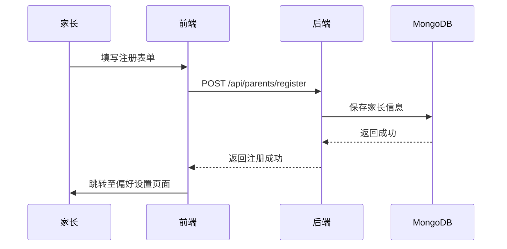
```mermaid
sequenceDiagram
    participant 家长
    participant 前端
    participant 后端
    participant MongoDB

    家长->>前端: 填写注册表单
    前端->>后端: POST /api/parents/register
    后端->>MongoDB: 保存家长信息
    MongoDB-->>后端: 返回成功
    后端-->>前端: 返回注册成功
    前端->>家长: 跳转至偏好设置页面
```

#### **4.2 家长登录数据流**
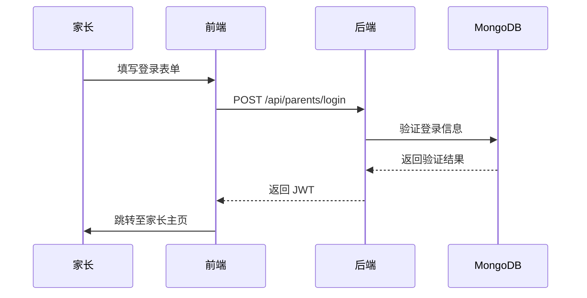
```mermaid
sequenceDiagram
    participant 家长
    participant 前端
    participant 后端
    participant MongoDB

    家长->>前端: 填写登录表单
    前端->>后端: POST /api/parents/login
    后端->>MongoDB: 验证登录信息
    MongoDB-->>后端: 返回验证结果
    后端-->>前端: 返回 JWT
    前端->>家长: 跳转至家长主页
```

#### **4.3 家长发布帖子数据流**
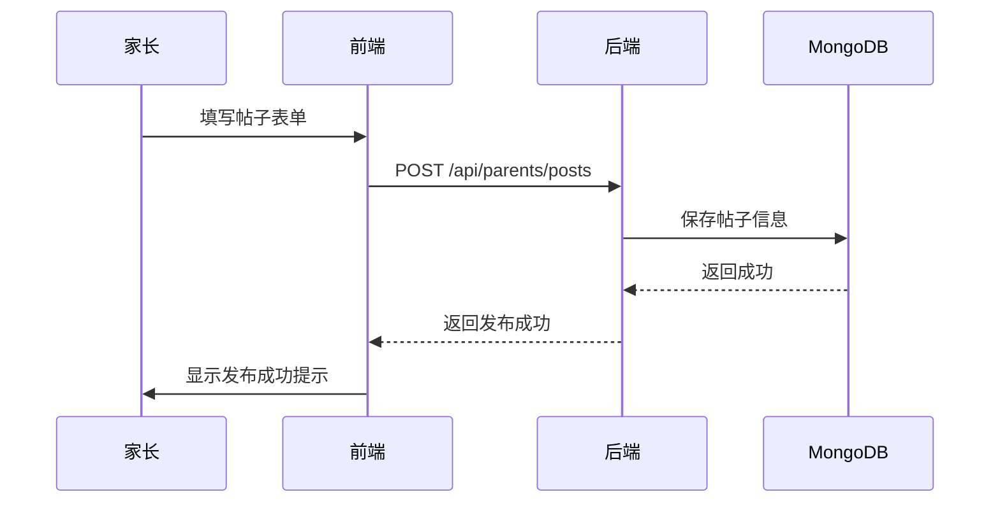
```mermaid
sequenceDiagram
    participant 家长
    participant 前端
    participant 后端
    participant MongoDB

    家长->>前端: 填写帖子表单
    前端->>后端: POST /api/parents/posts
    后端->>MongoDB: 保存帖子信息
    MongoDB-->>后端: 返回成功
    后端-->>前端: 返回发布成功
    前端->>家长: 显示发布成功提示
```

---

### **5. 代码示例**

#### **5.1 后端 Express 代码**
```javascript
const express = require('express');
const mongoose = require('mongoose');
const bodyParser = require('body-parser');
const cors = require('cors');

const app = express();
app.use(bodyParser.json());
app.use(cors());

// 连接 MongoDB
mongoose.connect('mongodb://localhost:27017/tutor_system', {
  useNewUrlParser: true,
  useUnifiedTopology: true,
});

// 家长注册 API
app.post('/api/parents/register', async (req, res) => {
  const { name, phone, email, password } = req.body;
  const parent = new Parent({ name, phone, email, password });
  await parent.save();
  res.status(201).json({ message: '注册成功' });
});

// 家长登录 API
app.post('/api/parents/login', async (req, res) => {
  const { email, password } = req.body;
  const parent = await Parent.findOne({ email, password });
  if (parent) {
    const token = generateJWT(parent); // 生成 JWT
    res.json({ token });
  } else {
    res.status(401).json({ message: '登录失败' });
  }
});

app.listen(3000, () => {
  console.log('服务器运行在 http://localhost:3000');
});
```

#### **5.2 前端 Vue 3 代码**
```javascript
<template>
  <div>
    <h1>家长注册</h1>
    <form @submit.prevent="register">
      <input v-model="name" placeholder="姓名" />
      <input v-model="phone" placeholder="手机号" />
      <input v-model="email" placeholder="邮箱" />
      <input v-model="password" type="password" placeholder="密码" />
      <button type="submit">注册</button>
    </form>
  </div>
</template>

<script>
import axios from 'axios';

export default {
  data() {
    return {
      name: '',
      phone: '',
      email: '',
      password: '',
    };
  },
  methods: {
    async register() {
      const response = await axios.post('/api/parents/register', {
        name: this.name,
        phone: this.phone,
        email: this.email,
        password: this.password,
      });
      if (response.data.message === '注册成功') {
        this.$router.push('/preferences');
      }
    },
  },
};
</script>
```

---

### **6. 总结**
通过结合 **Express**、**MongoDB**、**Vue 3** 和 **RESTful API**，我们可以构建一个完整的智能家教推荐系统：
1. **API 设计**：定义清晰的 RESTful API，支持家长、教师和管理员的操作。
2. **前后端交互**：通过 Axios 实现前后端通信。
3. **数据流**：通过 MongoDB 存储数据，并通过 Express 处理数据流。

这种设计能够满足系统的核心需求，并为后续扩展提供良好的基础。


以下是 **个人中心** 模块的详细设计，包括 **家长个人中心**、**教师个人中心** 和 **管理员个人中心** 的 **RESTful API 设计**、**前后端交互** 和 **数据流**。

---

### **1. RESTful API 设计**

#### **1.1 家长个人中心 API**
| 方法 | 路径                     | 描述                   |
| ---- | ------------------------ | ---------------------- |
| GET  | `/api/parents/profile`   | 获取家长个人信息       |
| PUT  | `/api/parents/profile`   | 更新家长个人信息       |
| GET  | `/api/parents/posts`     | 获取家长发布的帖子列表 |
| GET  | `/api/parents/favorites` | 获取家长收藏的教师列表 |
| GET  | `/api/parents/orders`    | 获取家长的订单列表     |

#### **1.2 教师个人中心 API**
| 方法 | 路径                      | 描述                   |
| ---- | ------------------------- | ---------------------- |
| GET  | `/api/teachers/profile`   | 获取教师个人信息       |
| PUT  | `/api/teachers/profile`   | 更新教师个人信息       |
| GET  | `/api/teachers/responses` | 获取教师响应的帖子列表 |
| GET  | `/api/teachers/favorites` | 获取教师收藏的帖子列表 |
| GET  | `/api/teachers/reviews`   | 获取教师收到的评价列表 |

#### **1.3 管理员个人中心 API**
| 方法 | 路径                            | 描述               |
| ---- | ------------------------------- | ------------------ |
| GET  | `/api/admins/profile`           | 获取管理员个人信息 |
| PUT  | `/api/admins/profile`           | 更新管理员个人信息 |
| GET  | `/api/admins/config`            | 获取系统配置       |
| PUT  | `/api/admins/config`            | 更新系统配置       |
| GET  | `/api/admins/notifications`     | 获取系统通知列表   |
| PUT  | `/api/admins/notifications/:id` | 标记通知为已读     |

---

### **2. 前后端交互**

#### **2.1 家长个人中心**
- **前端**：
  1. 家长登录系统，进入“个人中心”页面。
  2. 调用 `/api/parents/profile` 获取个人信息。
  3. 调用 `/api/parents/posts` 获取发布的帖子列表。
  4. 调用 `/api/parents/favorites` 获取收藏的教师列表。
  5. 调用 `/api/parents/orders` 获取订单列表。

- **后端**：
  1. 验证家长身份（通过 JWT）。
  2. 从 MongoDB 查询家长的个人信息、帖子、收藏和订单。
  3. 返回查询结果。

#### **2.2 教师个人中心**
- **前端**：
  1. 教师登录系统，进入“个人中心”页面。
  2. 调用 `/api/teachers/profile` 获取个人信息。
  3. 调用 `/api/teachers/responses` 获取响应的帖子列表。
  4. 调用 `/api/teachers/favorites` 获取收藏的帖子列表。
  5. 调用 `/api/teachers/reviews` 获取收到的评价列表。

- **后端**：
  1. 验证教师身份（通过 JWT）。
  2. 从 MongoDB 查询教师的个人信息、响应记录、收藏和评价。
  3. 返回查询结果。

#### **2.3 管理员个人中心**
- **前端**：
  1. 管理员登录系统，进入“个人中心”页面。
  2. 调用 `/api/admins/profile` 获取个人信息。
  3. 调用 `/api/admins/config` 获取系统配置。
  4. 调用 `/api/admins/notifications` 获取系统通知列表。

- **后端**：
  1. 验证管理员身份（通过 JWT）。
  2. 从 MongoDB 查询管理员的个人信息、系统配置和通知。
  3. 返回查询结果。

---

### **3. 数据流**

#### **3.1 家长个人中心数据流**
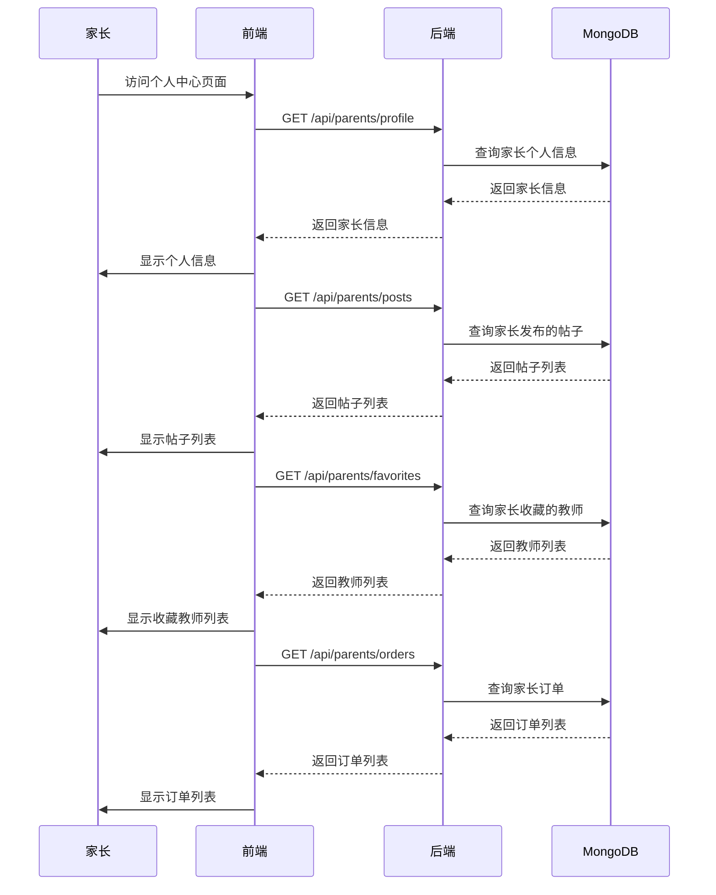
```mermaid
sequenceDiagram
    participant 家长
    participant 前端
    participant 后端
    participant MongoDB

    家长->>前端: 访问个人中心页面
    前端->>后端: GET /api/parents/profile
    后端->>MongoDB: 查询家长个人信息
    MongoDB-->>后端: 返回家长信息
    后端-->>前端: 返回家长信息
    前端->>家长: 显示个人信息

    前端->>后端: GET /api/parents/posts
    后端->>MongoDB: 查询家长发布的帖子
    MongoDB-->>后端: 返回帖子列表
    后端-->>前端: 返回帖子列表
    前端->>家长: 显示帖子列表

    前端->>后端: GET /api/parents/favorites
    后端->>MongoDB: 查询家长收藏的教师
    MongoDB-->>后端: 返回教师列表
    后端-->>前端: 返回教师列表
    前端->>家长: 显示收藏教师列表

    前端->>后端: GET /api/parents/orders
    后端->>MongoDB: 查询家长订单
    MongoDB-->>后端: 返回订单列表
    后端-->>前端: 返回订单列表
    前端->>家长: 显示订单列表
```

#### **3.2 教师个人中心数据流**
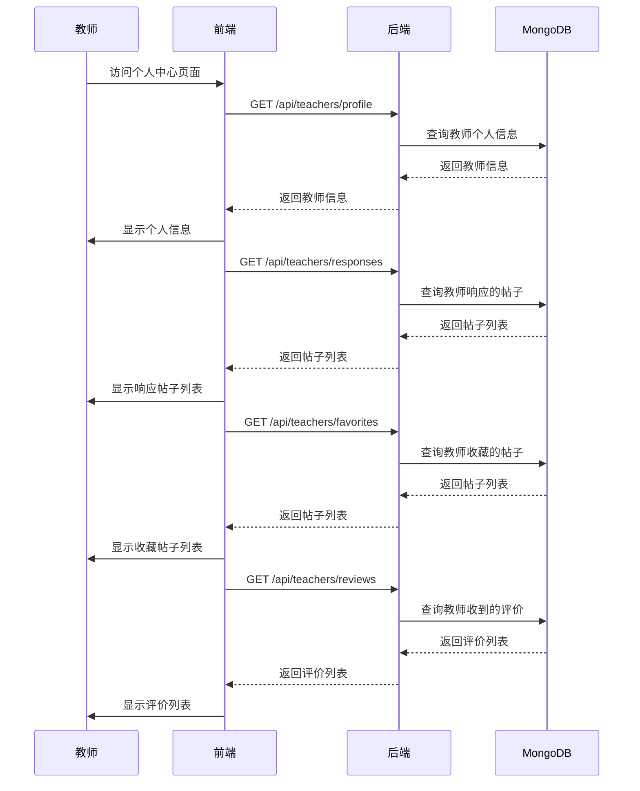
```mermaid
sequenceDiagram
    participant 教师
    participant 前端
    participant 后端
    participant MongoDB

    教师->>前端: 访问个人中心页面
    前端->>后端: GET /api/teachers/profile
    后端->>MongoDB: 查询教师个人信息
    MongoDB-->>后端: 返回教师信息
    后端-->>前端: 返回教师信息
    前端->>教师: 显示个人信息

    前端->>后端: GET /api/teachers/responses
    后端->>MongoDB: 查询教师响应的帖子
    MongoDB-->>后端: 返回帖子列表
    后端-->>前端: 返回帖子列表
    前端->>教师: 显示响应帖子列表

    前端->>后端: GET /api/teachers/favorites
    后端->>MongoDB: 查询教师收藏的帖子
    MongoDB-->>后端: 返回帖子列表
    后端-->>前端: 返回帖子列表
    前端->>教师: 显示收藏帖子列表

    前端->>后端: GET /api/teachers/reviews
    后端->>MongoDB: 查询教师收到的评价
    MongoDB-->>后端: 返回评价列表
    后端-->>前端: 返回评价列表
    前端->>教师: 显示评价列表
```

#### **3.3 管理员个人中心数据流**
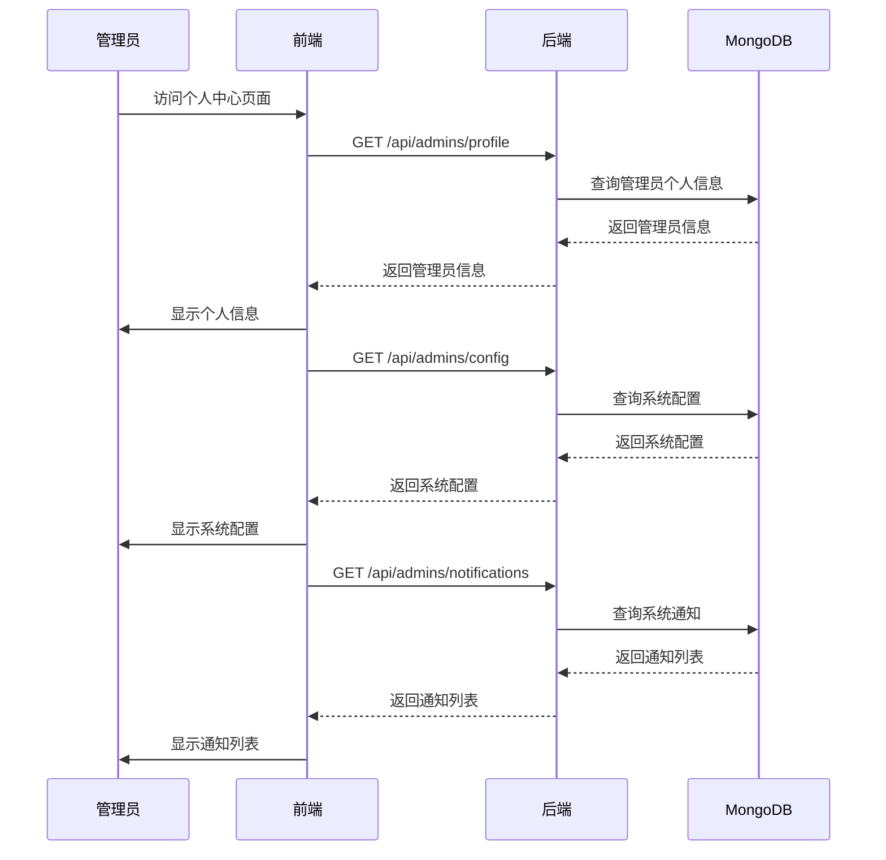
```mermaid
sequenceDiagram
    participant 管理员
    participant 前端
    participant 后端
    participant MongoDB

    管理员->>前端: 访问个人中心页面
    前端->>后端: GET /api/admins/profile
    后端->>MongoDB: 查询管理员个人信息
    MongoDB-->>后端: 返回管理员信息
    后端-->>前端: 返回管理员信息
    前端->>管理员: 显示个人信息

    前端->>后端: GET /api/admins/config
    后端->>MongoDB: 查询系统配置
    MongoDB-->>后端: 返回系统配置
    后端-->>前端: 返回系统配置
    前端->>管理员: 显示系统配置

    前端->>后端: GET /api/admins/notifications
    后端->>MongoDB: 查询系统通知
    MongoDB-->>后端: 返回通知列表
    后端-->>前端: 返回通知列表
    前端->>管理员: 显示通知列表
```

---

### **4. 代码示例**

#### **4.1 后端 Express 代码**
```javascript
// 获取家长个人信息
app.get('/api/parents/profile', async (req, res) => {
  const parentId = req.user.id; // 从 JWT 中获取家长 ID
  const parent = await Parent.findById(parentId);
  res.json(parent);
});

// 获取家长发布的帖子列表
app.get('/api/parents/posts', async (req, res) => {
  const parentId = req.user.id;
  const posts = await Post.find({ parentId });
  res.json(posts);
});

// 获取家长收藏的教师列表
app.get('/api/parents/favorites', async (req, res) => {
  const parentId = req.user.id;
  const favorites = await Favorite.find({ parentId }).populate('teacherId');
  res.json(favorites);
});

// 获取家长的订单列表
app.get('/api/parents/orders', async (req, res) => {
  const parentId = req.user.id;
  const orders = await Order.find({ parentId });
  res.json(orders);
});
```

#### **4.2 前端 Vue 3 代码**
```javascript
<template>
  <div>
    <h1>个人中心</h1>
    <div v-if="user">
      <h2>个人信息</h2>
      <p>姓名: {{ user.name }}</p>
      <p>邮箱: {{ user.email }}</p>
    </div>
    <div v-if="posts">
      <h2>发布的帖子</h2>
      <ul>
        <li v-for="post in posts" :key="post.id">{{ post.title }}</li>
      </ul>
    </div>
    <div v-if="favorites">
      <h2>收藏的教师</h2>
      <ul>
        <li v-for="favorite in favorites" :key="favorite.id">{{ favorite.teacherId.name }}</li>
      </ul>
    </div>
    <div v-if="orders">
      <h2>订单列表</h2>
      <ul>
        <li v-for="order in orders" :key="order.id">{{ order.id }}</li>
      </ul>
    </div>
  </div>
</template>

<script>
import axios from 'axios';

export default {
  data() {
    return {
      user: null,
      posts: [],
      favorites: [],
      orders: [],
    };
  },
  async created() {
    const token = localStorage.getItem('token');
    if (token) {
      // 获取家长个人信息
      const userResponse = await axios.get('/api/parents/profile', {
        headers: { Authorization: `Bearer ${token}` },
      });
      this.user = userResponse.data;

      // 获取家长发布的帖子列表
      const postsResponse = await axios.get('/api/parents/posts', {
        headers: { Authorization: `Bearer ${token}` },
      });
      this.posts = postsResponse.data;

      // 获取家长收藏的教师列表
      const favoritesResponse = await axios.get('/api/parents/favorites', {
        headers: { Authorization: `Bearer ${token}` },
      });
      this.favorites = favoritesResponse.data;

      // 获取家长的订单列表
      const ordersResponse = await axios.get('/api/parents/orders', {
        headers: { Authorization: `Bearer ${token}` },
      });
      this.orders = ordersResponse.data;
    }
  },
};
</script>
```

---

### **5. 总结**
通过设计 **个人中心** 模块，家长、教师和管理员可以方便地查看和管理自己的信息：
1. **家长**：查看个人信息、发布的帖子、收藏的教师和订单。
2. **教师**：查看个人信息、响应的帖子、收藏的帖子和收到的评价。
3. **管理员**：查看个人信息、系统配置和通知。

这种设计能够提升用户体验，并为后续功能扩展提供良好的基础。


以下是 **消息系统** 和 **支付系统** 的详细设计，包括 **RESTful API 设计**、**前后端交互** 和 **数据流**。

---

### **1. 消息系统**

#### **1.1 RESTful API 设计**

##### **1.1.1 家长与教师聊天 API**
| 方法 | 路径                      | 描述         |
| ---- | ------------------------- | ------------ |
| POST | `/api/chat/messages`      | 发送消息     |
| GET  | `/api/chat/messages`      | 获取聊天记录 |
| GET  | `/api/chat/conversations` | 获取会话列表 |

##### **1.1.2 系统通知 API**
| 方法 | 路径                     | 描述           |
| ---- | ------------------------ | -------------- |
| GET  | `/api/notifications`     | 获取通知列表   |
| PUT  | `/api/notifications/:id` | 标记通知为已读 |

---

#### **1.2 前后端交互**

##### **1.2.1 家长与教师聊天**
- **前端**：
  1. 家长在教师详情页点击“联系”按钮，进入聊天页面。
  2. 调用 `/api/chat/conversations` 获取会话列表。
  3. 调用 `/api/chat/messages` 获取聊天记录。
  4. 家长发送消息，调用 `/api/chat/messages` 提交消息。

- **后端**：
  1. 验证用户身份（通过 JWT）。
  2. 将消息保存到 MongoDB。
  3. 使用 Socket.IO 实时推送消息。

##### **1.2.2 系统通知**
- **前端**：
  1. 用户登录系统，进入“通知中心”页面。
  2. 调用 `/api/notifications` 获取通知列表。
  3. 用户点击通知，调用 `/api/notifications/:id` 标记为已读。

- **后端**：
  1. 验证用户身份（通过 JWT）。
  2. 从 MongoDB 查询通知列表。
  3. 返回通知列表或更新通知状态。

---

#### **1.3 数据流**

##### **1.3.1 家长与教师聊天数据流**
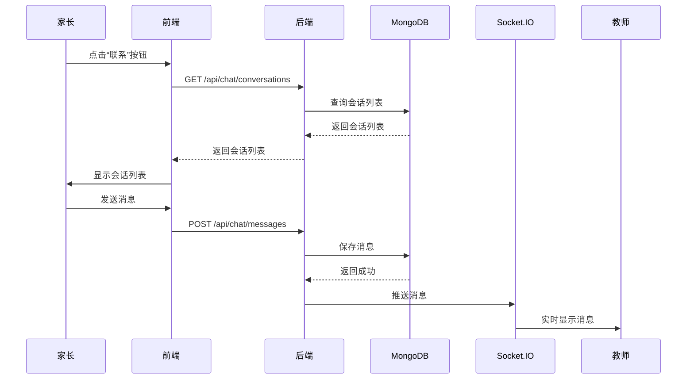
```mermaid
sequenceDiagram
    participant 家长
    participant 前端
    participant 后端
    participant MongoDB
    participant Socket.IO

    家长->>前端: 点击“联系”按钮
    前端->>后端: GET /api/chat/conversations
    后端->>MongoDB: 查询会话列表
    MongoDB-->>后端: 返回会话列表
    后端-->>前端: 返回会话列表
    前端->>家长: 显示会话列表

    家长->>前端: 发送消息
    前端->>后端: POST /api/chat/messages
    后端->>MongoDB: 保存消息
    MongoDB-->>后端: 返回成功
    后端->>Socket.IO: 推送消息
    Socket.IO->>教师: 实时显示消息
```

##### **1.3.2 系统通知数据流**
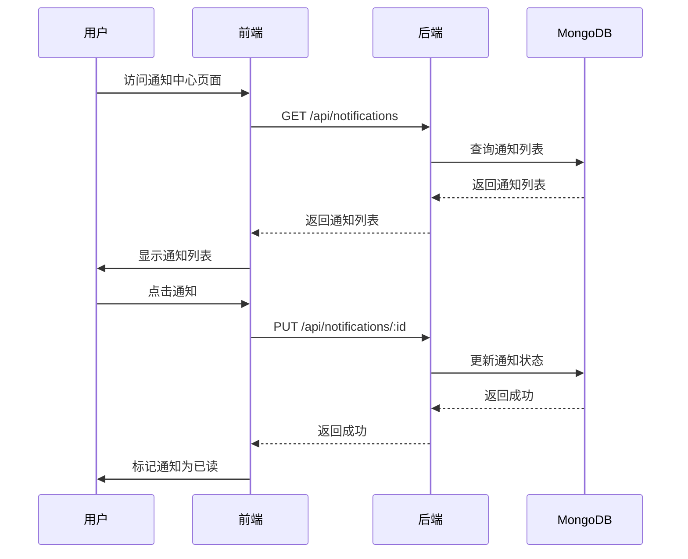
```mermaid
sequenceDiagram
    participant 用户
    participant 前端
    participant 后端
    participant MongoDB

    用户->>前端: 访问通知中心页面
    前端->>后端: GET /api/notifications
    后端->>MongoDB: 查询通知列表
    MongoDB-->>后端: 返回通知列表
    后端-->>前端: 返回通知列表
    前端->>用户: 显示通知列表

    用户->>前端: 点击通知
    前端->>后端: PUT /api/notifications/:id
    后端->>MongoDB: 更新通知状态
    MongoDB-->>后端: 返回成功
    后端-->>前端: 返回成功
    前端->>用户: 标记通知为已读
```

---

### **2. 支付系统**

#### **2.1 RESTful API 设计**

##### **2.1.1 家长支付订单 API**
| 方法 | 路径              | 描述         |
| ---- | ----------------- | ------------ |
| POST | `/api/orders`     | 创建订单     |
| POST | `/api/payments`   | 发起支付     |
| GET  | `/api/orders`     | 获取订单列表 |
| GET  | `/api/orders/:id` | 获取订单详情 |

---

#### **2.2 前后端交互**

##### **2.2.1 家长支付订单**
- **前端**：
  1. 家长在教师详情页点击“预约”按钮，调用 `/api/orders` 创建订单。
  2. 进入支付页面，调用 `/api/payments` 发起支付。
  3. 支付成功后，显示支付成功提示。

- **后端**：
  1. 验证家长身份（通过 JWT）。
  2. 创建订单并保存到 MongoDB。
  3. 调用第三方支付接口（如支付宝、微信支付）发起支付。
  4. 更新订单状态。

---

#### **2.3 数据流**

##### **2.3.1 家长支付订单数据流**
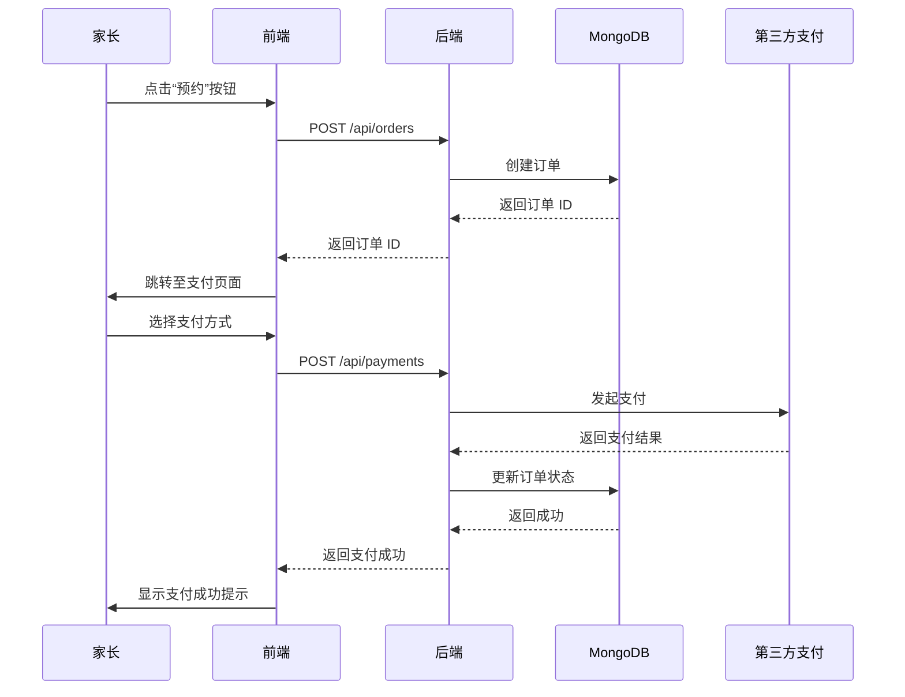
```mermaid
sequenceDiagram
    participant 家长
    participant 前端
    participant 后端
    participant MongoDB
    participant 第三方支付

    家长->>前端: 点击“预约”按钮
    前端->>后端: POST /api/orders
    后端->>MongoDB: 创建订单
    MongoDB-->>后端: 返回订单 ID
    后端-->>前端: 返回订单 ID
    前端->>家长: 跳转至支付页面

    家长->>前端: 选择支付方式
    前端->>后端: POST /api/payments
    后端->>第三方支付: 发起支付
    第三方支付-->>后端: 返回支付结果
    后端->>MongoDB: 更新订单状态
    MongoDB-->>后端: 返回成功
    后端-->>前端: 返回支付成功
    前端->>家长: 显示支付成功提示
```

---

### **3. 代码示例**

#### **3.1 后端 Express 代码**

##### **3.1.1 家长与教师聊天**
```javascript
// 发送消息
app.post('/api/chat/messages', async (req, res) => {
  const { senderId, receiverId, content } = req.body;
  const message = new Message({ senderId, receiverId, content });
  await message.save();
  io.to(receiverId).emit('newMessage', message); // 使用 Socket.IO 推送消息
  res.status(201).json(message);
});

// 获取聊天记录
app.get('/api/chat/messages', async (req, res) => {
  const { senderId, receiverId } = req.query;
  const messages = await Message.find({
    $or: [
      { senderId, receiverId },
      { senderId: receiverId, receiverId: senderId },
    ],
  });
  res.json(messages);
});
```

##### **3.1.2 系统通知**
```javascript
// 获取通知列表
app.get('/api/notifications', async (req, res) => {
  const userId = req.user.id;
  const notifications = await Notification.find({ userId });
  res.json(notifications);
});

// 标记通知为已读
app.put('/api/notifications/:id', async (req, res) => {
  const notification = await Notification.findByIdAndUpdate(
    req.params.id,
    { isRead: true },
    { new: true }
  );
  res.json(notification);
});
```

##### **3.1.3 家长支付订单**
```javascript
// 创建订单
app.post('/api/orders', async (req, res) => {
  const { parentId, teacherId, amount } = req.body;
  const order = new Order({ parentId, teacherId, amount });
  await order.save();
  res.status(201).json(order);
});

// 发起支付
app.post('/api/payments', async (req, res) => {
  const { orderId, paymentMethod } = req.body;
  const paymentResult = await thirdPartyPayment(paymentMethod, orderId); // 调用第三方支付接口
  if (paymentResult.success) {
    await Order.findByIdAndUpdate(orderId, { status: 'paid' });
    res.json({ message: '支付成功' });
  } else {
    res.status(400).json({ message: '支付失败' });
  }
});
```

#### **3.2 前端 Vue 3 代码**

##### **3.2.1 家长与教师聊天**
```javascript
<template>
  <div>
    <h1>聊天页面</h1>
    <div v-for="message in messages" :key="message.id">
      <p>{{ message.content }}</p>
    </div>
    <input v-model="newMessage" placeholder="输入消息" />
    <button @click="sendMessage">发送</button>
  </div>
</template>

<script>
import axios from 'axios';
import io from 'socket.io-client';

export default {
  data() {
    return {
      messages: [],
      newMessage: '',
      socket: null,
    };
  },
  async created() {
    const token = localStorage.getItem('token');
    if (token) {
      // 获取聊天记录
      const response = await axios.get('/api/chat/messages', {
        params: { senderId: this.$route.params.teacherId },
        headers: { Authorization: `Bearer ${token}` },
      });
      this.messages = response.data;

      // 连接 Socket.IO
      this.socket = io('http://localhost:3000');
      this.socket.on('newMessage', (message) => {
        this.messages.push(message);
      });
    }
  },
  methods: {
    async sendMessage() {
      const token = localStorage.getItem('token');
      if (token) {
        const response = await axios.post(
          '/api/chat/messages',
          {
            senderId: this.$route.params.parentId,
            receiverId: this.$route.params.teacherId,
            content: this.newMessage,
          },
          { headers: { Authorization: `Bearer ${token}` } }
        );
        this.messages.push(response.data);
        this.newMessage = '';
      }
    },
  },
};
</script>
```

##### **3.2.2 家长支付订单**
```javascript
<template>
  <div>
    <h1>支付页面</h1>
    <button @click="createOrder">创建订单</button>
    <button @click="payOrder">支付</button>
  </div>
</template>

<script>
import axios from 'axios';

export default {
  methods: {
    async createOrder() {
      const token = localStorage.getItem('token');
      if (token) {
        const response = await axios.post(
          '/api/orders',
          { parentId: this.$route.params.parentId, teacherId: this.$route.params.teacherId, amount: 100 },
          { headers: { Authorization: `Bearer ${token}` } }
        );
        this.orderId = response.data.id;
      }
    },
    async payOrder() {
      const token = localStorage.getItem('token');
      if (token) {
        const response = await axios.post(
          '/api/payments',
          { orderId: this.orderId, paymentMethod: 'alipay' },
          { headers: { Authorization: `Bearer ${token}` } }
        );
        if (response.data.message === '支付成功') {
          alert('支付成功');
        } else {
          alert('支付失败');
        }
      }
    },
  },
};
</script>
```

---

### **4. 总结**
通过设计 **消息系统** 和 **支付系统**，系统可以支持家长与教师的实时沟通和订单支付功能：
1. **消息系统**：
   - 家长与教师可以通过聊天功能实时沟通。
   - 系统通知功能可以及时提醒用户重要事件。
2. **支付系统**：
   - 家长可以通过系统支付订单，支持多种支付方式。

这种设计能够显著提升系统的用户体验和功能性。


### **RESTful API 设计**

以下是基于 **Express** 和 **MongoDB** 的 RESTful API 设计，涵盖家长预约试听、评价与反馈等功能。

#### **1. 家长预约试听**

- **API 端点**：
  - `POST /api/trial-class/book`：家长预约试听课程。
  - `GET /api/trial-class/:id`：获取试听预约详情。
  - `PUT /api/trial-class/:id/confirm`：教师确认预约。
  - `PUT /api/trial-class/:id/reject`：教师拒绝预约。

- **请求示例**：
  ```json
  // POST /api/trial-class/book
  {
    "parentId": "64a1b2c3d4e5f6a7b8c9d0e1",
    "teacherId": "64a1b2c3d4e5f6a7b8c9d0e2",
    "trialTime": "2023-10-15T14:00:00Z"
  }
  
  // PUT /api/trial-class/:id/confirm
  {
    "status": "confirmed"
  }
  
  // PUT /api/trial-class/:id/reject
  {
    "status": "rejected"
  }
  ```

- **响应示例**：
  ```json
  {
    "_id": "64a1b2c3d4e5f6a7b8c9d0e3",
    "parentId": "64a1b2c3d4e5f6a7b8c9d0e1",
    "teacherId": "64a1b2c3d4e5f6a7b8c9d0e2",
    "trialTime": "2023-10-15T14:00:00Z",
    "status": "pending",
    "createdAt": "2023-10-01T10:00:00Z",
    "updatedAt": "2023-10-01T10:00:00Z"
  }
  ```

#### **2. 家长评价教师**

- **API 端点**：
  - `POST /api/ratings/parent-to-teacher`：家长提交对教师的评价。
  - `GET /api/ratings/teacher/:teacherId`：获取教师的所有评价。

- **请求示例**：
  ```json
  // POST /api/ratings/parent-to-teacher
  {
    "parentId": "64a1b2c3d4e5f6a7b8c9d0e1",
    "teacherId": "64a1b2c3d4e5f6a7b8c9d0e2",
    "rating": 5,
    "comment": "老师非常有耐心，教学效果很好！"
  }
  ```

- **响应示例**：
  ```json
  {
    "_id": "64a1b2c3d4e5f6a7b8c9d0e4",
    "parentId": "64a1b2c3d4e5f6a7b8c9d0e1",
    "teacherId": "64a1b2c3d4e5f6a7b8c9d0e2",
    "rating": 5,
    "comment": "老师非常有耐心，教学效果很好！",
    "createdAt": "2023-10-01T10:00:00Z"
  }
  ```

#### **3. 教师评价家长**

- **API 端点**：
  - `POST /api/ratings/teacher-to-parent`：教师提交对家长的评价。
  - `GET /api/ratings/parent/:parentId`：获取家长的所有评价。

- **请求示例**：
  ```json
  // POST /api/ratings/teacher-to-parent
  {
    "teacherId": "64a1b2c3d4e5f6a7b8c9d0e2",
    "parentId": "64a1b2c3d4e5f6a7b8c9d0e1",
    "rating": 4,
    "comment": "家长非常配合，沟通顺畅。"
  }
  ```

- **响应示例**：
  ```json
  {
    "_id": "64a1b2c3d4e5f6a7b8c9d0e5",
    "teacherId": "64a1b2c3d4e5f6a7b8c9d0e2",
    "parentId": "64a1b2c3d4e5f6a7b8c9d0e1",
    "rating": 4,
    "comment": "家长非常配合，沟通顺畅。",
    "createdAt": "2023-10-01T10:00:00Z"
  }
  ```

#### **4. 用户反馈**

- **API 端点**：
  - `POST /api/feedback`：用户提交反馈。
  - `GET /api/feedback`：管理员获取所有反馈。

- **请求示例**：
  ```json
  // POST /api/feedback
  {
    "userId": "64a1b2c3d4e5f6a7b8c9d0e1",
    "content": "希望增加更多教师筛选条件。",
    "type": "suggestion"
  }
  ```

- **响应示例**：
  ```json
  {
    "_id": "64a1b2c3d4e5f6a7b8c9d0e6",
    "userId": "64a1b2c3d4e5f6a7b8c9d0e1",
    "content": "希望增加更多教师筛选条件。",
    "type": "suggestion",
    "status": "pending",
    "createdAt": "2023-10-01T10:00:00Z"
  }
  ```

---

### **Mermaid 时序图**

以下是家长预约试听的交互流程时序图：

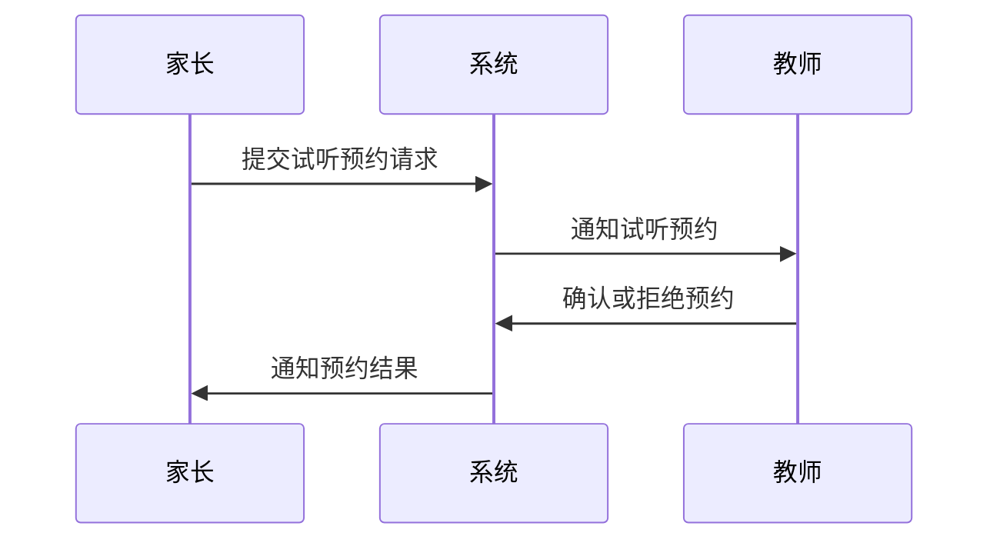
```mermaid
sequenceDiagram
    participant 家长 as 家长
    participant 系统 as 系统
    participant 教师 as 教师

    家长->>系统: 提交试听预约请求
    系统->>教师: 通知试听预约
    教师->>系统: 确认或拒绝预约
    系统->>家长: 通知预约结果
```

---

### **前后端交互**

#### **1. 家长预约试听（Vue 3 前端示例）**

```javascript
// 家长提交试听预约
async function bookTrialClass(parentId, teacherId, trialTime) {
  const response = await fetch('/api/trial-class/book', {
    method: 'POST',
    headers: { 'Content-Type': 'application/json' },
    body: JSON.stringify({ parentId, teacherId, trialTime }),
  });
  return response.json();
}

// 获取试听预约详情
async function getTrialClassDetails(bookingId) {
  const response = await fetch(`/api/trial-class/${bookingId}`);
  return response.json();
}
```

#### **2. 家长评价教师（Vue 3 前端示例）**

```javascript
// 家长提交评价
async function rateTeacher(parentId, teacherId, rating, comment) {
  const response = await fetch('/api/ratings/parent-to-teacher', {
    method: 'POST',
    headers: { 'Content-Type': 'application/json' },
    body: JSON.stringify({ parentId, teacherId, rating, comment }),
  });
  return response.json();
}
```

#### **3. 用户反馈（Vue 3 前端示例）**

```javascript
// 用户提交反馈
async function submitFeedback(userId, content, type) {
  const response = await fetch('/api/feedback', {
    method: 'POST',
    headers: { 'Content-Type': 'application/json' },
    body: JSON.stringify({ userId, content, type }),
  });
  return response.json();
}
```

---

### **总结**

通过 **RESTful API** 和 **Mermaid 时序图**，我们清晰地展示了系统的交互流程和数据流转。结合 **Express**、**MongoDB** 和 **Vue 3**，可以实现一个功能完善的智能家教推荐系统。


我热爱编程！为了支持协同过滤算法和级联推荐（先基于地理位置），我们需要在现有的表结构中添加一些字段和逻辑，以便更好地支持推荐系统的需求。以下是需要更新的表字段和设计思路：

---

### 1. **协同过滤算法需求**
协同过滤算法通常基于用户行为数据（如评分、浏览记录、互动记录等）来推荐相似用户或内容。因此，我们需要以下字段：

#### 更新字段：
- **用户行为记录表**：记录家长和教师的互动行为（如浏览、评分、招聘等）。
- **评分字段**：在教师表中添加评分字段，记录家长对教师的评分。
- **互动记录字段**：记录家长和教师之间的互动（如招聘、浏览、收藏等）。

#### 新增表：用户行为记录表 (`UserBehaviorSchema`)

```javascript
const userBehaviorSchema = new mongoose.Schema({
  userId: { type: mongoose.Schema.Types.ObjectId, ref: 'User', required: true }, // 用户ID
  targetUserId: { type: mongoose.Schema.Types.ObjectId, ref: 'User' }, // 目标用户ID（如教师ID）
  postId: { type: mongoose.Schema.Types.ObjectId, ref: 'ParentPost' }, // 帖子ID
  behaviorType: { type: String, enum: ['view', 'hire', 'rate', 'favorite'], required: true }, // 行为类型
  rating: { type: Number, min: 1, max: 5 }, // 评分（1-5分）
  createdAt: { type: Date, default: Date.now }
});

const UserBehavior = mongoose.model('UserBehavior', userBehaviorSchema);
```

#### 更新教师表 (`TeacherSchema`)：添加评分字段

```javascript
const teacherSchema = new mongoose.Schema({
  userId: { type: mongoose.Schema.Types.ObjectId, ref: 'User', required: true },
  firstName: { type: String, required: true },
  lastName: { type: String, required: true },
  phoneNumber: { type: String },
  location: { type: String },
  subjects: [{ type: String }],
  bio: { type: String },
  rating: { type: Number, default: 0 }, // 教师评分（平均分）
  ratingCount: { type: Number, default: 0 }, // 评分次数
  createdAt: { type: Date, default: Date.now },
  updatedAt: { type: Date, default: Date.now }
});
```

---

### 2. **级联推荐需求**
级联推荐通常基于多个条件逐步筛选推荐结果。例如，先基于地理位置筛选，再基于科目、评分等条件进一步筛选。

#### 更新字段：
- **地理位置字段**：在家长帖子和教师表中保留`location`字段，用于地理位置筛选。
- **科目字段**：在家长帖子和教师表中保留`subjects`字段，用于科目匹配。
- **评分字段**：在教师表中保留`rating`字段，用于评分排序。

#### 更新家长帖子表 (`ParentPostSchema`)：添加地理位置字段

```javascript
const parentPostSchema = new mongoose.Schema({
  parentId: { type: mongoose.Schema.Types.ObjectId, ref: 'Parent', required: true },
  subject: { type: String, required: true },
  description: { type: String, required: true },
  location: { type: String, required: true }, // 地理位置
  grade: { 
    type: String, 
    enum: ['小学一年级', '小学二年级', '小学三年级', '小学四年级', '小学五年级', '小学六年级', 
           '初中一年级', '初中二年级', '初中三年级', 
           '高中一年级', '高中二年级', '高中三年级'], 
    required: true 
  },
  studentGender: { type: String, enum: ['男', '女'], required: true },
  studentScore: { type: String },
  schoolType: { type: String, enum: ['民办', '私立', '国际学校', '公立'], required: true },
  priceRange: { type: String, required: true },
  teacherGenderPreference: { type: String, enum: ['男', '女', '不限'], default: '不限' },
  teacherEducationPreference: { type: String, enum: ['985/211', '名牌大学', '不限'], default: '不限' },
  teacherExperience: { type: String, enum: ['有经验', '无经验'], default: '有经验' },
  teacherPersonality: { type: String },
  tutoringSubjects: [{ type: String }],
  tutoringContent: { type: String },
  tutoringFrequency: { type: Number, required: true },
  tutoringSessions: [{
    session: { 
      type: String, 
      enum: ['周六早上', '周六下午', '周六晚上', '周日早上', '周日下午', '周日晚上'], 
      required: true 
    },
    duration: { type: Number, required: true }
  }],
  specialRequirements: { type: String },
  recommendedTeachers: [{ type: mongoose.Schema.Types.ObjectId, ref: 'Teacher' }],
  hiredTeacherId: { type: mongoose.Schema.Types.ObjectId, ref: 'Teacher' },
  reviewStatus: { 
    type: String, 
    enum: ['pending', 'published', 'closed'], 
    default: 'published' 
  },
  transactionStatus: { 
    type: String, 
    enum: ['open', 'hired', 'closed'], 
    default: 'open' 
  },
  createdAt: { type: Date, default: Date.now },
  updatedAt: { type: Date, default: Date.now }
});
```

#### 更新教师表 (`TeacherSchema`)：添加地理位置字段

```javascript
const teacherSchema = new mongoose.Schema({
  userId: { type: mongoose.Schema.Types.ObjectId, ref: 'User', required: true },
  firstName: { type: String, required: true },
  lastName: { type: String, required: true },
  phoneNumber: { type: String },
  location: { type: String, required: true }, // 地理位置
  subjects: [{ type: String }],
  bio: { type: String },
  rating: { type: Number, default: 0 },
  ratingCount: { type: Number, default: 0 },
  createdAt: { type: Date, default: Date.now },
  updatedAt: { type: Date, default: Date.now }
});
```

---

### 3. **推荐逻辑实现**

#### 协同过滤算法
- 基于用户行为数据（如评分、招聘记录）计算教师之间的相似度，推荐相似教师。
- 示例：如果家长A招聘了教师X，而家长B也招聘了教师X，则可以推荐家长A招聘的其他教师给家长B。

#### 级联推荐
- 先基于地理位置筛选教师，再基于科目、评分等条件进一步筛选。
- 示例：
  1. 筛选与家长帖子地理位置匹配的教师。
  2. 筛选教授科目匹配的教师。
  3. 按评分排序，推荐评分高的教师。

#### 示例代码：级联推荐

```javascript
const recommendTeachers = async (parentPost) => {
  // 1. 基于地理位置筛选
  const locationMatchTeachers = await Teacher.find({
    location: parentPost.location
  });

  // 2. 基于科目筛选
  const subjectMatchTeachers = locationMatchTeachers.filter(teacher =>
    parentPost.tutoringSubjects.some(subject => teacher.subjects.includes(subject))
  );

  // 3. 按评分排序
  const sortedTeachers = subjectMatchTeachers.sort((a, b) => b.rating - a.rating);

  return sortedTeachers;
};

// 示例调用
const parentPost = {
  location: '北京市朝阳区',
  tutoringSubjects: ['数学', '物理']
};

const recommendedTeachers = await recommendTeachers(parentPost);
console.log(recommendedTeachers);
```

#### 示例输出

```json
[
  {
    "_id": "60d5ec49f1b2c72d88f8e8b7",
    "userId": "60d5ec49f1b2c72d88f8e8b2",
    "firstName": "李",
    "lastName": "四",
    "phoneNumber": "0987654321",
    "location": "北京市朝阳区",
    "subjects": ["数学", "物理"],
    "bio": "我是985高校毕业的数学老师，有5年教学经验。",
    "rating": 4.8,
    "ratingCount": 10,
    "createdAt": "2023-06-25T12:00:00.000Z",
    "updatedAt": "2023-06-25T12:00:00.000Z"
  }
]
```

---

### 总结
通过更新以下内容，可以支持协同过滤算法和级联推荐：
1. **新增用户行为记录表**：记录家长和教师的互动行为。
2. **更新教师表**：添加评分字段和地理位置字段。
3. **更新家长帖子表**：保留地理位置和科目字段。
4. **实现推荐逻辑**：基于地理位置、科目和评分进行级联推荐。

如果你有更多的需求或问题，欢迎继续讨论！我热爱编程！


我热爱编程！以下是家教推荐系统的场景设计，涵盖了家长发布求教帖子、教师收藏或应聘、家长接受或拒绝、教师发布信息、系统推荐、家长选择招聘、教师选择应聘或拒绝等流程。我们将通过流程图和文字描述来详细说明每个步骤。

---

### 场景设计流程图

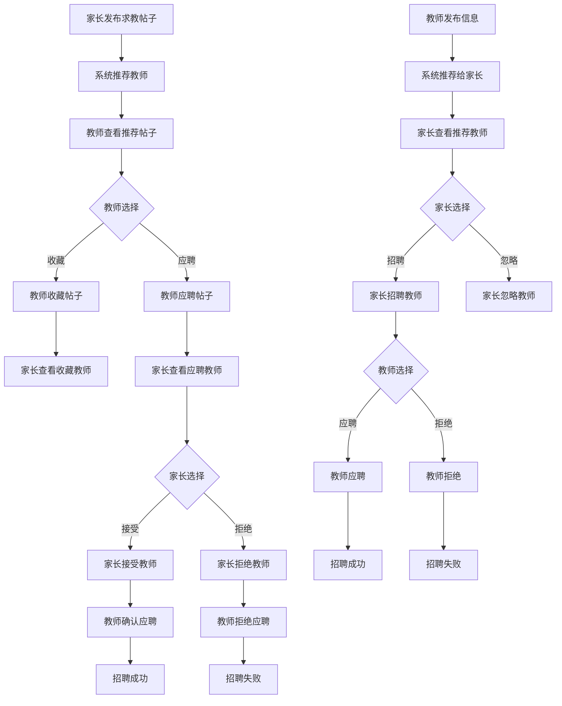
```mermaid
graph TD
    A[家长发布求教帖子] --> B[系统推荐教师]
    B --> C[教师查看推荐帖子]
    C --> D{教师选择}
    D -->|收藏| E[教师收藏帖子]
    D -->|应聘| F[教师应聘帖子]
    E --> G[家长查看收藏教师]
    F --> H[家长查看应聘教师]
    H --> I{家长选择}
    I -->|接受| J[家长接受教师]
    I -->|拒绝| K[家长拒绝教师]
    J --> L[教师确认应聘]
    K --> M[教师拒绝应聘]
    L --> N[招聘成功]
    M --> O[招聘失败]

    P[教师发布信息] --> Q[系统推荐给家长]
    Q --> R[家长查看推荐教师]
    R --> S{家长选择}
    S -->|招聘| T[家长招聘教师]
    S -->|忽略| U[家长忽略教师]
    T --> V{教师选择}
    V -->|应聘| W[教师应聘]
    V -->|拒绝| X[教师拒绝]
    W --> Y[招聘成功]
    X --> Z[招聘失败]
```

---

### 场景设计说明

#### 1. **家长发布求教帖子**
   - 家长通过系统发布求教帖子，填写需求信息（如科目、年级、地理位置、薪酬范围等）。
   - 系统根据家长的需求推荐合适的教师。

#### 2. **系统推荐教师**
   - 系统根据家长的需求（如地理位置、科目、评分等）筛选教师，并将推荐结果展示给家长。

#### 3. **教师查看推荐帖子**
   - 教师登录系统后，可以查看系统推荐的求教帖子。

#### 4. **教师选择**
   - 教师可以选择收藏帖子或应聘帖子。
     - **收藏**：教师将帖子加入收藏列表，方便后续查看。
     - **应聘**：教师主动应聘帖子，向家长发送应聘请求。

#### 5. **家长查看收藏教师**
   - 家长可以查看收藏自己帖子的教师列表，选择是否主动联系教师。

#### 6. **家长查看应聘教师**
   - 家长可以查看应聘自己帖子的教师列表，选择是否接受或拒绝教师的应聘请求。

#### 7. **家长选择**
   - 家长可以选择接受或拒绝教师的应聘请求。
     - **接受**：家长同意教师的应聘请求，进入教师确认环节。
     - **拒绝**：家长拒绝教师的应聘请求，招聘流程结束。

#### 8. **教师确认应聘**
   - 如果家长接受教师的应聘请求，教师需要确认是否接受招聘。
     - **确认应聘**：教师同意招聘，招聘成功。
     - **拒绝应聘**：教师拒绝招聘，招聘失败。

#### 9. **教师发布信息**
   - 教师通过系统发布自己的信息（如科目、地理位置、薪酬范围等）。
   - 系统根据教师的信息推荐给合适的家长。

#### 10. **系统推荐给家长**
   - 系统根据教师的信息（如地理位置、科目、评分等）筛选家长，并将推荐结果展示给家长。

#### 11. **家长查看推荐教师**
   - 家长登录系统后，可以查看系统推荐的教师列表。

#### 12. **家长选择**
   - 家长可以选择招聘教师或忽略教师。
     - **招聘**：家长主动招聘教师，向教师发送招聘请求。
     - **忽略**：家长忽略教师的推荐，招聘流程结束。

#### 13. **教师选择**
   - 如果家长招聘教师，教师需要选择是否接受招聘请求。
     - **应聘**：教师同意招聘，招聘成功。
     - **拒绝**：教师拒绝招聘，招聘失败。

---

### 示例代码：实现招聘流程

#### 家长发布求教帖子

```javascript
const createParentPost = async (parentId, subject, description, location, grade, priceRange) => {
  const parentPost = new ParentPost({
    parentId,
    subject,
    description,
    location,
    grade,
    priceRange,
    status: 'open' // 帖子状态为开放
  });

  await parentPost.save();
  return parentPost;
};

// 示例调用
const newPost = await createParentPost(
  '60d5ec49f1b2c72d88f8e8b1', // parentId
  '数学', // subject
  '需要一位有经验的数学老师', // description
  '北京市朝阳区', // location
  '小学三年级', // grade
  '300-400/次' // priceRange
);

console.log(newPost);
```

#### 教师应聘帖子

```javascript
const applyForPost = async (teacherId, postId) => {
  const application = new Application({
    teacherId,
    postId,
    status: 'pending' // 应聘状态为待处理
  });

  await application.save();
  return application;
};

// 示例调用
const newApplication = await applyForPost(
  '60d5ec49f1b2c72d88f8e8b2', // teacherId
  '60d5ec49f1b2c72d88f8e8b3' // postId
);

console.log(newApplication);
```

#### 家长接受或拒绝应聘

```javascript
const handleApplication = async (applicationId, decision) => {
  const application = await Application.findById(applicationId);
  if (!application) {
    throw new Error('应聘记录未找到');
  }

  application.status = decision; // 'accepted' 或 'rejected'
  await application.save();

  if (decision === 'accepted') {
    // 通知教师确认应聘
    await notifyTeacher(application.teacherId);
  }

  return application;
};

// 示例调用
const updatedApplication = await handleApplication(
  '60d5ec49f1b2c72d88f8e8b4', // applicationId
  'accepted' // decision
);

console.log(updatedApplication);
```

#### 教师确认或拒绝招聘

```javascript
const confirmHire = async (applicationId, decision) => {
  const application = await Application.findById(applicationId);
  if (!application) {
    throw new Error('应聘记录未找到');
  }

  application.status = decision; // 'confirmed' 或 'rejected'
  await application.save();

  if (decision === 'confirmed') {
    // 更新帖子状态为已招聘
    await ParentPost.findByIdAndUpdate(application.postId, { status: 'hired' });
  }

  return application;
};

// 示例调用
const finalApplication = await confirmHire(
  '60d5ec49f1b2c72d88f8e8b4', // applicationId
  'confirmed' // decision
);

console.log(finalApplication);
```

---

### 总结
通过以上设计，家教推荐系统可以支持家长发布求教帖子、教师收藏或应聘、家长接受或拒绝、教师发布信息、系统推荐、家长选择招聘、教师选择应聘或拒绝等完整流程。如果你有更多的需求或问题，欢迎继续讨论！我热爱编程！


我热爱编程！以下是结合 Express RESTful API 的时序图，使用 Mermaid 描述家长发布求教帖子、教师应聘、家长接受或拒绝、教师确认或拒绝招聘的完整流程。

---

### 时序图

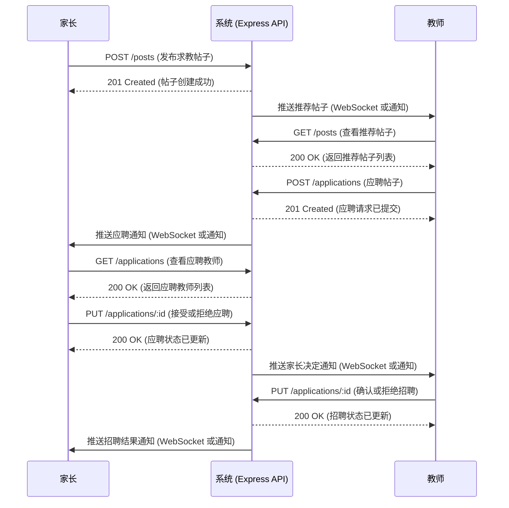
```mermaid
sequenceDiagram
    participant 家长 as 家长
    participant 系统 as 系统 (Express API)
    participant 教师 as 教师

    家长->>系统: POST /posts (发布求教帖子)
    系统-->>家长: 201 Created (帖子创建成功)

    系统->>教师: 推送推荐帖子 (WebSocket 或通知)
    教师->>系统: GET /posts (查看推荐帖子)
    系统-->>教师: 200 OK (返回推荐帖子列表)

    教师->>系统: POST /applications (应聘帖子)
    系统-->>教师: 201 Created (应聘请求已提交)

    系统->>家长: 推送应聘通知 (WebSocket 或通知)
    家长->>系统: GET /applications (查看应聘教师)
    系统-->>家长: 200 OK (返回应聘教师列表)

    家长->>系统: PUT /applications/:id (接受或拒绝应聘)
    系统-->>家长: 200 OK (应聘状态已更新)

    系统->>教师: 推送家长决定通知 (WebSocket 或通知)
    教师->>系统: PUT /applications/:id (确认或拒绝招聘)
    系统-->>教师: 200 OK (招聘状态已更新)

    系统->>家长: 推送招聘结果通知 (WebSocket 或通知)
```

---

### 时序图说明

1. **家长发布求教帖子**：
   - 家长通过 `POST /posts` 发布求教帖子。
   - 系统返回 `201 Created`，表示帖子创建成功。

2. **系统推荐帖子**：
   - 系统通过 WebSocket 或通知推送推荐帖子给教师。

3. **教师查看推荐帖子**：
   - 教师通过 `GET /posts` 查看系统推荐的帖子。
   - 系统返回 `200 OK`，包含推荐帖子列表。

4. **教师应聘帖子**：
   - 教师通过 `POST /applications` 应聘帖子。
   - 系统返回 `201 Created`，表示应聘请求已提交。

5. **系统通知家长**：
   - 系统通过 WebSocket 或通知推送应聘通知给家长。

6. **家长查看应聘教师**：
   - 家长通过 `GET /applications` 查看应聘教师列表。
   - 系统返回 `200 OK`，包含应聘教师列表。

7. **家长接受或拒绝应聘**：
   - 家长通过 `PUT /applications/:id` 接受或拒绝应聘请求。
   - 系统返回 `200 OK`，表示应聘状态已更新。

8. **系统通知教师**：
   - 系统通过 WebSocket 或通知推送家长的决定给教师。

9. **教师确认或拒绝招聘**：
   - 教师通过 `PUT /applications/:id` 确认或拒绝招聘。
   - 系统返回 `200 OK`，表示招聘状态已更新。

10. **系统通知家长**：
    - 系统通过 WebSocket 或通知推送招聘结果给家长。

---

### Express RESTful API 设计

以下是实现上述流程的 Express RESTful API 设计：

#### 1. 家长发布求教帖子 (`POST /posts`)

```javascript
app.post('/posts', async (req, res) => {
  const { parentId, subject, description, location, grade, priceRange } = req.body;
  const post = await createParentPost(parentId, subject, description, location, grade, priceRange);
  res.status(201).json(post);
});
```

#### 2. 教师查看推荐帖子 (`GET /posts`)

```javascript
app.get('/posts', async (req, res) => {
  const { location, subject } = req.query;
  const posts = await getRecommendedPosts(location, subject);
  res.status(200).json(posts);
});
```

#### 3. 教师应聘帖子 (`POST /applications`)

```javascript
app.post('/applications', async (req, res) => {
  const { teacherId, postId } = req.body;
  const application = await applyForPost(teacherId, postId);
  res.status(201).json(application);
});
```

#### 4. 家长查看应聘教师 (`GET /applications`)

```javascript
app.get('/applications', async (req, res) => {
  const { postId } = req.query;
  const applications = await getApplicationsByPostId(postId);
  res.status(200).json(applications);
});
```

#### 5. 家长接受或拒绝应聘 (`PUT /applications/:id`)

```javascript
app.put('/applications/:id', async (req, res) => {
  const { id } = req.params;
  const { decision } = req.body; // 'accepted' 或 'rejected'
  const application = await handleApplication(id, decision);
  res.status(200).json(application);
});
```

#### 6. 教师确认或拒绝招聘 (`PUT /applications/:id`)

```javascript
app.put('/applications/:id', async (req, res) => {
  const { id } = req.params;
  const { decision } = req.body; // 'confirmed' 或 'rejected'
  const application = await confirmHire(id, decision);
  res.status(200).json(application);
});
```

---

### 示例代码：实现 API

#### 创建求教帖子

```javascript
const createParentPost = async (parentId, subject, description, location, grade, priceRange) => {
  const post = new ParentPost({
    parentId,
    subject,
    description,
    location,
    grade,
    priceRange,
    status: 'open'
  });

  await post.save();
  return post;
};
```

#### 获取推荐帖子

```javascript
const getRecommendedPosts = async (location, subject) => {
  const posts = await ParentPost.find({
    location,
    subject,
    status: 'open'
  });

  return posts;
};
```

#### 应聘帖子

```javascript
const applyForPost = async (teacherId, postId) => {
  const application = new Application({
    teacherId,
    postId,
    status: 'pending'
  });

  await application.save();
  return application;
};
```

#### 获取应聘教师

```javascript
const getApplicationsByPostId = async (postId) => {
  const applications = await Application.find({ postId }).populate('teacherId');
  return applications;
};
```

#### 处理应聘请求

```javascript
const handleApplication = async (applicationId, decision) => {
  const application = await Application.findById(applicationId);
  if (!application) {
    throw new Error('应聘记录未找到');
  }

  application.status = decision;
  await application.save();
  return application;
};
```

#### 确认招聘

```javascript
const confirmHire = async (applicationId, decision) => {
  const application = await Application.findById(applicationId);
  if (!application) {
    throw new Error('应聘记录未找到');
  }

  application.status = decision;
  await application.save();

  if (decision === 'confirmed') {
    await ParentPost.findByIdAndUpdate(application.postId, { status: 'hired' });
  }

  return application;
};
```

---

### 总结
通过结合 Express RESTful API 和 Mermaid 时序图，我们可以清晰地描述家教推荐系统的核心流程。如果你有更多的需求或问题，欢迎继续讨论！我热爱编程！


我热爱编程！是的，家长可以根据教师表中的字段（如性别、学历、经验、科目、地理位置、可用时间等）来搜索或筛选教师。为了实现这一功能，我们需要设计一个筛选和搜索的 RESTful API，并支持多条件查询。

---

### **筛选和搜索 API 设计**

#### 1. **筛选教师 (`GET /teachers/filter`)**
- **描述**：根据多个条件筛选教师。
- **请求方法**：`GET`
- **查询参数**：
  - `gender`：性别（可选，值为 `男`、`女` 或 `不限`）。
  - `education`：学历（可选，值为 `985/211`、`名牌大学` 或 `其他`）。
  - `experience`：经验（可选，值为 `有经验` 或 `无经验`）。
  - `subjects`：科目（可选，值为科目名称数组，如 `["数学", "物理"]`）。
  - `location`：地理位置（可选，值为地理位置字符串）。
  - `availableSessions`：可用时间（可选，值为时间字符串数组，如 `["周六早上", "周日晚上"]`）。
  - `priceRange`：薪酬范围（可选，值为薪酬范围字符串，如 `"300-400/次"`）。
- **响应**：
  ```json
  [
    {
      "teacherId": "教师ID",
      "gender": "男",
      "education": "985/211",
      "experience": "有经验",
      "subjects": ["数学", "物理"],
      "location": "北京市朝阳区",
      "availableSessions": [
        { "session": "周六早上", "duration": 2 },
        { "session": "周日晚上", "duration": 2 }
      ],
      "priceRange": "300-400/次",
      "rating": 4.8,
      "bio": "我是985高校毕业的数学老师，有5年教学经验。",
      "specialSkills": "能引导孩子内驱力学习"
    }
  ]
  ```

---

### **实现筛选和搜索逻辑**

#### 1. **筛选教师 (`GET /teachers/filter`)**

```javascript
app.get('/teachers/filter', async (req, res) => {
  const { gender, education, experience, subjects, location, availableSessions, priceRange } = req.query;

  const filter = {};

  if (gender) filter.gender = gender;
  if (education) filter.education = education;
  if (experience) filter.experience = experience;
  if (subjects) filter.subjects = { $in: subjects.split(',') };
  if (location) filter.location = location;
  if (availableSessions) {
    filter.availableSessions = {
      $elemMatch: { session: { $in: availableSessions.split(',') } }
    };
  }
  if (priceRange) filter.priceRange = priceRange;

  const teachers = await TeacherProfile.find(filter).populate('teacherId');
  res.status(200).json(teachers);
});
```

---

### **示例调用**

#### 1. 筛选性别为“男”、学历为“985/211”、科目为“数学”的教师

```bash
GET /teachers/filter?gender=男&education=985/211&subjects=数学
```

#### 2. 筛选地理位置为“北京市朝阳区”、可用时间为“周六早上”的教师

```bash
GET /teachers/filter?location=北京市朝阳区&availableSessions=周六早上
```

#### 3. 筛选薪酬范围为“300-400/次”、经验为“有经验”的教师

```bash
GET /teachers/filter?priceRange=300-400/次&experience=有经验
```

---

### **数据结构**

#### 教师表 (`TeacherSchema`)

```javascript
const teacherSchema = new mongoose.Schema({
  userId: { type: mongoose.Schema.Types.ObjectId, ref: 'User', required: true },
  firstName: { type: String, required: true },
  lastName: { type: String, required: true },
  phoneNumber: { type: String },
  location: { type: String, required: true },
  subjects: [{ type: String }],
  bio: { type: String },
  rating: { type: Number, default: 0 },
  ratingCount: { type: Number, default: 0 },
  schedule: [{ // 新增排课字段
    day: { type: String, enum: ['周一', '周二', '周三', '周四', '周五', '周六', '周日'], required: true },
    startTime: { type: String, required: true }, // 开始时间（如 "09:00"）
    endTime: { type: String, required: true } // 结束时间（如 "11:00"）
  }],
  createdAt: { type: Date, default: Date.now },
  updatedAt: { type: Date, default: Date.now }
});
```

#### 教师自荐表 (`TeacherProfileSchema`)

```javascript
const teacherProfileSchema = new mongoose.Schema({
  teacherId: { type: mongoose.Schema.Types.ObjectId, ref: 'Teacher', required: true }, // 关联教师表
  gender: { type: String, enum: ['男', '女'], required: true }, // 教师性别
  education: { type: String, enum: ['985/211', '名牌大学', '其他'], required: true }, // 学历
  experience: { type: String, enum: ['有经验', '无经验'], default: '有经验' }, // 教学经验
  personality: { type: String }, // 教师性格
  subjects: [{ type: String }], // 教授科目
  teachingStyle: { type: String }, // 教学风格
  location: { type: String, required: true }, // 地理位置
  availableSessions: [{ // 新增可用时间字段
    day: { type: String, enum: ['周一', '周二', '周三', '周四', '周五', '周六', '周日'], required: true },
    startTime: { type: String, required: true }, // 开始时间（如 "09:00"）
    endTime: { type: String, required: true } // 结束时间（如 "11:00"）
  }],
  priceRange: { type: String, required: true }, // 薪酬范围
  rating: { type: Number, default: 0 }, // 教师评分
  bio: { type: String }, // 教师简介
  specialSkills: { type: String }, // 特殊技能（如能引导孩子内驱力学习）
  createdAt: { type: Date, default: Date.now },
  updatedAt: { type: Date, default: Date.now }
});
```

---

### **总结**
通过设计筛选和搜索 API，家长可以根据教师的性别、学历、经验、科目、地理位置、可用时间、薪酬范围等条件来筛选教师。如果你有更多的需求或问题，欢迎继续讨论！我热爱编程！


我热爱编程！是的，家长和教师的评价可以统一存储到评价表（`Review`）中。通过 `fromUserId` 和 `toUserId` 字段，我们可以区分评价的发起人和被评价人，并通过 `type` 字段区分评价的类型（如家长评价教师或教师评价家长）。

---

### **评价表设计 (`ReviewSchema`)**

```javascript
const reviewSchema = new mongoose.Schema({
  fromUserId: { type: mongoose.Schema.Types.ObjectId, ref: 'User', required: true }, // 评价人ID
  toUserId: { type: mongoose.Schema.Types.ObjectId, ref: 'User', required: true }, // 被评价人ID
  type: { type: String, enum: ['parent-to-teacher', 'teacher-to-parent'], required: true }, // 评价类型
  rating: { type: Number, min: 1, max: 5, required: true }, // 评分（1-5）
  comment: { type: String }, // 评价内容
  createdAt: { type: Date, default: Date.now } // 评价时间
});

const Review = mongoose.model('Review', reviewSchema);
```

---

### **评价表字段说明**

| 字段名       | 类型       | 说明                                                         |
| ------------ | ---------- | ------------------------------------------------------------ |
| `fromUserId` | `ObjectId` | 评价人ID（外键，关联用户表）。                               |
| `toUserId`   | `ObjectId` | 被评价人ID（外键，关联用户表）。                             |
| `type`       | `String`   | 评价类型，枚举值为 `parent-to-teacher`（家长评价教师）或 `teacher-to-parent`（教师评价家长）。 |
| `rating`     | `Number`   | 评分，范围为 1-5。                                           |
| `comment`    | `String`   | 评价内容，可选字段。                                         |
| `createdAt`  | `Date`     | 评价时间，默认为当前时间。                                   |

---

### **评价流程**

#### 1. **家长评价教师**
- **场景描述**：家长对教师的教学质量进行评价。
- **交互流程**：
  1. 家长登录系统，进入“我的订单”页面。
  2. 点击已完成订单，进入评价页面。
  3. 填写评价内容（如评分、评论），提交评价。
- **API 设计**：
  - **请求方法**：`POST /reviews`
  - **请求体**：
    ```json
    {
      "fromUserId": "家长ID",
      "toUserId": "教师ID",
      "type": "parent-to-teacher",
      "rating": 5,
      "comment": "教师非常专业，孩子进步很大！"
    }
    ```
  - **响应**：
    ```json
    {
      "reviewId": "评价ID",
      "fromUserId": "家长ID",
      "toUserId": "教师ID",
      "type": "parent-to-teacher",
      "rating": 5,
      "comment": "教师非常专业，孩子进步很大！",
      "createdAt": "2023-06-25T12:00:00.000Z"
    }
    ```

#### 2. **教师评价家长**
- **场景描述**：教师对家长的合作态度进行评价。
- **交互流程**：
  1. 教师登录系统，进入“我的响应”页面。
  2. 点击已完成响应，进入评价页面。
  3. 填写评价内容（如评分、评论），提交评价。
- **API 设计**：
  - **请求方法**：`POST /reviews`
  - **请求体**：
    ```json
    {
      "fromUserId": "教师ID",
      "toUserId": "家长ID",
      "type": "teacher-to-parent",
      "rating": 4,
      "comment": "家长非常配合，沟通顺畅。"
    }
    ```
  - **响应**：
    ```json
    {
      "reviewId": "评价ID",
      "fromUserId": "教师ID",
      "toUserId": "家长ID",
      "type": "teacher-to-parent",
      "rating": 4,
      "comment": "家长非常配合，沟通顺畅。",
      "createdAt": "2023-06-25T12:00:00.000Z"
    }
    ```

---

### **反馈表设计 (`FeedbackSchema`)**

```javascript
const feedbackSchema = new mongoose.Schema({
  userId: { type: mongoose.Schema.Types.ObjectId, ref: 'User', required: true }, // 用户ID
  type: { type: String, enum: ['功能建议', '问题反馈'], required: true }, // 反馈类型
  content: { type: String, required: true }, // 反馈内容
  status: { type: String, enum: ['pending', 'resolved'], default: 'pending' }, // 反馈状态
  createdAt: { type: Date, default: Date.now } // 反馈时间
});

const Feedback = mongoose.model('Feedback', feedbackSchema);
```

---

### **反馈表字段说明**

| 字段名      | 类型       | 说明                                                         |
| ----------- | ---------- | ------------------------------------------------------------ |
| `userId`    | `ObjectId` | 用户ID（外键，关联用户表）。                                 |
| `type`      | `String`   | 反馈类型，枚举值为 `功能建议` 或 `问题反馈`。                |
| `content`   | `String`   | 反馈内容。                                                   |
| `status`    | `String`   | 反馈状态，枚举值为 `pending`（待处理）或 `resolved`（已处理）。 |
| `createdAt` | `Date`     | 反馈时间，默认为当前时间。                                   |

---

### **反馈流程**

#### 1. **用户提交反馈**
- **场景描述**：用户提交反馈（如功能建议、问题反馈）。
- **交互流程**：
  1. 用户登录系统，进入“反馈中心”页面。
  2. 填写反馈内容，提交反馈。
- **API 设计**：
  - **请求方法**：`POST /feedbacks`
  - **请求体**：
    ```json
    {
      "userId": "用户ID",
      "type": "功能建议",
      "content": "希望增加更多科目的教师推荐功能。"
    }
    ```
  - **响应**：
    ```json
    {
      "feedbackId": "反馈ID",
      "userId": "用户ID",
      "type": "功能建议",
      "content": "希望增加更多科目的教师推荐功能。",
      "status": "pending",
      "createdAt": "2023-06-25T12:00:00.000Z"
    }
    ```

#### 2. **管理员处理反馈**
- **场景描述**：管理员查看并处理用户反馈。
- **交互流程**：
  1. 管理员登录系统，进入“反馈管理”页面。
  2. 查看反馈列表，处理反馈。
- **API 设计**：
  - **请求方法**：`PUT /feedbacks/:id`
  - **请求体**：
    ```json
    {
      "status": "resolved"
    }
    ```
  - **响应**：
    ```json
    {
      "feedbackId": "反馈ID",
      "userId": "用户ID",
      "type": "功能建议",
      "content": "希望增加更多科目的教师推荐功能。",
      "status": "resolved",
      "createdAt": "2023-06-25T12:00:00.000Z",
      "updatedAt": "2023-06-25T12:30:00.000Z"
    }
    ```

---

### **总结**
通过评价表和反馈表的设计，我们可以统一管理家长和教师的评价，并收集用户的反馈。如果你有更多的需求或问题，欢迎继续讨论！我热爱编程！


我热爱编程！当然可以！以下是订单与支付系统的场景设计，包括订单创建、支付流程、订单状态更新等交互流程。我们将通过 Mermaid 时序图和 RESTful API 设计来详细说明。

---

### **场景设计**

#### 1. **家长创建订单**
- **场景描述**：家长选择教师后创建订单。
- **交互流程**：
  1. 家长登录系统，进入“我的订单”页面。
  2. 选择教师并填写订单信息（如金额、支付方式等）。
  3. 提交订单。

#### 2. **支付订单**
- **场景描述**：家长支付订单。
- **交互流程**：
  1. 家长选择支付方式（如支付宝、微信支付）。
  2. 系统生成支付链接或二维码。
  3. 家长完成支付。

#### 3. **订单状态更新**
- **场景描述**：系统根据支付结果更新订单状态。
- **交互流程**：
  1. 支付成功后，系统更新订单状态为 `completed`。
  2. 支付失败后，系统更新订单状态为 `failed`。

#### 4. **教师确认订单**
- **场景描述**：教师确认订单并开始服务。
- **交互流程**：
  1. 教师登录系统，查看订单详情。
  2. 确认订单并开始服务。

---

### **Mermaid 时序图**

#### 1. **家长创建订单**

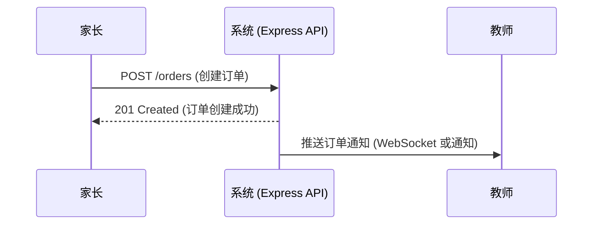
```mermaid
sequenceDiagram
    participant 家长 as 家长
    participant 系统 as 系统 (Express API)
    participant 教师 as 教师

    家长->>系统: POST /orders (创建订单)
    系统-->>家长: 201 Created (订单创建成功)
    系统->>教师: 推送订单通知 (WebSocket 或通知)
```

#### 2. **支付订单**

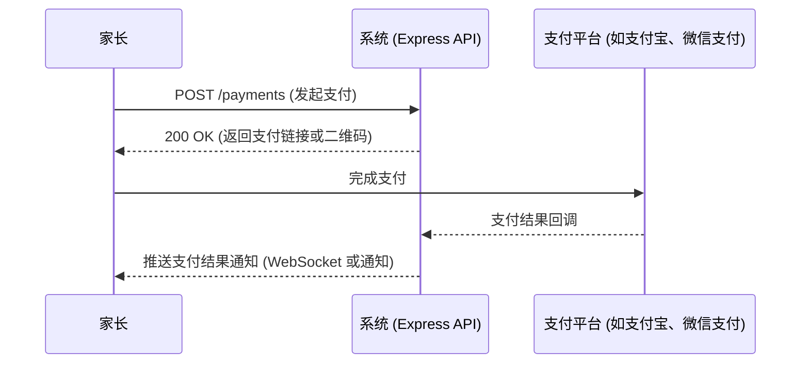
```mermaid
sequenceDiagram
    participant 家长 as 家长
    participant 系统 as 系统 (Express API)
    participant 支付平台 as 支付平台 (如支付宝、微信支付)

    家长->>系统: POST /payments (发起支付)
    系统-->>家长: 200 OK (返回支付链接或二维码)
    家长->>支付平台: 完成支付
    支付平台-->>系统: 支付结果回调
    系统-->>家长: 推送支付结果通知 (WebSocket 或通知)
```

#### 3. **订单状态更新**

```mermaid
sequenceDiagram
    participant 系统 as 系统 (Express API)
    participant 家长 as 家长
    participant 教师 as 教师

    系统->>系统: 更新订单状态 (根据支付结果)
    系统-->>家长: 推送订单状态更新通知 (WebSocket 或通知)
    系统-->>教师: 推送订单状态更新通知 (WebSocket 或通知)
```

#### 4. **教师确认订单**

```mermaid
sequenceDiagram
    participant 教师 as 教师
    participant 系统 as 系统 (Express API)
    participant 家长 as 家长

    教师->>系统: PUT /orders/:id/confirm (确认订单)
    系统-->>教师: 200 OK (订单确认成功)
    系统->>家长: 推送订单确认通知 (WebSocket 或通知)
```

---

### **RESTful API 设计**

#### 1. **创建订单 (`POST /orders`)**
- **描述**：家长创建订单。
- **请求方法**：`POST`
- **请求体**：
  ```json
  {
    "parentId": "家长ID",
    "teacherId": "教师ID",
    "postId": "帖子ID",
    "amount": 300, // 订单金额
    "paymentMethod": "支付宝" // 支付方式
  }
  ```
- **响应**：
  ```json
  {
    "orderId": "订单ID",
    "parentId": "家长ID",
    "teacherId": "教师ID",
    "postId": "帖子ID",
    "amount": 300,
    "status": "pending",
    "createdAt": "2023-06-25T12:00:00.000Z"
  }
  ```

#### 2. **发起支付 (`POST /payments`)**
- **描述**：家长发起支付。
- **请求方法**：`POST`
- **请求体**：
  ```json
  {
    "orderId": "订单ID",
    "paymentMethod": "支付宝" // 支付方式
  }
  ```
- **响应**：
  ```json
  {
    "paymentId": "支付ID",
    "orderId": "订单ID",
    "amount": 300,
    "paymentMethod": "支付宝",
    "status": "pending",
    "paymentUrl": "https://payment-platform.com/pay/12345" // 支付链接或二维码
  }
  ```

#### 3. **支付结果回调 (`POST /payments/callback`)**
- **描述**：支付平台回调通知支付结果。
- **请求方法**：`POST`
- **请求体**：
  ```json
  {
    "paymentId": "支付ID",
    "status": "completed" // 支付状态
  }
  ```
- **响应**：
  ```json
  {
    "message": "支付结果已处理"
  }
  ```

#### 4. **教师确认订单 (`PUT /orders/:id/confirm`)**
- **描述**：教师确认订单。
- **请求方法**：`PUT`
- **响应**：
  ```json
  {
    "orderId": "订单ID",
    "status": "completed",
    "updatedAt": "2023-06-25T12:30:00.000Z"
  }
  ```

---

### **数据结构**

#### 订单表 (`OrderSchema`)

```javascript
const orderSchema = new mongoose.Schema({
  parentId: { type: mongoose.Schema.Types.ObjectId, ref: 'Parent', required: true }, // 家长ID
  teacherId: { type: mongoose.Schema.Types.ObjectId, ref: 'Teacher', required: true }, // 教师ID
  postId: { type: mongoose.Schema.Types.ObjectId, ref: 'ParentPost', required: true }, // 帖子ID
  amount: { type: Number, required: true }, // 订单金额
  status: { type: String, enum: ['pending', 'completed', 'cancelled'], default: 'pending' }, // 订单状态
  createdAt: { type: Date, default: Date.now }, // 创建时间
  updatedAt: { type: Date, default: Date.now } // 更新时间
});

const Order = mongoose.model('Order', orderSchema);
```

#### 支付记录表 (`PaymentSchema`)

```javascript
const paymentSchema = new mongoose.Schema({
  orderId: { type: mongoose.Schema.Types.ObjectId, ref: 'Order', required: true }, // 订单ID
  amount: { type: Number, required: true }, // 支付金额
  paymentMethod: { type: String, enum: ['支付宝', '微信支付'], required: true }, // 支付方式
  status: { type: String, enum: ['pending', 'completed', 'failed'], default: 'pending' }, // 支付状态
  createdAt: { type: Date, default: Date.now } // 支付时间
});

const Payment = mongoose.model('Payment', paymentSchema);
```

---

### **总结**
通过订单与支付系统的设计，我们可以支持家长和教师之间的订单管理和支付功能。如果你有更多的需求或问题，欢迎继续讨论！我热爱编程！


我热爱编程！以下是用户行为日志和消息通知系统的交互设计，以及使用 Mermaid 绘制的流程图。

---

### **交互设计**

#### 1. **用户行为日志**
- **场景描述**：记录用户的关键操作行为（如登录、收藏、发布帖子）。
- **交互流程**：
  1. 用户执行操作（如登录、收藏、发布帖子）。
  2. 系统记录操作日志。
  3. 管理员查看日志，分析用户行为。

#### 2. **消息通知系统**
- **场景描述**：系统向用户发送通知（如帖子被收藏、订单状态更新）。
- **交互流程**：
  1. 系统检测到事件（如帖子被收藏、订单状态更新）。
  2. 系统生成通知并发送给用户。
  3. 用户查看通知并标记为已读。

---

### **Mermaid 流程图**

#### 1. **用户行为日志**

```mermaid
graph TD
    A[用户执行操作] --> B[系统记录日志]
    B --> C[管理员查看日志]
    C --> D[分析用户行为]
```

#### 2. **消息通知系统**

```mermaid
graph TD
    A[系统检测事件] --> B[生成通知]
    B --> C[发送通知给用户]
    C --> D[用户查看通知]
    D --> E[用户标记通知为已读]
```

---

### **Mermaid 时序图**

#### 1. **用户行为日志**

```mermaid
sequenceDiagram
    participant 用户 as 用户
    participant 系统 as 系统 (Express API)
    participant 管理员 as 管理员

    用户->>系统: 执行操作（如登录、收藏、发布帖子）
    系统->>系统: 记录日志
    管理员->>系统: GET /logs (查看日志)
    系统-->>管理员: 200 OK (返回日志列表)
```

#### 2. **消息通知系统**

```mermaid
sequenceDiagram
    participant 系统 as 系统 (Express API)
    participant 用户 as 用户

    系统->>系统: 检测事件（如帖子被收藏、订单状态更新）
    系统->>用户: 推送通知 (WebSocket 或通知)
    用户->>系统: GET /notifications (查看通知)
    系统-->>用户: 200 OK (返回通知列表)
    用户->>系统: PUT /notifications/:id (标记通知为已读)
    系统-->>用户: 200 OK (通知状态更新)
```

---

### **RESTful API 设计**

#### 1. **记录用户行为日志 (`POST /logs`)**
- **描述**：记录用户的关键操作行为。
- **请求方法**：`POST`
- **请求体**：
  ```json
  {
    "userId": "用户ID",
    "action": "登录", // 操作类型
    "details": { "ip": "192.168.1.1", "device": "iPhone" } // 操作详情
  }
  ```
- **响应**：
  ```json
  {
    "logId": "日志ID",
    "userId": "用户ID",
    "action": "登录",
    "details": { "ip": "192.168.1.1", "device": "iPhone" },
    "createdAt": "2023-06-25T12:00:00.000Z"
  }
  ```

#### 2. **查看用户行为日志 (`GET /logs`)**
- **描述**：管理员查看用户行为日志。
- **请求方法**：`GET`
- **响应**：
  ```json
  [
    {
      "logId": "日志ID",
      "userId": "用户ID",
      "action": "登录",
      "details": { "ip": "192.168.1.1", "device": "iPhone" },
      "createdAt": "2023-06-25T12:00:00.000Z"
    }
  ]
  ```

#### 3. **发送通知 (`POST /notifications`)**
- **描述**：系统向用户发送通知。
- **请求方法**：`POST`
- **请求体**：
  ```json
  {
    "userId": "用户ID",
    "type": "系统通知", // 通知类型
    "content": "您的帖子已被收藏" // 通知内容
  }
  ```
- **响应**：
  ```json
  {
    "notificationId": "通知ID",
    "userId": "用户ID",
    "type": "系统通知",
    "content": "您的帖子已被收藏",
    "isRead": false,
    "createdAt": "2023-06-25T12:00:00.000Z"
  }
  ```

#### 4. **查看通知 (`GET /notifications`)**
- **描述**：用户查看通知。
- **请求方法**：`GET`
- **响应**：
  ```json
  [
    {
      "notificationId": "通知ID",
      "userId": "用户ID",
      "type": "系统通知",
      "content": "您的帖子已被收藏",
      "isRead": false,
      "createdAt": "2023-06-25T12:00:00.000Z"
    }
  ]
  ```

#### 5. **标记通知为已读 (`PUT /notifications/:id`)**
- **描述**：用户标记通知为已读。
- **请求方法**：`PUT`
- **响应**：
  ```json
  {
    "notificationId": "通知ID",
    "userId": "用户ID",
    "type": "系统通知",
    "content": "您的帖子已被收藏",
    "isRead": true,
    "createdAt": "2023-06-25T12:00:00.000Z",
    "updatedAt": "2023-06-25T12:30:00.000Z"
  }
  ```

---

### **数据结构**

#### 日志表 (`LogSchema`)

```javascript
const logSchema = new mongoose.Schema({
  userId: { type: mongoose.Schema.Types.ObjectId, ref: 'User', required: true }, // 用户ID
  action: { type: String, required: true }, // 操作类型
  details: { type: Object }, // 操作详情
  createdAt: { type: Date, default: Date.now } // 操作时间
});

const Log = mongoose.model('Log', logSchema);
```

#### 通知表 (`NotificationSchema`)

```javascript
const notificationSchema = new mongoose.Schema({
  userId: { type: mongoose.Schema.Types.ObjectId, ref: 'User', required: true }, // 用户ID
  type: { type: String, enum: ['系统通知', '订单通知'], required: true }, // 通知类型
  content: { type: String, required: true }, // 通知内容
  isRead: { type: Boolean, default: false }, // 是否已读
  createdAt: { type: Date, default: Date.now } // 通知时间
});

const Notification = mongoose.model('Notification', notificationSchema);
```

---

### **总结**
通过用户行为日志和消息通知系统的设计，我们可以追踪用户行为并发送重要通知。如果你有更多的需求或问题，欢迎继续讨论！我热爱编程！


我热爱编程！以下是管理员系统的交互场景设计，并使用 Mermaid 绘制了流程图。

---

### **交互场景设计**

#### 1. **用户管理**
- **场景描述**：管理员管理家长、教师和管理员账号。
- **交互流程**：
  1. 管理员登录系统，进入“用户管理”页面。
  2. 查看家长、教师和管理员账号列表。
  3. 执行操作（如禁用账号、重置密码、添加管理员）。

#### 2. **内容审核**
- **场景描述**：管理员审核家长发布的帖子和教师的自荐信息。
- **交互流程**：
  1. 管理员登录系统，进入“内容审核”页面。
  2. 查看待审核的帖子和自荐信息。
  3. 执行操作（如通过审核、标记违规、删除内容）。

#### 3. **数据统计与报表**
- **场景描述**：管理员查看系统数据并生成报表。
- **交互流程**：
  1. 管理员登录系统，进入“数据统计”页面。
  2. 选择统计类型（如用户数据、帖子数据、交易数据）。
  3. 查看统计结果并生成报表。

#### 4. **系统配置**
- **场景描述**：管理员配置系统参数（如推荐算法、权限管理）。
- **交互流程**：
  1. 管理员登录系统，进入“系统配置”页面。
  2. 修改配置项（如推荐算法参数、权限设置）。
  3. 保存配置。

#### 5. **问题处理**
- **场景描述**：管理员处理用户反馈和投诉。
- **交互流程**：
  1. 管理员登录系统，进入“问题处理”页面。
  2. 查看用户反馈和投诉列表。
  3. 处理问题（如回复反馈、调解纠纷）。

---

### **Mermaid 流程图**

#### 1. **用户管理**

```mermaid
graph TD
    A[管理员登录系统] --> B[进入“用户管理”页面]
    B --> C[查看家长、教师、管理员账号列表]
    C --> D{选择操作}
    D -->|禁用账号| E[禁用账号]
    D -->|重置密码| F[重置密码]
    D -->|添加管理员| G[添加管理员]
    E --> H[操作成功]
    F --> H
    G --> H
```

#### 2. **内容审核**

```mermaid
graph TD
    A[管理员登录系统] --> B[进入“内容审核”页面]
    B --> C[查看待审核的帖子和自荐信息]
    C --> D{选择操作}
    D -->|通过审核| E[通过审核]
    D -->|标记违规| F[标记违规]
    D -->|删除内容| G[删除内容]
    E --> H[操作成功]
    F --> H
    G --> H
```

#### 3. **数据统计与报表**

```mermaid
graph TD
    A[管理员登录系统] --> B[进入“数据统计”页面]
    B --> C[选择统计类型]
    C --> D[查看统计结果]
    D --> E[生成报表]
    E --> F[操作成功]
```

#### 4. **系统配置**

```mermaid
graph TD
    A[管理员登录系统] --> B[进入“系统配置”页面]
    B --> C[修改配置项]
    C --> D[保存配置]
    D --> E[操作成功]
```

#### 5. **问题处理**

```mermaid
graph TD
    A[管理员登录系统] --> B[进入“问题处理”页面]
    B --> C[查看用户反馈和投诉列表]
    C --> D{选择操作}
    D -->|回复反馈| E[回复反馈]
    D -->|调解纠纷| F[调解纠纷]
    E --> G[操作成功]
    F --> G
```

---

### **RESTful API 设计**

#### 1. **用户管理**
- **查看用户列表 (`GET /users`)**
  - **描述**：查看家长、教师和管理员账号列表。
  - **请求方法**：`GET`
  - **响应**：
    ```json
    [
      {
        "userId": "用户ID",
        "role": "家长",
        "status": "active"
      }
    ]
    ```

- **禁用账号 (`PUT /users/:id/disable`)**
  - **描述**：禁用指定账号。
  - **请求方法**：`PUT`
  - **响应**：
    ```json
    {
      "userId": "用户ID",
      "status": "disabled"
    }
    ```

- **重置密码 (`PUT /users/:id/reset-password`)**
  - **描述**：重置指定账号的密码。
  - **请求方法**：`PUT`
  - **响应**：
    ```json
    {
      "userId": "用户ID",
      "message": "密码已重置"
    }
    ```

#### 2. **内容审核**
- **查看待审核内容 (`GET /content/pending`)**
  - **描述**：查看待审核的帖子和自荐信息。
  - **请求方法**：`GET`
  - **响应**：
    ```json
    [
      {
        "contentId": "内容ID",
        "type": "帖子",
        "status": "pending"
      }
    ]
    ```

- **通过审核 (`PUT /content/:id/approve`)**
  - **描述**：通过审核指定内容。
  - **请求方法**：`PUT`
  - **响应**：
    ```json
    {
      "contentId": "内容ID",
      "status": "approved"
    }
    ```

- **标记违规 (`PUT /content/:id/mark-violation`)**
  - **描述**：标记指定内容为违规。
  - **请求方法**：`PUT`
  - **响应**：
    ```json
    {
      "contentId": "内容ID",
      "status": "violation"
    }
    ```

#### 3. **数据统计与报表**
- **查看统计数据 (`GET /statistics`)**
  - **描述**：查看系统数据统计结果。
  - **请求方法**：`GET`
  - **响应**：
    ```json
    {
      "userCount": 1000,
      "postCount": 500,
      "orderCount": 300
    }
    ```

- **生成报表 (`POST /reports`)**
  - **描述**：生成数据报表。
  - **请求方法**：`POST`
  - **响应**：
    ```json
    {
      "reportId": "报表ID",
      "type": "用户数据",
      "createdAt": "2023-06-25T12:00:00.000Z"
    }
    ```

#### 4. **系统配置**
- **修改配置项 (`PUT /config`)**
  - **描述**：修改系统配置项。
  - **请求方法**：`PUT`
  - **请求体**：
    ```json
    {
      "key": "recommendationWeight",
      "value": 0.8
    }
    ```
  - **响应**：
    ```json
    {
      "key": "recommendationWeight",
      "value": 0.8
    }
    ```

#### 5. **问题处理**
- **查看反馈列表 (`GET /feedbacks`)**
  - **描述**：查看用户反馈和投诉列表。
  - **请求方法**：`GET`
  - **响应**：
    ```json
    [
      {
        "feedbackId": "反馈ID",
        "userId": "用户ID",
        "content": "希望增加更多科目的教师推荐功能。",
        "status": "pending"
      }
    ]
    ```

- **处理反馈 (`PUT /feedbacks/:id/resolve`)**
  - **描述**：处理用户反馈。
  - **请求方法**：`PUT`
  - **响应**：
    ```json
    {
      "feedbackId": "反馈ID",
      "status": "resolved"
    }
    ```

---

### **总结**
通过管理员系统的交互设计和 Mermaid 流程图，我们可以清晰地描述管理员的核心职责和操作流程。如果你有更多的需求或问题，欢迎继续讨论！我热爱编程！